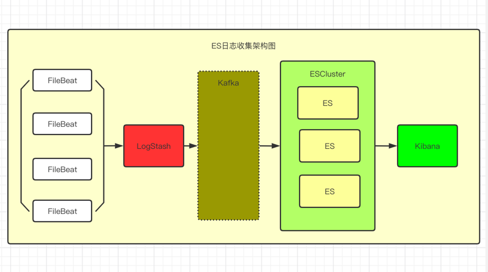

## ElasticSearch

### 介绍:

**ElasticSearch**是基于开源库**Lucene**做的搜索引擎，基于倒排索引对数据进行索引与查询等，但是使用ES的时候不能直接使用Lucene的API，因为ES是服务器，所以我们在使用的时候只能调用ES的REST API。**ElasticSearch Cluster**，即ES集群，集群中有多个节点，类似于ES节点，这个节点通过选举产生，但是主从节点是对于集群内部而言的，ES是去中心化的，就是集群对外部来说是一个整体，与任一一个节点通讯都是与整个ES集群通讯。

### 部署集群
（1）选择三台机器用来搭建ES集群（原因因为ES的集群机制类似于ZK），下载并解压：

    wget https://artifacts.elastic.co/downloads/elasticsearch/elasticsearch-6.7.1.tar.gz
     
    tar –zxvf elasticsearch-6.7.1.tar.gz

（2）分别修改三台机器上的配置文件：

    vim elasticsearch.yml

（3）修改如下配置项：

     #集群名称
     cluster.name=es-cluster 
     #节点名称
     node.name=es1         
     #数据存放位置
     path.data:/xx         
     #日志存放位置
     path.log: /xx            
     #本机IP地址
     network.host: 192.168.0.1   
     #对外提供的端口 9200
     http.port=9200           
     #集群中各节点IP
     discovery.zen.ping.unicast.hosts: ["192.168.0.1", "192.168.0.2", "192.168.0.3"]   
     #避免脑裂 为节点半数+1
     discovery.zen.minimum_master_nodes:2    

（4）修改JVM配置：

    vim jvm.opetions

修改最大最小使用内存为1G，因为es比较占用内存，太小会启动后会挂掉，太大会拖慢系统本身

    -Xms1g
    -Xmx1g

（5）启动ES：

     nohup sh xxx/bin/elasticsearch &

（6）可能启动会报错，常见错误：

**max file descriptors [4096] for elasticsearch process likely too low, increase to at least [65536]**

root用户 **vi /etc/security/limits.conf** 添加如下内容:

    * soft nofile 65536
    * hard nofile 131072
    * soft nproc 2048
    * hard nproc 4096

**max number of threads [1024] for user [es] likely too low, increase to at least [2048]**

root用户 **vi /etc/security/limits.d/90-nproc.conf**

    * soft nproc 2048

**max virtual memory areas vm.max_map_count [65530] likely too low, increase to at least [262144]**

root用户下 **vi /etc/sysctl.conf**

    vm.max_map_count=655360

**system call filters failed to install; check the logs and fix your configuration or disable system call filters at your own risk**

在elasticsearch.yml中配置bootstrap.system_call_filter为false，注意要在Memory下面:

    bootstrap.memory_lock: false
    bootstrap.system_call_filter: false

如果改了不生效，则**reboot**服务器或者重新加载配置指令即可

（7）进行测试

    curl -XGET 'http://172.18.68.11:9200/_cat/nodes?pretty'

## Logstash

### 介绍
**LogStash**是一款强大的日志数据处理工具，可以实现数据传输，格式处理格式化输出等，常用于日志处理，原理类似于Servlet中Filter的概念input -> filter -> output，数据通过input输入，然后input可以直接给output，也可以使用Filter进行过滤处理后再到output

（1） 配置 

创建**logstash.conf**文件，并添加如下内容:

    input {
        beats {
            port => 5044
        }
    }
    output {
        elasticsearch {
        hosts => ["http://192.168.0.1:9200", "http://192.168.0.2:9200", "http://192/168.0.3:9200"]
        index => "%{[fields][log_source]}-%{[@metadata][version]}-%{+YYYY.MM.dd}"
        }
    }

（2）启动

    ./bin/logstash -f logstash.conf

## FileBeat

## 介绍
是一个轻量级的日志收集处理工具，因为**FileBeat**占用资源比较少，所以适合在各个服务器上收集日志然后传输给**LogStash**

（1）安装 
建议使用wget安装

    wget https://artifacts.elastic.co/downloads/beats/filebeat/filebeat-6.0.1-x86_64.rpm yum install ./filebeat-6.0.1-x86_64.rpm

(1)  配置 
**vim /etc/filebeat/filebeat.yml** 删除所有配置，填写如下信息

    filebeat.inputs:
    - type: log
     
    # Change to true to enable this input configuration.
    enabled: true
     
    # Paths that should be crawled and fetched. Glob based paths.
    paths:
    - /home/dubbo/billion-keynes-webapp/logs/*.log
    #- c:\programdata\elasticsearch\logs\*
     
    fields:
    level: info
    log_source: billion-keynes-webapp
    # review: 1
     
    # The regexp Pattern that has to be matched. The example pattern matches all lines starting with [
    multiline.pattern: ^\[
     
    # Defines if the pattern set under pattern should be negated or not. Default is false.
    multiline.negate: true
     
     
    output.logstash:
    # The Logstash hosts
    hosts: ["192.168.1.11:5044"]

**需要修改paths以及log_source**

（3）启动

    systemctl start filebeat

## Kibana

### 介绍

**Kibana** 是通向 Elastic 产品集的窗口。 它可以在 Elasticsearch 中对数据进行视觉探索和实时分析。 此视频非常适合 Kibana 的新手用户，如果您正在寻找关于数据探索，可视化和仪表盘的初级读本。 看看吴斌如何在几分钟内从 Kibana 安装到完整仪表板建设的演示。

**最好使用6.7以后的版本这样的话可以支持汉化**

（1）配置
修改**config/kibana.yml**修改最后一行

    i18n.locale: "zh-CN"

然后继续修改该文件

    elasticsearch.hosts: ["http://192.168.0.1:9200", "http://192.168.0.2:9200", "http://192/168.0.3:9200"]

（2）启动

    nohup sh bin/kibana &

（3）关闭

    ps -ef | grep '.*node/bin/node.*src/cli'
    kill -9 PID

然后开放该服务的端口5601进行访问

## 系统架构图

