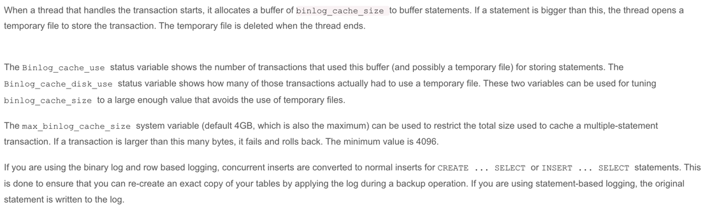

### 问题表现

错误异常 "Error writing file '/data/mysql-data/tmp/XXXX' (ErrorCode: 28 - No space left on device)"

### 问题排查

- /data/mysql-data/tmp为MySQL服务器的临时文件的存放地址，因此定位到问题发生的地方为tmp目录，临时文件位置可以使用如下命令查询：

```shell
show variables like 'tmpdir'
```

- 为什么会出现这个问题，根据查询binlog_cache的使用状况，发现binlog_cache_disk_use使用了1307次，binlog_cache_use为2388889次，因此
定位问题是因为磁盘使用次数过多

```shell
show global status like '%binlog_cache%'
```

- 什么情况下会导致binlog_cache使用磁盘进行存储呢，经过查阅文档发现，当binlog_cache大于binlog_cache_size的时候，就会使用磁盘存储，并存储到
临时文件中，binlog_cache_size为0.5M，当大于这个数据的时候，就会使用tmp文件

```shell
show variables like '%binlog_cache%'
```

[MySQL的参考文档](https://dev.mysql.com/doc/refman/5.6/en/binary-log.html)


- 结合业务代码判断，因为批量插入的语句比较多，因此会导致此问题。因此对binlog_cache_size进行修改，提升binlog_cache_size的大小


