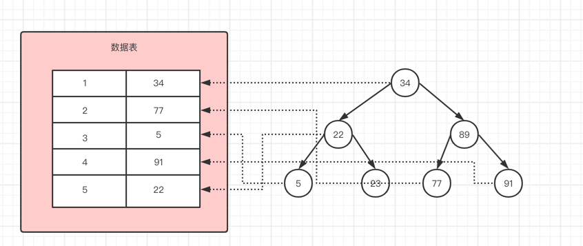
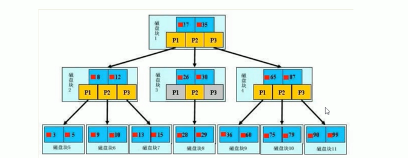

### 什么是Mysql索引

- 索引是帮组Mysql高效获取数据的数据接口，本质上来说是一种数据结构，可以简单的理解为"排好序的快速查找数据结构"

- 在数据之外，数据库还维护着满足特定查找算法的数据结构，这些数据结构以某种方式引用指向数据，
这样就可以在这些数据结构上实现高效的查找算法，这种数据结构就是索引

为了加快第二列的查找，可以维护一个右边所示的二叉查找树，每一个节点分别包含索引键值和一个指向对应数据记录的物理地址指针，
这样就可以运用二叉树查找在一定的复杂度内获取到相应数据，从而快速的检索出符合条件的索引。这个不是数据库真实的索引结构

- 一般来说索引本身也很大，不能全部存储到内存里，所以索引往往以索引文件的形式存储到磁盘上

---

### 索引的优势和劣势

- 优势
    - 提交检索的效率，降低数据库IO成本
    - 通过索引列对数据进行排序，降低数据排序的成本，降低了CPU的消耗
    
- 劣势
    - 实际上索引也是一张表，保存了主键与索引字段，并指向实体表的记录，所以索引列也是要占用空间的
    - 虽然索引大大提升了查询效率，但是同时也降低了更新表的速度，在更新表的时候，也要修改数据库索引
    - 需要花时间研究创建最优的索引或者优化查询
   
---

### 索引的分类

- 单值索引，即一个索引只包含单个列，一个表可以有多个单列索引

- 唯一索引，索引列的值必须唯一，单允许有控制

- 复合索引，即一个索引包含多个列

| 操作  |                            语句                             | 备注                     |
|:---:|:---------------------------------------------------------:|------------------------|
| 创建  | create [unique] index index_name on table(column(length)) | 如果是BLOB或者TEXT类型，必须指定长度 |
| 删除  |              drop index index_name on table               | -                      |
| 查看  |                   show index from table                   | -                      |

---

### 索引的结构

- B+Tree索引

实际情况中，3层的B+树可以表示上百万的数据，上百万的数据只需要三次IO

在此图中，浅蓝色的我们称之为磁盘块，每个磁盘块中包含多个数据项(深蓝色表示)和指针(黄色表示)

如图磁盘块1中包含了数据项17和15，包含指针P1,P2,P3

P1表示小于17的磁盘块，P2表示17到35之间的磁盘块，P3表示大于35的磁盘块

**而真实的数据存储到也只叶子节点上**，即3、5、9、10、13、15、28、29...等

- Hash索引

- Full-Text全文索引

- R-Tree索引

---

### 索引的创建

- 哪些情况适合创建索引

    - 主键自动创建索引
    - 频繁作为查询条件的字段应当做索引
    - 查询中与其他表关联的字段，外键关系建立索引
    - 频繁更新的字段不适合做索引
    - where条件里用不到的字段不创建索引
    - 单键/组合索引的选择问题，高并发下倾向创建组合索引
    - 查询中排序的字段，排序字段若通过索引去访问将大大提升排序效率
    - 查询中统计或者分组字段

- 哪些情况不适合创建索引

    - 表记录太少
    - 经常增、删、改的表
    - 如果数据列包含了许多重复的内容，创建索引没什么效果

---

### 性能分析

- Mysql中有专门负责SELECT语句的优化器模块，主要功能:通过计算分析系统中收集到的统计信息，
为客户请求的Query提供它认为最有的执行计划
  
- 当客户端向Mysql请求一条Query，命令解析器模块完成请求分类，去别处Select并转发给Mysql Query Optimizer， Optimizer
首先会对整条Query进行优化，处理掉一些常量表达式的预算、直接换成常量值，并对Query中的查询条件进行简化和转换，如果去掉一些无用或
显而易见的条件、结构调整等，然后分析Query中的Hint信息，看显示Hint信息是否可以完全确定该Query的执行计划，如果没有Hint或Hint信息不足以
完全确定执行计划，则会读取所涉及对象的统计信息，根据Query进行写相应的计算分析，然后再得出最后的执行计划

- Mysql常见瓶颈

  - CPU: CPU在饱和的时候一般发生在数据装入内存或从磁盘上读取数据的时候
  - IO: IO瓶颈发生在装入数据远大于内存容量的时候
  - 服务器硬件的性能瓶颈: top、free、iostat和vmstat来查看系统的性能状态

---

### Explain的执行分析

- id
  - select查询的序列号，包含一组数字，表示查询中执行select子句或操作表的顺序
  - 三种情况
    - id相同，执行顺序从上到下
    - id不同，id值越大则越优先被执行，如果是子查询，id的序号会递增
    - id相同和不同一起存在

- table

  - SIMPLE，简单的select查询，不包括子查询和union
  - PRIMARY，查询中包含任何复杂的字部分，最外层则被标记为PRIMARY
  - SUBQUEYR，在Select中Where列表中包含了的子查询
  - DERIVED，在FROM列表中包含的子查询被标记为DERIVED(衍生)，Mysql会递归执行这些子查询，把结果放在临时表
  - UNION，若第二个SELECT出现在UNION之后，则被标记为UNION；若UNION包含在FROM子句的子查询中，外层SELECT将被标记为DERIVED
  - UNION RESULT，从UNION表获取结果的SELECT
  
- type

  - 访问类型怕排序
  - 从最好到最差依次是 system > const > eq_ref > ref > range > index > all
  
    - system，表只有一行记录，等于系统表，这是const类型的特例，平时不会出现，这个也可以忽略不计
    - const，表示通过索引一次就找到了，const用于比较primary key或者unique索引。因为只匹配一行数据，所以很快，
    如果主键置于where列表中，Mysql就能将该查询转换为一个常量
    - eq_ref，唯一性索引扫描，对于每个索引键，表中只有一条记录与之匹配，常见于主键或唯一索引扫描
    - ref，非唯一索引扫描，返回匹配某个单独值的所有行，本质上也是一种索引访问，它返回所有匹配某个单独值的行，然后它可能会找到
    多个符合条件的行，所以它应该属于查找和扫描的混合体
    - range，只检索给定范围的行，使用一个索引来选择行，key列显示使用哪个索引，一般就是在你的where语句中出现了between、<、>、in等查询
    - index，full index scan，index与all的区别在于，index是遍历所有的索引数，通常比all快，如select id from A
    - all，full table scan，将遍历全表以查找到匹配的行

一般来说，必须保证查询至少达到range级别

- possible_keys，显示可能应用在这张表的索引，一个或多个

- key，实际使用的索引，如果为NULL，则没有使用索引，若使用了覆盖索引，则该索引仅出现在key列表中

- key_len，表示索引中使用的字节数，可通过该列计算查询中使用的索引的长度，在不损失准确度的情况下，长度越短越好。key_len显示的值
为索引字段的最大可能长度，并非实际使用长度，即key_len是根据表定义计算而得，不是通过表内检索出的
  
- ref，显示索引的哪一列被使用了，如果可能的话，是一个常数，哪些列或常量被用于查找索引列上的值

- rows，根据表统计信息以及索引选择情况，大致估算出找到所需的记录所需要读取的行数

- extra，不适合在其他列显示，但是十分重要的额外信息

  - using filesort，Mysql中无法利用索引完成的排序操作成为"文件排序"，出现这种问题的时候要引起重视
  - using temporary，Mysql需要使用临时表来存储结果集，常见于排序和分组查询，这个值表示使用了内部临时表(基于内存的)，一个查询可能用到多个临时表，
  常见于不同表上使用了distinct，或者使用了不同的order by和group by列，遇到这个问题一定要去解决
  - using where，表示服务器将在存储引擎检索行后进行过滤，许多where条件里设计索引中的列，当它读取索引时，就能被存储引擎检验，因此不是所有带where
  子句的查询都会显示"using where"
  - using index，表示select使用了覆盖索引，即查询的字段在索引中就能找到，不需要再根据索引再读取数据文件
  - using join buffer，在获取连接条件的时候没有使用索引，并且需要连接缓冲区来存储中间结果，如果出现这个值需要注意，根据查询的具体情况可以按需添加索引来解决这个问题
  - impossible where，强调了where语句会导致没有符合条件的行
  - select tables optimized away，意味着仅通过使用索引，优化器可能仅从聚合函数结果中返回一行
  - index merges，当Mysql决定再一个给定的表上使用超过一个索引的时候，就会出现以下格式中的一个，详细说明使用的索引以及合并的类型

