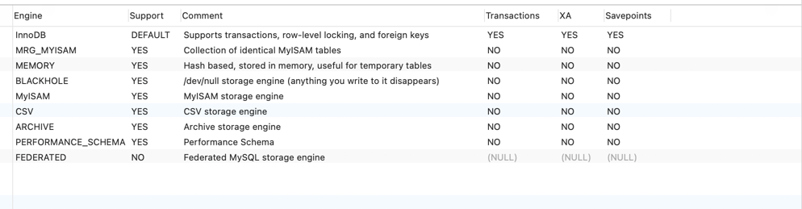
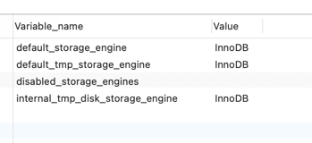

### 查看支持的存储引擎

    show engines;

### 查看当前使用存储引擎
 
    SHOW VARIABLES LIKE '%storage_engine%'

### MyISAM 和 InnoDB的区别

| 对比项 | MyISAM | InnoDB |
|----|----|----|
主外键 | 不支持 | 支持
事务 | 不支持 | 支持
行表锁 | 表锁，即使操作一条记录也会锁住整个表，不适合高并发操作 | 行锁，操作时只锁一行，不对其他行有影响，适合高并发
缓存 | 只缓存索引，不缓存数据 | 不仅缓存索引，还会缓存数据，对内存要求比较高，而且内存大小对性能有决定性的影响
表空间 | 小 | 大
关注点 | 性能 | 事务
默认安装 | 是 | 是

