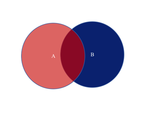
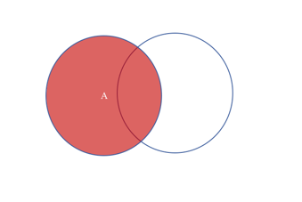
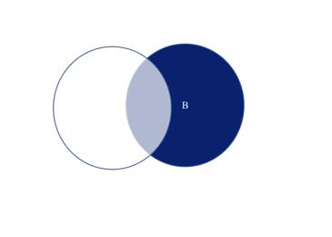
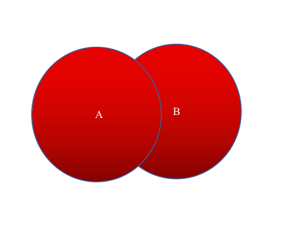
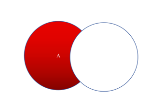
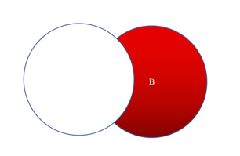
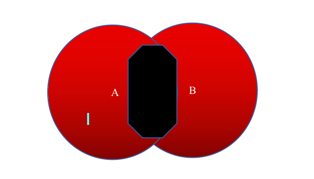

### inner join

    select <select_list> from A inner join B on A.key = B.key

其中A和B重叠的部分就是Inner Join的结果

### left join

    select <select_list> from A left join B on A.key = B.key

其中A的全部就是left join的结果

### right join

    select <select_list> from A right join B on A.key = B.key

### full outer joiner 

mysql不支持此操作，可以用union等效，因为union也有去重的效果

    select <select_list> from A full outer join B on A.key = B.key

等价于    

    select <select_list> from A left join B on A.key = B.key 
    union
    select <select_list> from A right join B on A.key = B.key

### the left join and B is null

    select <select_list> from A left join B on A.key = B.key where B.key is NULL

### the right join and A is null

    select <select_list> from A right join B on A.key = B.key where A.key is NULL

### the full outer join and (A is null Or B is null)

    select <select_list> from A full outer join B on A.key = B.key where A.key is NULL or B.key is NULL

等价于
    
    select <select_list> from A left join B on A.key = B.key where B.key is NULL
    union
    select <select_list> from A right join B on A.key = B.key where A.key is NULL

结果是去除黑色的面积
