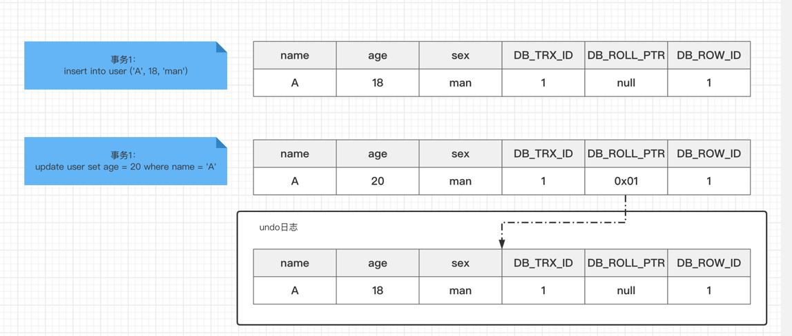
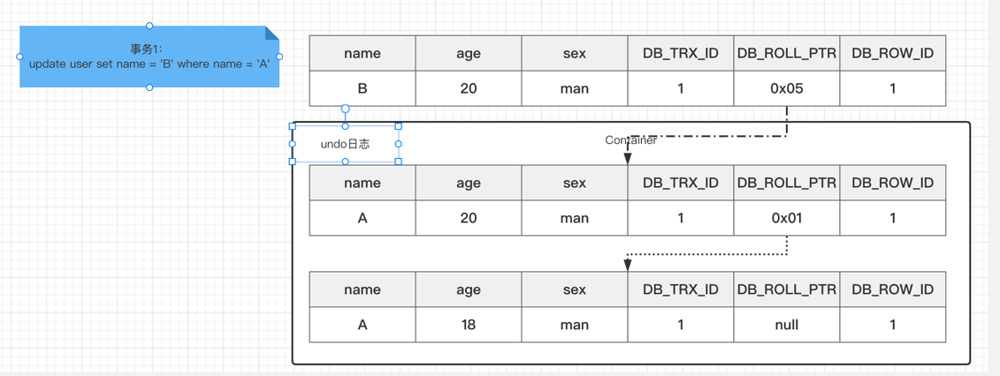
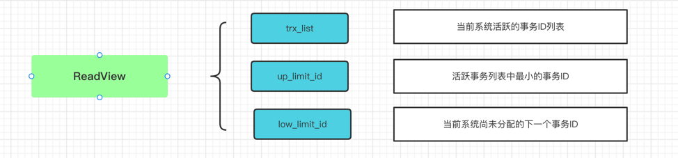

### 什么是MVCC

MVCC(Multi-Version Concurrency Control)，多版本并发控制，是一种并发控制方法，一般在数据库管理系统中，实现对数据库的并发访问，在编程语言中实现事务内存。

**MVCC主要是为了提高数据库并发性能，用更好的方式处理读-写冲突，做到即使有读写冲突，也能做到不加锁，非阻塞并发读**。

### 当前读和快照读

- 当前读

  - 像select lock in share mode(S锁)，select for update、update、insert、delete(X锁)这些操作都是当前读；
  - 这些读取都是记录的最新版本，读取时还要保障其他事务不能修改当前记录，会对读取的记录进行加锁

- 快照读
  
  - 向不加锁的select操作就是快照读，即不加锁的非阻塞读；快照读的前提隔离级别不是串行级别(SERIALIZABLE)，串行的级别快照读会退化为当前读；
  - 快照读是基于提高并发性能，快照读的实现是基于多版本并发控制，即MVCC，可以认为MVCC是行锁的一个变种，很多情况下避免了加锁操作，降低开销
  - 基于快照读，可能读取的数据不是最新版本的，而有可能是之前的历史版本

### 当前读、快照读和MVCC的关系

- MVCC是一个数据的多个版本，使得读写操作没有冲突的概念，只是一个抽象概念，不是具体实现
- MySQL需要提供具体的功能去实现它，快照读是MySQL实现MVCC理想模型的其中一个非阻塞功能，快照读本身也是一个抽象概念，MySQL的具体实现通过3个隐藏字段、undo日志、ReadView完成的
- 相对而言，当前读就是悲观锁的具体实现

### 数据库的并发场景

- 读读: 不存在任何问题，不需要并发控制
- 读写: 存在线程安全，可能会遇到脏读、幻读、不可重复读等问题，需要MVCC
- 写写: 存在线程安全，可能存在更新丢失问题，如第一类更新丢失、第二类信息丢失

MVCC是一种解决读-写冲突的无锁并发控制，也就是为事务分配单向增长的时间戳，为每个修改保存一个版本，版本与事务时间关联，读操作只读该事务开始前的数据库快照。因此可以解决一下问题：
- 并发读取数据库时，可以做到读操作时不阻塞写操作，写操作也不阻塞读操作，提高数据库性能
- 解决脏读、幻读、不可重复读等事务隔离问题，但是不能解决更新丢失问题

### MVCC的工作原理

MVCC的目的就是多版本并发控制，在数据库中的实现，就是为了解决读写冲突，他的实现远离主要是依赖记录中的三个隐藏字段，undo日志和ReadView实现的

#### 隐藏字段

- DB_TRX_ID，记录最近更新这条记录的事务ID，大小为6字节
- DB_ROLL_PTR，表示该行回滚段(rollback segment)的指针，大小为7个字节，InnoDB便是通过这个找到之前版本的数据，该行记录上所有的旧版本，在Undo日志中通过链表的形式组织
- DB_ROW_ID，行标识(隐藏单调递增ID)，大小为6字节，如果表上没有主键，InnoDB会自动生成隐藏主键，因此会出现此列

#### ReadView

- ReadView是事务进行快照读操作时产生的读视图，在事务执行的那一刻，会生成数据库系统当前的一个快照，记录并维护系统当前活跃事务的ID(当每个事务开启时，都会被分配一个ID，这个ID是递增的)
- ReadView主要是用来判断可见性的，即当我们某个事务执行快照读的时候，对该记录创建一个ReadView读视图，然后用来判断当前事务能够看到哪些版本的数据，即可能是当前最新的数据，也可能是该记录的undo log里某个版本的数据
- ReadView遵循一个可见性算法，即将当前事务ID取出来，与系统当前其他活跃事务的ID去对比(由ReadView维护)，如果DB_TRX_ID跟ReadView的属性做比较，不符合可见性的就通过DB_ROLL_PTR去取undo log中的DB_TRX_ID再比较，直到查询到满足特定的DB_TRX_ID，这个所在的记录就是当前事务能看到的最新老版本

#### 可见性算法

- 首先比较DB_TRX_ID < up_limit_id，如果小于，在当前事务能看到DB_TRX_ID所在的记录，如果大于或者等于则进入下一个判断
- 其次如果DB_TRX_ID >= low_limit_id，如果条件符合则代表DB_TRX_ID所在记录在ReadView生成后才出现的，对于当前事务，肯定看不到DB_TRX_ID所在的记录，进入下一个判断
- 判断DB_TRX_ID是否在trx_list中，如果在，则代表ReadView生成时，这个事务还是活跃状态，还没提交，修改的数据对当前数据是不可见的，如果不在说明此事数据已经提交了，那么修改的结果对当前事务就是可见的

### 总结

能够看到事务修改的数据，取决于可见性算法，可见性算法比较的时候又取决于ReadView中的结果值。因为在不同隔离级别中，生成ReadView的时机是不同的

- RC：每次执行快照读都会重新生成新的ReadView(因此RC的隔离机制，会出现不可重复度，因为每次select都会生成新的ReadView读取到别的事务提交的数据)
- RR：只要当第一次事务进行快照读的时候才会生成ReadView，之后的快照读都会复用当前的快照读