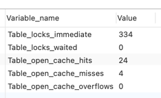
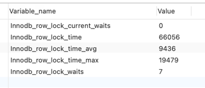

### 锁的分类

- 从对数据库操作的类型分
    - 读锁，又称为共享锁
    - 写锁，又称为排它锁
    
- 从对数据库操作的颗粒对分
    - 表锁
    - 行锁
  
### 共享锁:

共享锁又称为读锁，简称S锁，顾名思义就是多个事务对于同一数据可以共享一把锁，都能访问到最新的数据

|session1 | session2|
|---|---|
|begin; | begin;|
|select * from tb_user where id = 1 lock in share mode   // 锁定记录成功 | -|
|- |  select * from tb_user where id = 1 lock in share mode    // 也可以锁定成功|
|update tb_user set username='asheng' where id = 1;   select sleep(10);   // 执行成功并且等待10s | -|
|- | update tb_user set username='asheng1' where id = 1;   // 有可能会直接抛出死锁，或者执行进入阻塞|
|commit; | 此时update才会执行成功|

- 结论
    - 多个事务的查询语句可以共用一把共享锁
    - 如果只有一个事务拿到了共享锁，他可以对数据进行UPDATE、DELETE等修改操作
    - 如果多个事务拿到了共享锁，则所有事务都不能对数据进行UPDATE、DELETE等修改操作
    

### 排它锁

排它锁又称为写锁，简称X锁，顾名思义排它锁不能和其他的锁共存，并且只有一个事务能拿到某一行数据的排它锁，其他事务均不能获取到该锁

|session1 | session2|
|---|---|
|begin | begin|
|select * from tb_user where id = 1 for update;   // 执行成功 | - |
| - | select * from tb_user where id = 1 for update;   // 将会进入阻塞|
|update tb_user set username='asheng' where id = 1;   // 执行成功 | // 继续阻塞|
|commit | 此时session2进入查询并且加锁成功|

- 结论:
    - 只有一个事务能够获取该数据的排它锁
    - 一旦有一个事务获取到该数据的排它锁以后，其他的事务对该数据的操作都会进入阻塞，直到锁释放

### 共享锁/排它锁的使用场景

- 共享锁:
    - 确保某个事务查询到最新的数据
    - 这个事务不需要对数据进行修改、删除等操作
    - 也不允许其他事务对该数据进行修改、删除等操作
    - 其他事务也能确保查询到最新的数据

- 排它锁
    - 确保某个事务查询到最新的数据
    - 并且只有该事务能对数据进行修改、删除操作

### 共享锁/排它锁的性能影响

- 因为排它锁只允许一个事务获取，因此在高并发的情况下，一旦有业务释放不及时，会导致其他事务阻塞，导致锁等待超时以及死锁等

- 虽然共享锁是多个事务共享，但一旦有多个事务同时获取了共享锁，则所有的事务都不能进行了修改操作，也会导致事务阻塞，锁超时和死锁等

- 都会影响数据库的并发问题

简而言之，就是读锁会阻塞写，但不会阻塞读，但是写锁会把读和写都阻塞

---

### 表锁

- 即对整张表进行加锁，例如

  
    lock table table_name read/write;

- 因为表锁颗粒度大，所以竞争的概率高，因此并发度比较低

|session1 | session2|
|---|---|
|lock table tb_user read;   // 使用读锁进行锁表 | -|
|select * from tb_user   // 可以执行 | select * from tb_user   // 可以执行|
|select * from tb_teacher   // 在不释放锁的情况，不能读取其他表  | select * from tb_teacher   // 可以执行|
|update tb_user set username = 'a'   // 不释放锁不能执行，将会执行报错 | -|
|- | update tb_user set username = 'a'   // 不释放锁将会一直阻塞|
|unlock tables;   // 释放锁 | 此时update阻塞结束|

- 看看那些表被加锁了
    

    show open tables;

- 如何分析表锁定

    - table_locks_immediate，产生表级锁的次数，表示可以立即获取锁的查询次数，每立即获取锁值+1
    - table_locks_waited，出现标记锁定争用而发生等待的次数(不能立即获取锁的次数，每次等待+1)，值越高说明表级锁竞争越严重
    

    show status like 'table%'

### 行锁

- 记录锁是封锁记录，记录锁也叫行锁，例如

  
    select * from test where id = 1 for update;
    // 就会在id=1的记录上加上记录锁，用来阻止其他事务的插入、更新、删除等

- 记录锁、间隙锁、临建锁都是排它锁

- 行锁颗粒度小，所以锁竞争的概率低，因此并发度高

- 索引失效会导致锁表，比如varchar类型不适用双引号''引发的索引失效

    
    create unique index idx_name on tb_user(username);
    // 这条语句正常来说只会锁行
    select * from tb_user where username = '1' for update;
    // 由于username类型错误，会导致索引失效进而导致锁表
    select * from tb_user where username = 1 for update;

- 分析行锁

  - Innodb_row_lock_current_waits，当前正在等待锁定的数量
  - Innodb_row_lock_time，从系统启动到现在锁定总时间，重要指标
  - Innodb_row_lock_time_avg，每次等待所花费的平均时间，重要指标
  - Innodb_row_lock_time_max，从系统启动到现在最长的一次锁定等待时间
  - Innodb_row_lock_waits，系统启动后到现在总共等待次数，总要指标
  

    show status like 'innodb_row_lock%'

---

### 间隙锁

- 当我们使用范围条件而不是相等条件检索数据的时候，并请求共享锁或者排它锁的时候，InnoDB就会给符合条件的已有数据记录的索引项进行加锁
- 对于键值的条件范围内不存在的记录，叫做"间隙(GAP)"
- InnoDB也会对这个"间隙"加锁，这种锁机制就是所谓的间隙锁(Next-key锁)

|session1 | session2|
|---|---|
|select * from tb_user;   // 存在两条记录，分别为id为1和id为3的记录 | - |
|begin; | begin;|
|select * from tb_user where id > 1 and id < 3 for update;   // 此时会对1-3的数据产生间隙锁 | -|
|- | INSERT INTO tb_user(`id`, `create_time`, `update_time`, `delete_time`, `username`, `password`, `salt`, `phone`, `role`)   VALUES (2, '2021-01-29 09:09:43', '2021-01-29 09:09:46', NULL, 'b', 'aa', 'aa', '18326937760', 'admin');   // 此时插入1-3之内的间隙，就进入等待|
|commit;   // 提交事务 | 此时插入成功|

- 结论

  - 使用唯一索引进行查询的时候，如果只查询到一条记录，这个时候会使用行锁，如果记录不存在会产生行锁和间隙锁
  - 使用唯一索引进行范围查找的时候会产生间隙锁
  - 在普通索引上，不管使用什么查询，只要加锁都会产生间隙锁，这个唯一索引不同
  - 在普通索引上和唯一索引中，数据间隙的分析，数据行会有限根据普通索引排序，在根据唯一索引排序

---

### 意向锁

- 意向共享锁
- 意向排它锁

- 解析
  - 意向锁分别对应共享锁和排他锁，在申请这两种锁的时候都会先申请意向锁
  - 意向锁会记录当前数据表中的锁状态
  - 当对全表进行修改的时候，就会使用意向锁进行判读，如果有锁就等待。当没锁的时候就获取锁，这样其他的操作也要在整张表操作完以后才能修改
  - 这样就可以大大的提高效率，不用逐条检查

这种情况就类似于，在一个游乐园分别有出口和入口，入口的地方会进行检票，出口的地方也进行检票，这样出口的检票次数-入口检票次数就是剩余的数量，如果>0就表示有人还在游乐园，=0表示人都离场了，可以清场了
