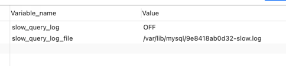
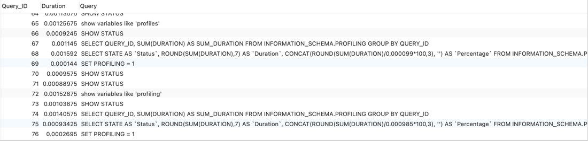
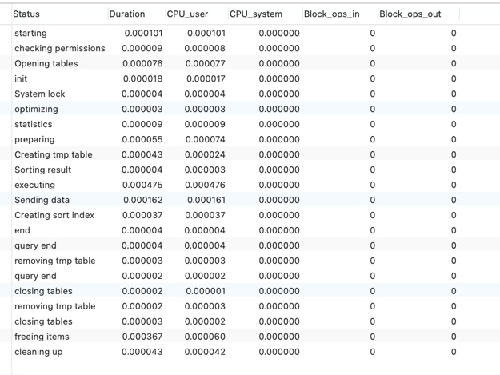

### 遵循的原则

- 全值匹配，查询的字段按照顺序在索引中都可以匹配到

    create index idx_name_age_gender on user('name', 'age', 'gender')
    explain select * from user where name = 'asheng'
    explain select * from user where name = 'asheng' and age = 10
    explain select * from user where name = 'asheng' and age = 10 and gender = 1
    
其中最后一条查询的列都在索引中，所以索引使用到的长度更长，但是所以会更加精准

- 最佳左前缀法则，如果索引了多列，要遵循最左前缀法则，指的是查询从索引的最左前列开始并且不跳过索引的列

- 不在索引列上做任何操作，如计算、函数、自动或手动的类型转换，会导致索引失效从而转向全表扫描

    explain select * from user where left(name,4) = 'asheng'

- 存储引擎不能使用索引中范围条件右边的列

    create index idx_name_age_gender on user('name', 'age', 'gender')
    explain select * from user where name = 'asheng' and age > 25 and gender = '1'

- 尽量使用覆盖索引，避免select *

- 使用不等于(!= 或者 <>)的时候无法使用索引会导致全表扫描

    explain select * from user where name != 'asheng'

- is null, is not null也无法使用索引

    
    explain select * from user where name is null

- like以通配符开头('%abc')会导致mysql索引失效从而全表扫描

    explain select * from user where name like '%asheng'

- 字符串不加单引号导致索引失效

    
    explain select * from user where name = 100，mysql会自己转换，但是会导致索引失效

- 少用or，用它来连接的时候会导致索引失效

    
    explain select * from user where name = 'asheng' or age = 12

---

### 索引优化

- 小表驱动大表

- order by子句，尽量使用index方式排序，避免使用filesort方式排序。mysql支持index和filesort
两种方式排序，但是index效率较高，而filesort方式效率低
  
    - order by语句使用索引最左前列
    - 使用where子句与order by子句条件列组合满足索引最前列
    - 尽可能在索引列上完成排序
    - 单路排序和双路排序，如果单路排序中sort_buffer不足的时候，可能要执行更多次io，性能可能低于双路，可以通过调增sort_buffer和max_length_for_sort_data来优化
    
- group by的优化和order by 差不多
  
    - 遵循最佳左前缀原则
    - 无法使用索引列的时候，增大max_length_for_sort_data参数的设置+增大sort_buffer_size参数
    - where高于having，能写在where限定条件不需要写去having中限制

---

### mysql慢日志

- 查看是否开启
    

    SHOW VARIABLES LIKE '%slow_query_log%';

- 开启慢日志查询

    set global slow_query_log = 1

- 配置慢日志阈值，仅大于阈值的才会被记录

    show variables like 'long_query_time%'
    set global long_query_time = 3

- 通过my.cnf修改

  
    [mysqld]
    slow_query_log=1
    slow_query_log_file=/var/lib/mysql/slow_sql.log

- 有的时候配置后需要重新连接或者打开一个新的会话才能看到修改值

---

### mysqldumpslow

- mysqldumpslow的帮助信息

| 参数  | 备注                  |
|-----|---------------------|
| s   | 按照何种方式排序            |
| c   | 访问次数                |
| l   | 锁定时间                |
| r   | 返回记录                |
| t   | 查询时间                |
| al  | 平均锁定时间              |
| ar  | 平均返回记录数             |
| at  | 平均查询时间              |
| t   | 即为返回前面多少条的数据        |
| g   | 后面搭配一个正则匹配模式，大小写不敏感 |

- 用法

| 语句                                                    | 备注                           |
|-------------------------------------------------------|------------------------------|
| mysqldumpslow -s r -t 10 slow_sql.log                 | 得到返回记录集最多的10个sql             |
| mysqldumpslow -s c -t 10 slow_sql.log                 | 得到访问次数最多的10个sql              |
| mysqldumpslow -s t -t 10 - g "left join" slow_sql.log | 得到按照时间排序的前10条里面包含左连接的查询语句    |
| mysqldumpslow -s r -t 10 slow_sql.log & more          | 使用上面命令输出，并使用more查看，避免出现刷屏的情况 |

---

### show profile

- 配置profile

    show variables like 'profiling'
    set global profile = 'ON'

- 执行show profile
    
    
    show profiles

第一列为queryId，第二行为耗时，第三行是查询语句

- 诊断SQL，show profile cpu, block io for query queryId

    
    show profile cpu, block io for query 10

- type

| 参数               | 备注                                              |
|------------------|-------------------------------------------------|
| ALL              | 显示所有的开销信息                                       |
| BLOCK IO         | 显示块IO相关开销                                       |
| CONTEXT SWITCHES | 上下文切换相关开销                                       |
| CPU              | 显示CPU相关开销                                       |
| IPC              | 显示发送和接收相关开销                                     |
| MEMORY           | 显示内存先关开销                                        |
| PAGE FAULTS      | 显示页面错误相关开销                                      |
| SOURCE           | 显示和SOURCE_FUNCTION、SOURCE_FILE、SOURCE_LINE相关的开销 |
| SWAPS            | 显示交换次数相关开销                                      |

- 重点关注的结果

  - converting HEAP to MyISAM，结果查询太大，内存不够用了往磁盘上搬运
  - Creating tmp table，创建临时表
    - 拷贝数据到临时表
    - 用完再删除
  - Copying to tmp table on disk，把内存中的临时表复制到磁盘，危险
  - locked

