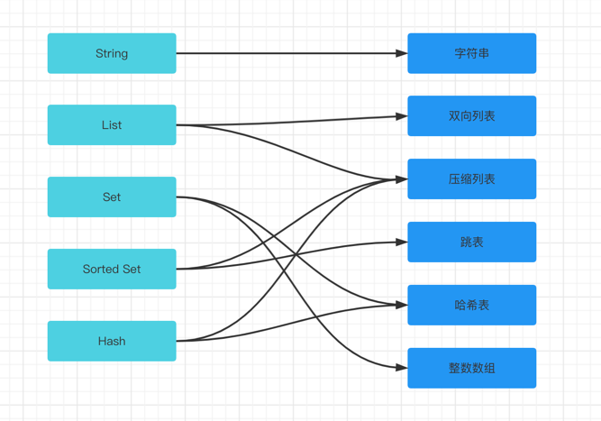
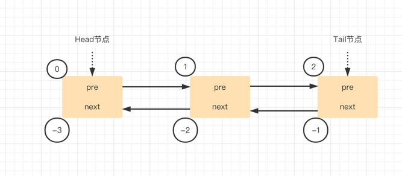
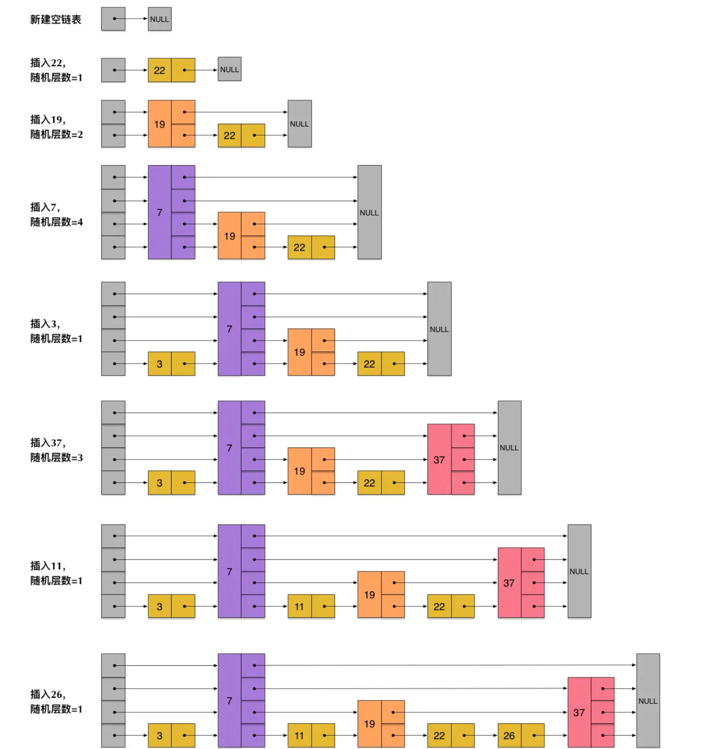
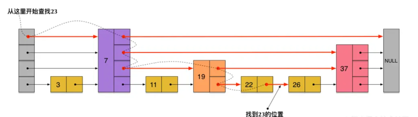
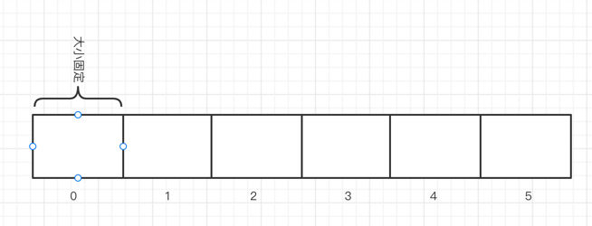
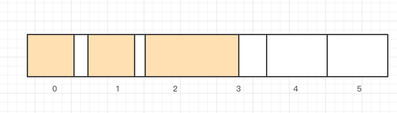
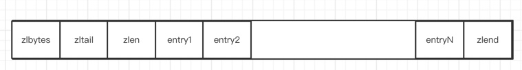
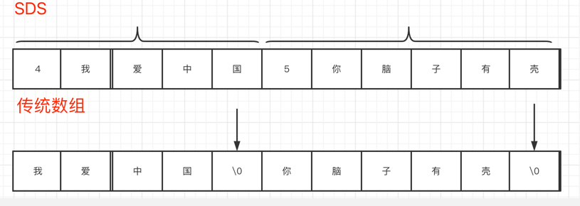

## Redis的数据结构

### 常用的数据结构

- String（字符串）
- List（列表）
- Set （集合）
- Sorted Set（有序集合）
- Hash （哈希）

### 双向链表

- 双向链表在Redis中主要是应用于List数据类型中，链表中每个节点都有一个指针指向前后的节点，头部的节点为Head节点，尾部的为Tail节点
- 通过lpush和rpush可以分别向链表的前后添加数据，通过lpop和rpop分别获取链表前后的数据
- 另外链表中每个节点还记录了正负索引，正索引从左到右0-N进行记录，负索引则从右到左-1--N进行记录。这样就可以通过正负索引使用lrange这样的指令进行范围查找

### 跳表

链表中如果要查找某个元素只能挨个遍历链表中的元素进行筛选，所以查询效率低。

- SortedSet使用跳表的数据结构来保存数据的
- 跳表是在链表的基础上进行排序，然后再进行二分查找法的优化
- 根据规则抽取链表中的节点构建另一个聊表，查找元素时通过最上层的链表逐渐向下查找，最终找到匹配元素或者返回空
- SortedSet的一个特征就是可以根据分值来进行范围查找和排序

跳表构建的逻辑

跳表查找的逻辑

### 压缩列表

压缩列表是在数据的基础上改造的的一种数据结构，传统的数组时申请连续的空间，每个存储元素的空间都是相同的，也是因为这种结构所以我们可以根据下标快速查找

加入存储不定长的数据，因为保存的数据长度不固定就会导致资源浪费的情况

因此引出了压缩列表，压缩列表可以有效的解决上述问题

- 和数组一样，创建的时候申请一段连续的内存空间
- 和数组不同的时，每个元素的空间是不固定的，每个元素都需要记录自己的实际长度和村粗数据，在读取数据的时候，通过记录的长度来解决开始位置和结束位置

- zlbytes: 4字节，记录压缩列表占用的内存字节数，在对压缩列表进行内存重分配或者计算zlend的位置时候使用
- zltail: 4字节，记录压缩列表表尾节点记录压缩列表的起始位置有多少个字节，可以快速定位到表尾地址
- zllen: 记录节点数量
- entry: 压缩列表中各节点信息，节点的长度由节点自己保存
- zlend: 特殊值0xFF，用于记录压缩列表的末端

### 哈希表

Redis的哈希表主要是由数组、链表实现的，通过哈希算法得到唯一hash值，然后通过hash值得到存储的下标，然后通过链表的方式把hash冲突的key关联到一起

### 整数数组

因为init4、int8、int16、int32、int64占的大小不同，因此为了不会产生空间浪费，所以根据数据的长度选择相应的存储空间，但是如果遇到空间不能保存的时候
就会进行整体的升级，即以最大的元素存储空间为标准

### 动态字符串

Redis中使用SDS(simple dynamic string)简单动态字符串作为String类型的存储结构，相较于传统的字符串具备下面的特点

- SDS的遍历速度快，SDS相比于传统的字符串，他保存了字符串数据的长度属性，获取的时候，只需要长度既可以计算出实际存储值的内存地址，就可以直接获取，而传统的需要组个遍历，需要结束符停止
- SDS是二进制安全的，因为有长度可以直接获取，因此可有有效分割。而传统的使用特殊字符分割，会存在因为保存的数据中有特殊的字符，就会破坏原有的意义

