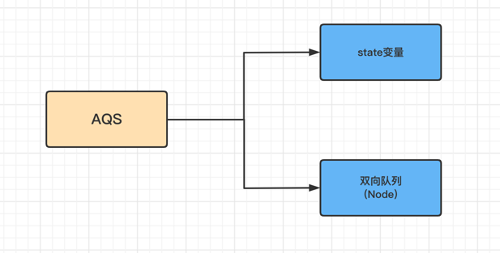
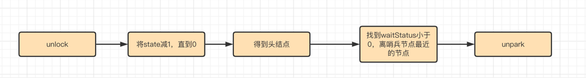

### AQS是什么

AQS全称AbstractQueuedSyschroinzer，内部实现是为了一个FIFO的队列和state状态变量(volatile)。FIFO队列存储的载体叫Node节点，该
节点标识着当前的状态值，是独享的还是共享模式，以及它的前驱和后驱节点等信息。ReentrantLock、Semphore、CountDownLatch、CycliceBarrier均
依赖AQS实现的。AQS支持两种模式：独占(锁只会被一个线程独占)和共享(多个线程可以同时执行).




### AQS的模板方法

- state为共享变量、是int类型数据，访问方式有三种，三种方法均为原子操作

```
// 查看state值
int getState()
// 设置state值
setState(int newState)
// 修改state值
compareAndSetState(int expect, int update)
```

- 资源的共享方式有2种

  - 1.独占方式[exclusive]: 只有一个线程能够成功获取到资源，入ReentrantLock
  - 2.共享式[shared]: 多个线程可以成功获取资源并执行，如sempahore/countDownLatch等


- AQS将大部分的同步逻辑都已实现好了，自定义同步器只需要实现state的获取和释放即可，主要包括如下方法
  - 1.tryAcquire(int):独占方式、尝试获取资源，成功返回true，失败false
  - 2.tryRelease(int):独占方式、释放资源
  - 3.tryAcquireShared(int):共享方式、尝试获取资源、负数失败，0:无可用资源，1:有剩余资源
  - 4.tryReleaseShared(int)：共享方式、释放资源，如果释放后允许唤醒后续等待节点返回true，否则返回false
  - 5.isHeldExclusively()：该线程是否正在独占资源，只有用到condition才需要实现它

### ReentrantLock详解

#### ReentrantLock非公平锁的加锁过程

- CAS尝试加锁，获取成功则执行同步代码块
- CAS获取失败，则调用acquire方法，acquire方法为AQS模板方法
- acquire首先会调用子类的tryAcquire方法(ReentrantLock)
- tryAcquire会判断当前state是否是0，等于0表示没加锁，采用CAS尝试加锁
- 如果CAS成功，则可以执行同步代码块
- 如果CAS失败，则判断当前线程是否持有锁，如果持有锁更新state的值，获取到锁（锁重入）
- CAS失败而且非重入失败，则回到tryAcquire方法执行入队列操作
- 将节点入队列后，会判断前驱节点是否是哨兵节点，如果是，则通过使用CAS尝试获取锁
- 如果前驱节点时哨兵，并获取到锁，则把当前节点当做哨兵，并把前驱节点释放
- 如果没获取到锁，则判断前驱节点的状态是否是SIGNAL，如果不是，则找到合法的前驱节点，并使用CAS将状态设置为SIGNAL
- 最后调用park方法将当前线程挂起


#### ReentrantLock解锁过程

- 调用unlock方法，实际上会调用AQS的release方法，而release方法会调用子类tryRelease方法
- tryRelease方法会把state一直减，直到为0，当前线程说明已经把锁释放了
- 找到离哨兵节点最近的节点进行唤醒
- 唤醒之后，被唤醒的线程则尝试使用CAS获取锁，假设获取到锁则把哨兵节点释放，自己做哨兵节点



### 代码详解

#### Lock接口的实现类

```java
public interface Lock {
    // 如果锁可用就获取锁，如果不可用就阻塞一直到锁释放
    void lock();
    // 和lock方法相似，但是可以中断，抛出InterruptedException异常
    void lockInterruptibly();
    // 非阻塞的方式加锁，尝试加锁，如果成功就返回true
    boolean tryLock();
    // 带有超时时间的获取锁方式
    boolean tryLock(long timeout, TimeUnit timeUnit);
    // 释放锁
    void unlock();
}
```

- ReentrantLock: 
可重入锁，他是唯一一个实现Lock接口的类，可重入锁即在此获取锁之后，再次获取锁的时候不需要阻塞，只需要计数器加一

- ReentrantReadWriteLock:
重入读写锁，它实现了ReadWriteLock接口，在这个类中维护了两个锁，一个ReadLock，一个WriteLock，他们都分别实现了Lock接口。读写锁适用于读多写少的场景。基本原则是:读和读不互斥，读和写互斥，写和写互斥

- StampedLock:
JDK8引入新的锁机制，可以认为是读写锁改进的一个版本，因为读写锁在高并发下，如果存在大量的读操作，写的线程会引起饥饿。StampedLock是一种乐观锁的读策略，所以完全不会阻塞写线程


#### AQS和ReentrantLock的类图


#### ReentrantLock的时序图


- ReentrantLock.lock()
```
public void lock() {
   sync.lock()
}
```

- NonfairSync.lock()

```
final void lock() {
   // 通过cas来操作修改state状态，表示抢占锁的操作
   if(compareAndSetState(0,1)){
       // 设置当前线程获取锁
       setExclusiveOwnerThread(Thread.currentThread());
   } else {
       // 尝试去获取锁
       acquire(1)
   }
}
```

- AQS.acquire()

```
public final void acquire(int arg) {
    // 尝试获取锁，如果获取不到则进入acquireQueued方法
   if (!tryAcquire(arg) && acquireQueued(addWaiter(Node.EXCLUSICE), arg)) {
       selfInterrupt();
   }
}
```

- Nofair.tryAcquire()

```
procted final boolean tryAcquire(int acquires) {
    return nonfairTryAcquire(acquires);
}
```

- ReentrantLock.nonfairTryAcquire(int acquires)

```
final boolean nofairTryAcquire(int acquires) {
   final Thread current = Thread.currentThread();
   if c = getState();
   if (c == 0) { // 说明当前没有锁，多线程通过CAS去抢占锁
        // 通过cas操作来替换state，因为多线程存在线程安全问题
        if(compareAndSetState(0, acquires)) {
            setExclusiceOwnerThred(current);
            return true;
        }
   } else if (current == getExcluseiveOwnerThread()) { // 锁重入
       int nextc = c + acquires;
       if (nextc < 0) {
            throw new Error("maximum lock count exceeded")
       }
       setState(nextc);
       retrun true;
   }
   return false;
}
```

- AQS.addWaiter()

addWaiter方法，当tryAcquire方法获取锁失败后，则会先调用addWaiter将当前线程封装成Node，然后添加到AQS队列中

```
    // 这里的mode == Node.EXCLUSIVE
    private Node addWaiter(Node mode) {
        // 封装成为node
        Node node = new Node(Thread.currentThread(), mode);
        
        // tail是AQS的队尾属性，刚开始为null
        Node pred = tail;
        if(pred != null) {
            // 通过CAS把node添加到队尾
            node.prev = pred;
            if (compareAndSetTail(pred, node)) {
                pred.next = node;
                return node;
            }
        }
        // tail == null， 将node添加到同步队列中
        enq(node);
        return nidel
    }

    private Node enq(Node node) {
        for(;;) {
            Node t = tail;
            if (t == null) {
                // CAS的方式创建一个空的Node最为head
                if (compareAndSetHead(new Node) {
                    // tail也使用head,此时只有一个节点
                    tail = head;
                }
            } else {
                node.prev = t;
                if (compareAndSetTail(t, node)) {
                    t.nect = node;
                    return t;
                }
            }
        }
        
    }
```

- AQS.acquireQueued()

```
    final boolean acquireQueued(fianl Node node, int arg) {
        boolean failed = true;
        try {
            boolean interrupted = false;
            for(;;) {
                // 获取prev节点，若为null即抛出NPT
                final Node p = node.predecessor();
                // 如果是头结点才有资格进行锁抢占
                if (p == head && tryAcquire(arg)) {
                    // 获取锁成功，就不需要通过操作了
                    setHead(node);
                    // 加快gc
                    p.next = null;
                    // 获取锁成功
                    fialed = false;
                    reutrn interrupted;
                }
                // 如果锁获取失败，则根据当前节点的waitStatus决定是否要挂起线程，如果允许挂起，则执行挂起操作等待下次唤醒，唤醒以后继续上面抢占锁的流程
                if (shouldParkAfterFailedAcquire(p, node) && parkAndCheckInterupt()) {
                    interrupted = true;
                }
            }
        } finally {
            if (falied) {
                cancelAcquire(node);
            }
        }
    }
```

- AQS.shouldParkAfterFailedAcquire()

```
    private static boolean shouldParkAfterFailedAcquire(Node pred, Node node) {
        if ws = pred.waitStatus;
        // 如果前继节点是SIGNAL状态，意味着当前线程需要被Unpark唤醒
        if (ws == Node.SIGNAL) {
            return true;
        }
        
        // 如果大于0，即为CANCEL状态，则会从当前节点一直向后，剔除队列中的CANCELED的节点
        if （ws > 0） {
            do {
                node.prev = pred = pred.prevv;
            } while (pred.waitStatus > 0);
        } else {
            compareAndSetWaitStatus(pred, ws, Node.SIGNAL);
        }
        return false;
    }
```

- AQS.parkAndCheckInterrupt()

通过LockSupport.park将当前线程挂起到WAITING状态，需要等待一个中断、unpark方法来唤醒它，通过这样的一中FIFO的机制等待，来实现了Lock操作。LockSupport是Java6引入的类，提供了基本的线程同步原语

### 4. 锁释放

释放过程及调用了release方法，主要是释放锁，唤醒park线程。通过传入Head节点，当前线程释放以后，通过LockSupoort.unpark掉下一个节点的线程
