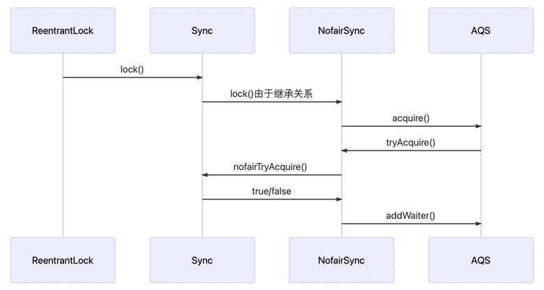

**AQS(AbstractQueuedSynchroinzer)**，它是提供一种实现阻塞锁和一系列依赖FIFO等待队列的同步器框架，**ReentrantLock**、**Semphore**、**CountDownLatch**、**CycliceBarrier**均依赖于AQS实现的

**AQS 维护了一个volatile的共享资源变量state和一个FIFO线程等待队列。以Lock为例，state的状态值只要大于0，别的线程就要加入等待队列，如果锁重入的话，state会加1，而且只有当前锁可以重入，锁释放的时候state会减1，直到state为0的时候，才会从等待队列中获取线程进行执行。而Semphore的实现方式是，首先将state设置为初始化值，当有线程获取到的时候，就会减1，当线程执行完以后加一，仅有state大于0的时候，才允许线程的获取，其他状态都会让线程进入等待队。**

State为共享变量、是int类型数据，访问方式有三种，三种方法均为原子操作

    // 查看state值
    int getState()
    
    // 设置state值
    setState(int newState)
    
    // 修改state值
    compareAndSetState(int expect, int update)


资源的共享方式有2种

- 1.独占方式[exclusive]

只有一个线程能够成功获取到资源，入ReentrantLock

- 2.共享式[shared]

多个线程可以成功获取资源并执行，如sempahore/countDownLatch等


AQS将大部分的同步逻辑都已实现好了，自定义同步器只需要实现state的获取和释放即可，主要包括如下方法

- 1.tryAcquire(int):独占方式、尝试获取资源，成功返回true，失败false

- 2.tryRelease(int):独占方式、释放资源

- 3.tryAcquireShared(int):共享方式、尝试获取资源、负数失败，0:无可用资源，1:有剩余资源

- 4.tryReleaseShared(int)：共享方式、释放资源，如果释放后允许唤醒后续等待节点返回true，否则返回false

- 5.isHeldExclusively()：该线程是否正在独占资源，只有用到condition才需要实现它

ReentrantLock、CountDownLatch因为经常使用，因此不做解释

**CycleBarrier使用详解**

可以用于达到栅栏的时候做什么操作，可以异步跑批

```java
public class CycliceBarrierTest {
    
    private static CyclicBarrier cyclicBarrier = new CyclicBarrier(1000, new Runnable() {
        @Override
        public void run() {
            System.out.println("到达了栅栏的阀值");
        }
    });
    
    
    public static void main(String[] args) {
        for (int i = 0; i < 1000; i ++) {
            int finalI = i;
            new Thread(() -> {
                System.out.println("i am ready. i:" + finalI);
                try {
                    cyclicBarrier.await();
                } catch (InterruptedException | BrokenBarrierException e) {
                    e.printStackTrace();
                }
            }).start();
        }
    }
    
}
```

**Semaphore用法**

同时允许多少线程通过，其他的等待

```java
public class SemaphoreTest {

        public static void main(String[] args) {
            Semaphore semaphore = new Semaphore(3);
    
            for (int i = 0; i < 10; i ++) {
                int finalI = i;
                new Thread(new Runnable() {
                    @Override
                    public void run() {
                        try {
                            semaphore.acquire();
                            System.out.println("i have acquire semaphore. i:" + finalI);
                            Thread.sleep(2000L);
                        } catch (InterruptedException e) {
                            e.printStackTrace();
                        } finally {
                            semaphore.release();
                        }
    
                    }
                }).start();
            }
            
        }
    }
```
    
### 1.Lock的内容

lock作为同步锁来解决线程安全问题的通用手段，也是我们工作中用的最多的方式

**首先查看一下Lock的接口**

```java
public interface Lock {
        // 如果锁可用就获取锁，如果不可用就阻塞一直到锁释放
        void lock();
        // 和lock方法相似，但是可以中断，抛出InterruptedException异常
        void lockInterruptibly();
        // 非阻塞的方式加锁，尝试加锁，如果成功就返回true
        boolean tryLock();
        // 带有超时时间的获取锁方式
        boolean tryLock(long timeout, TimeUnit timeUnit);
        // 释放锁
        void unlock();
    }
```
**Lock接口的实现类**

**ReentrantLock**: 可重入锁，他是唯一一个实现Lock接口的类，可重入锁即在此获取锁之后，再次获取锁的时候不需要阻塞，只需要计数器加一

**ReentrantReadWriteLock**:
重入读写锁，它实现了ReadWriteLock接口，在这个类中维护了两个锁，一个ReadLock，一个WriteLock，他们都分别实现了Lock接口。读写锁适用于读多写少的场景。基本原则是:读和读不互斥，读和写互斥，写和写互斥

**StampedLock**:
JDK8引入新的锁机制，可以认为是读写锁改进的一个版本，因为读写锁在高并发下，如果存在大量的读操作，写的线程会引起饥饿。StampedLock是一种乐观锁的读策略，所以完全不会阻塞写线程

**因此我们会引发一个问题，多线程竞争锁，那竞争失败的锁如何实现等待和唤醒的呢？**

### 2.什么是AQS

AQS的全称是**AbstractQueuedSynchroinzer**，它提供了一个**FIFO队列**，可以看成是一个用来实现同步锁以及其他涉及到同步功能的核心组件，常见的有:ReentrantLock，CountDownLatch等

AQS是一个抽象类，主要通过继承的方式来使用，它本身没有实现任何同步接口，仅仅是**定义了同步状态的获取以及释放的方法**来提供自定义同步组件

AQS的两种功能：独占和共享

1.独占锁：每次有且仅有一个线程持有锁，比如前面的ReentrantLock

2.共享锁：允许多个线程同时获取锁，并发访问共享资源

**AQS和ReentrantLock的类图**


**AQS的内部实现**

AQS的实现依赖内部的同步队列，也就是FIFO的双向队列，如果当前线程竞争失败，那么AQS会把当前线程以及等待状态信息构建成一个Node加入到同步队列中，同时再阻塞该线程。当获取锁的线程释放锁以后，会从队列中唤醒一个阻塞的节点[即线程和状态的Node]

AQS队列内维护的是一个FIFO的双向队列，这种结构特点就是每个数据节点都是有两个指针。所以双向链表可以从任意一个节点开始很方便的访问前驱和后继，每个Node其实都是由线程包装，当线程竞争强锁失败后会包装成Node加入到AQS队列中


**释放锁已经添加线程对于队列的变化**

当出现锁竞争以及释放的时候，AQS队列中会发生如下变化，首先是添加节点

- 添加节点

AQS header --> 不变

AQS tail --> 指向插入的新节点

oldTail.next --> 新插入的节点

新插入的节点.prev --> oldTail


这里涉及到两个变化，新的线程封装成为Node节点追加到同步队列中，设置prev节点以及修改当前节点的前置节点的next指向自己，tail指针指向新的队尾。注意AQS和节点的关系

- 锁释放移除节点

head节点表示获取锁成功的节点，当头节点在释放同步状态时，会唤醒后续节点，如果后续节点获得锁成功，会把自己设置为头结点


这里涉及到两个变化，修改head节点指向下一个获取到锁的节点，新的获取到锁的节点，将prev的指针指向null

这里有个小变化，设置head节点的时候不需要CAS，因为设置head节点由获取到锁的线程完成的，而同步锁只能由一个线程获得，所以不需要CAS保证


### 3.AQS原码分析

首先查看ReentrantLock的时序图



**ReentrantLock.lock()**

    public void lock() {
        sync.lock()
    }

这里是ReentrantLock获取锁的入口，调用的是sync的方法，那sync是什么

    abstract static class Sync extends AbstractQueuedSynchroinzer

Sync是一个静态内部类，它继承了AQS这个抽象类，前面说过AQS是一个同步工具，主要用来实现同步控制，我们在利用这个工具的时候，会继承它来实现同步工作

通过进一步发现Sync也有两个具体的实现类，分别是NofairSync和FairSync，其中FairSync即按照严格的FIFO的标准来获取锁的，而NoFairSync是使用抢占锁的功能，也就是说不管当前队列里是否有等待的线程，新线程进都有机会抢占锁

**NofairSync.lock()**

    final void lock() {
        // 通过cas来操作修改state状态，表示抢占锁的操作
        if(compareAndSetState(0,1)){
            // 设置当前线程获取锁
            setExclusiveOwnerThread(Thread.currentThread());
        } else {
            // 尝试去获取锁
            acquire(1)
        }
    }

这里锁的机制就是首先通过cas的方法去抢占，这个时候是非公平的，如果抢占成功，保存获取锁成功的线程，如果抢占失败的话，通过acquire来走锁竞争的逻辑

其中acquire方式是AQS的方法，如果cas方法操作失败的话，此时的锁已经被使用，此时acquire(1)d的方法就是会使用AQS的如下方法

    public final void acquire(int arg) {
        if (!tryAcquire(arg) && acquireQueued(addWaiter(Node.EXCLUSICE), arg)) {
            selfInterrupt();
        }
    }

这里的逻辑是，通过tryAcquire尝试获取独占锁，如果成功就返回true,如果失败就返回false。如果tryAcquire失败，则通过addWaiter把当前线程包装成为Node添加到AQS的队尾。acquireQueued将Node作为参数，通过自旋去获取锁

其中tryAcquire方法在AQS中是没有实现的，是通过抽象的方法定义让子类去实现

而Nofaire的tryAcquire的实现方式如下:

    procted final boolean tryAcquire(int acquires) {
        return nonfairTryAcquire(acquires);
    }

    final boolean nofairTryAcquire(int acquires) {
        final Thread current = Thread.currentThread();
        if c = getState();
        // 说明无锁
        if (c == 0) {
            // 通过cas操作来替换state，因为多线程存在线程安全问题
            if(compareAndSetState(0, acquires)) {
                setExclusiceOwnerThred(current);
                return true;
            }
        } else if (current == getExcluseiveOwnerThread()) {
            int nextc = c + acquires;
            if (nextc < 0) {
                throw new Error("maximum lock count exceeded")
            }
            setState(nextc);
            retrun true;
        }
        return false;
    }

获取当前线程，判断是否有锁，如果有锁判断是否重入；没有锁，进行竞争锁

addWaiter方法，当tryAcquire方法获取锁失败后，则会先调用addWaiter将当前线程封装成Node，然后添加到AQS队列中

    // 这里的mode == Node.EXCLUSIVE
    private Node addWaiter(Node mode) {
        // 封装成为node
        Node node = new Node(Thread.currentThread(), mode);
        
        // tail是AQS的队尾属性，刚开始为null
        Node pred = tail;
        if(pred != null) {
            // 通过CAS把node添加到队尾
            node.prev = pred;
            if (compareAndSetTail(pred, node)) {
                pred.next = node;
                return node;
            }
        }
        // tail == null， 将node添加到同步队列中
        enq(node);
        return nidel
    }

enq操作，就是通过自旋把当前节点加入到队列中

    private Node enq(Node node) {
        for(;;) {
            Node t = tail;
            if (t == null) {
                // CAS的方式创建一个空的Node最为head
                if (compareAndSetHead(new Node) {
                    // tail也使用head,此时只有一个节点
                    tail = head;
                }
            } else {
                node.prev = t;
                if (compareAndSetTail(t, node)) {
                    t.nect = node;
                    return t;
                }
            }
        }
        
    }

acquireQueued方法，将添加到队列中的Node作为参数传递给此方法，这里面会做抢占锁的操作

    final boolean aqcuireQueued(fianl Node node, int arg) {
        boolean failed = true;
        try {
            boolean interrupted = false;
            for(;;) {
                // 获取prev节点，若为null即抛出npt
                final Node p = node.predecessor();
                // 如果是头结点才有资格进行锁抢占
                if (p == head && tryAcquire(arg)) {
                    // 获取锁成功，就不需要通过操作了
                    setHead(node);
                    // 加快gc
                    p.next = null;
                    // 获取锁成功
                    fialed = false;
                    reutrn interrupted;
                }
                // 如果锁获取失败，则根据当前节点的waitStatus决定是否要挂起线程，如果允许挂起，则执行挂起操作等待下次唤醒
                if (shouldParkAfterFailedAcquire(p, node) && parkAndCheckInterupt()) {
                    interrupted = true;
                }
            }
        } finally {
            if (falied) {
                cancelAcquire(node);
            }
        }
    }

shouldParkAfterFailedAcquire方法，通过上面的代码分析得出只有第二个node才有获取锁的机会，如果获取锁，第二个节点晋升为头结点。对于第三个和以后的节点，if(p == head)是不成立的，首先进行shouldParkAfterFailedAcquire方法操作，这个方法是判断一个竞争所的线程是否应给被阻塞。他会首先判断一个节点的前置节点的状态是否是Node.SIGNAL，如果是的话，则说明此节点已经将状态设置，如果锁释放，则应该通知它，所以它可以安全的阻塞了，返回true

    private static boolean shouldParkAfterFailedAcquire(Node pred, Node node) {
        if ws = pred.waitStatus;
        // 如果前继节点是SIGNAL状态，意味着当前线程需要被Unpark唤醒
        if (ws == Node.SIGNAL) {
            return true;
        }
        
        // 如果大于0，即为CANCEL状态，则会从当前节点一直向后，提出队列中的CANCELED的节点
        if （ws > 0） {
            do {
                node.prev = pred = pred.prevv;
            } while (pred.waitStatus > 0);
        } else {
            compareAndSetWaitStatus(pred, ws, Node.SIGNAL);
        }
        return false;
    }


parkAndCheckInterrupt方法通过LockSupport.park将当前线程挂起到WAITING状态，需要等待一个中断、unpark方法来唤醒它，通过这样的一中FIFO的机制等待，来实现了Lock操作

LockSupport是Java6引入的类，提供了基本的线程同步原语

### 4. 锁释放

释放过程及调用了release方法，主要是释放锁，唤醒park线程。通过传入Head节点，当前线程释放以后，通过LockSupoort.unpark掉下一个节点的线程


参考文档

https://zhuanlan.zhihu.com/p/268317084
