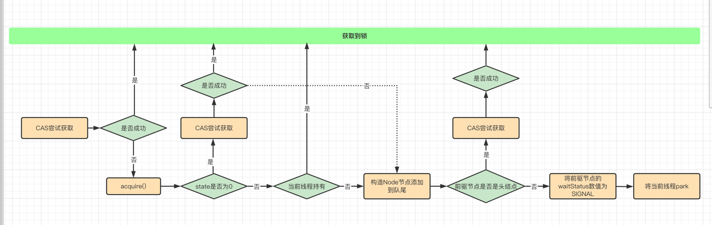

#### 1. 可重入锁

同一个线程在最外部获取到锁，在进入到该线程内部的方法会自动获取锁，前提是这个锁对象是同一个，不会因为之前没有释放锁而获取不到锁，可以很大程度上避免死锁

隐式锁synchronized和显示锁ReentrantLock两种

#### 2. LockSupport的解释

用于创建锁和其他同步类的基本线程阻塞原语。可以理解为线程wait/notify的升级版。有park和unpark两个方法用来阻塞线程和解除阻塞

3种让线程等待和阻塞的方法

- Object的wait和notify方法
- JUC包的Condition的await和signal方法
- LockSupport类的park和unpark方法

**注意wait和sleep的区别**

wait的调用，不会占用锁资源，会把锁资源释放，但是sleep不会

    private static final Object lock = new Object();

    public static void main(String[] args) {
        new Thread(new Runnable() {
            @Override
            public void run() {
               synchronized (lock) {
                   System.out.println("thread one come in");
                   try {
                       lock.wait();
                   } catch (InterruptedException e) {
                       e.printStackTrace();
                   }
                   System.out.println("thread one come out");
               }
            }
        }).start();

        new Thread(new Runnable() {
            @Override
            public void run() {
                synchronized (lock) {
                    System.out.println("thread two come in");
                    lock.notify();
                    System.out.println("thread two notify");
                }
            }
        }).start();
    }

在此方法中lock被第一个线程占用，然后调用了wait，如果不释放锁资源的话，第二个线程无法持有锁，也就没法唤醒，就会导致死锁。但是程序正常执行，所以得出的理论就是wait会释放锁资源

     private static final Lock reentrantLock = new ReentrantLock();

    private static final Condition condition = reentrantLock.newCondition();

    @Test
    public void conditionAwaitAndNotify() {
        new Thread(new Runnable() {
            @Override
            public void run() {
                reentrantLock.lock();

                System.out.println("thread one come in ----");
                try {
                    condition.await();
                    System.out.println("thread one come out ---");
                } catch (InterruptedException e) {
                    e.printStackTrace();
                } finally {
                    reentrantLock.unlock();
                }

            }
        }).start();

        new Thread(new Runnable() {
            @Override
            public void run() {
                reentrantLock.lock();
                System.out.println("thread two come in ----");
                try {
                    condition.signal();
                    System.out.println("thread two notify ---");
                } finally {
                    reentrantLock.unlock();
                }

            }
        }).start();
    }

Condition的await和signal和Object的wait和notify方法很类似，也会释放锁，然后把当前线程给阻塞了等待唤醒

LockSupport底层是一个通过Unsafe类的实现的，通过permit进行控制，permit默认是0，所以刚开始调用park方法，当前线程阻塞，直到别的线程将当前线程的permit设置为1时，park方法被唤醒，然后会将permit再次设置为0并返回。permit不会累加的，即可以理解为只能为0和1。如果当前有凭证的时候，会消费凭证正常退出等待，如果没有凭证就会进入等待，而且最多仅能有1个permit

原码实现:

    public static void unpark(Thread thread) {
        if (thread != null)
            UNSAFE.unpark(thread);
    }
    
    public static void park() {
        UNSAFE.park(false, 0L);
    }

测试用例:

    @Test
    public void lockSupportParkAndUnPark() throws InterruptedException {
        Thread threadA = new Thread(new Runnable() {
            @Override
            public void run() {
                System.out.println("thread a come in");
                LockSupport.park();
                System.out.println("thread a come out");
            }
        });
        threadA.start();

        Thread.sleep(3000L);

        new Thread(new Runnable() {
            @Override
            public void run() {
                System.out.println("thread b come in");
                LockSupport.unpark(threadA);
                System.out.println("thread b notify");
            }
        }).start();
    }

LockSupport的和Object以及Condition的区别在于，Object和Condition的wait必须在notify之前，不然就会一直进入阻塞。但是LockSupport可以先唤醒后等待，这样的话，线程进入park方法的时候就不会进入阻塞

#### 3. AQS

AQ是构建锁或者其他同步器组件重量级的基础框架以及整个JUC的基石。通过一个int类型的state和双向的链表做的Queue构建而成。详细可以看AQS详解

**AQS = FIFO + status + head + tail**

**Node节点 = waitStatus + 前后、指针 + thread**

- SHARED和EXCLUSIVE表示以什么样的模式去等待锁
- waitStatus当前节点在队列中的状态。
  - 0:初始化值
  - 1:获取锁的请求取消
  - -2:节点在等待队列中等待唤醒
  - -3:线程处于Shared的时候才会使用
  - -1:SIGNAL线程已经准备好了，等待资源释放

[ReentrantLock的流程图和原码解析](https://www.processon.com/view/link/5fd181e37d9c0830e8e80192)

