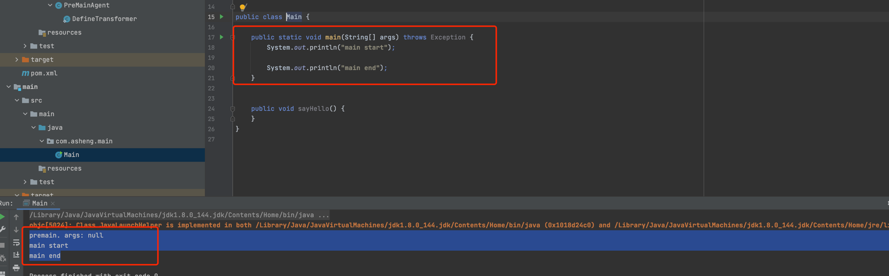
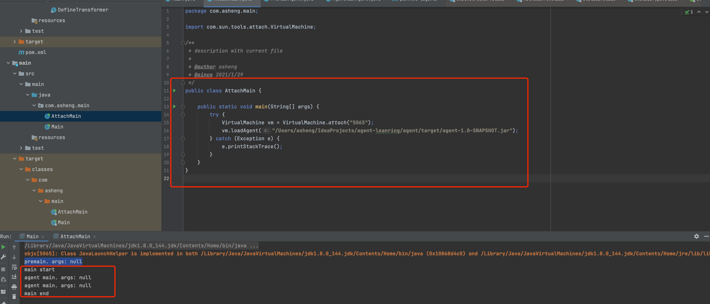
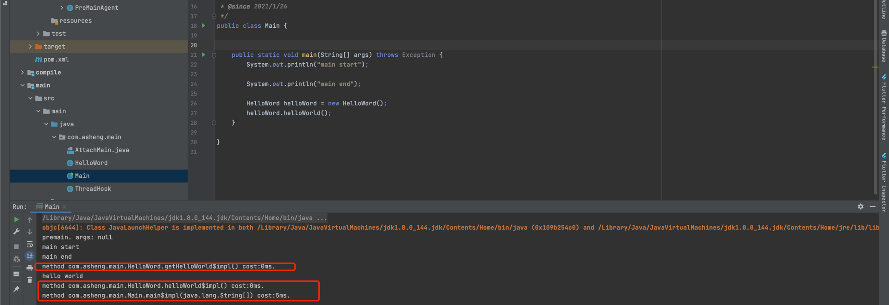

### 什么是Java Agent

通常，javaagent是一个JVM插件，一种专门精心制作的.jar文件，它能够利用JVM提供的Instrumentation Api。
Java1.5提供了Instrumentation API，因此无论从哪方面来看，我们将要探讨的解决方案都是非常便捷的。我们可以使用
agent技术构建一个独立于应用程序的代理程序，用来协作检测、运行甚至替换其他JVM上的程序

### Agent分类

- 在主程序之前运行的

使用premain方法，顾名思义就是在主程序main方法之前运行，args代表传递过去的参数，instrumentation则是agent主要使用的
api，可以用这个类来改变重订义类的行为

- 在主程序之后运行的

在主程序之前运行agent存在一些缺陷，例如需要在主程序运行前就指定javaagent参数，premain方法中代码出现异常会导致主程序启动失败等，
为了解决以上问题，jdk1.6以后提供了在程序运行后修改程序的能力

### premain

- 代码

    public class PreMainAgent {
        public static void premain(String args, Instrumentation instrumentation) {
            System.out.println("premain. args: " + args);
            //instrumentation.addTransformer(new DefineTransformer(), true);
        }
    }

- 编写MANIFEST.MF文件

MANIFEST.MF文件用来描述jar包的信息，例如指定入口函数等，我们需要指定premain方法类的全限定类名，然后将agent类打包成为jar包

    Manifest-Version: 1.0
    Premain-Class: com.asheng.agent.PreMainAgent

- 通过maven配置，因为编写的会被覆盖

    <plugin>
        <groupId>org.apache.maven.plugins</groupId>
        <artifactId>maven-jar-plugin</artifactId>
        <version>3.1.0</version>
        <configuration>
            <archive>
            <!--自动添加META-INF/MANIFEST.MF -->
                <manifest>
                    <addClasspath>true</addClasspath>
                </manifest>
                <manifestEntries>
                    <Premain-Class>com.asheng.agent.PreMainAgent</Premain-Class>
                    <Can-Redefine-Classes>true</Can-Redefine-Classes>
                    <Can-Retransform-Classes>true</Can-Retransform-Classes>
                </manifestEntries>
            </archive>
        </configuration>
    </plugin>

- 启动

    - 编写主程序
    - 添加jvm参数，-javaagent:/Users/asheng/IdeaProjects/agent-learning/agent/target/agent-1.0-SNAPSHOT.jar

- 运行结果

### agentmain

- 代码

    public class AgentMainAgent {
        public static void agentmain(String args, Instrumentation instrumentation) {
            System.out.println("agent main. args: " + args);
        }
    }

- 配置maven

    <plugin>
        <groupId>org.apache.maven.plugins</groupId>
        <artifactId>maven-jar-plugin</artifactId>
        <version>3.1.0</version>
        <configuration>
            <archive>
            <!--自动添加META-INF/MANIFEST.MF -->
                <manifest>
                    <addClasspath>true</addClasspath>
                </manifest>
                <manifestEntries>
                    <Agent-Class>com.asheng.agent.AgentMainAgent</Premain-Class>
                    <Can-Redefine-Classes>true</Can-Redefine-Classes>
                    <Can-Retransform-Classes>true</Can-Retransform-Classes>
                </manifestEntries>
            </archive>
        </configuration>
    </plugin>

- 启动

在主程序运行后加载，我们不可能在主程序中编写加载的代码，只能另写程序，那么另写程序如何和主程序进行通讯呢？这里就用到了attach机制，它可以
将JVM A链接至JVM B，并发送指令给JVM B执行，JDK自带的命令如jstack、jps等就是使用此机制。我们先启动一个main程序作为主程序，并获取其pid，
然后编写织入代码

    // 主程序
    public class Main { 
        public static void main(String[] args) throws Exception {
            System.out.println("main start");
            Thread.sleep(1000L * 60);
            System.out.println("main end");
        }
    }  

    // 注入程序
    public class AttachMain {
        public static void main(String[] args) {
            try {
                // pid替换成为上述进程的id
                VirtualMachine vm = VirtualMachine.attach("5065");
                vm.loadAgent("/Users/asheng/IdeaProjects/agent-leanring/agent/target/agent-1.0-SNAPSHOT.jar");
            } catch (Exception e) {
                e.printStackTrace();
            }
        }
    }

- 运行结果

因为没有去处-javaagent参数，所以会有premain的打印

### 织入自定义代码

- 代码

    public class PreMainAgent {
    
        public static void premain(String args, Instrumentation instrumentation) {
            System.out.println("premain. args: " + args);
            instrumentation.addTransformer(new DefineTransformer());
        }
    
        static class DefineTransformer implements ClassFileTransformer {
    
            private static final String START_TIME = "\nlong startTime = System.currentTimeMillis();\n";
            private static final String END_TIME = "\nlong endTime = System.currentTimeMillis();\n";
            private static final String METHOD_RETURN_VALUE_VAR = "__time_monitor_result";
    
            @Override
            public byte[] transform(ClassLoader loader, String className, Class<?> classBeingRedefined, ProtectionDomain protectionDomain, byte[] classfileBuffer) throws IllegalClassFormatException {
    
                System.out.println(className);
    
                className = className.replaceAll("/", ".");
    
                ClassPool classPool = ClassPool.getDefault();
    
                try {
                     CtClass ctClass = classPool.getCtClass(className);
    
                    if (ctClass.getName().startsWith("com.asheng")) {
    
                        for (CtMethod ctMethod : ctClass.getDeclaredMethods()) {
                            String methodName = ctMethod.getName();
    
                            // 将原来的方法重命名为新方法
                            String newMethodName = methodName + "$impl";
                            ctMethod.setName(newMethodName);
        
                            // 复制老的方法为新方法
                            CtMethod newMethod = CtNewMethod.copy(ctMethod, methodName, ctClass, null);
    
                            // 保存新方法的方法体
                            StringBuilder bodyStr = new StringBuilder();
                            bodyStr.append("{");
    
                            CtClass returnType = ctMethod.getReturnType();
    
                            // 判断是否有返回值类型
                            boolean hasReturnValue = CtClass.voidType != returnType;
                            // 定于局部变量用来接收返回值
                            if (hasReturnValue) {
                                String returnClass = returnType.getName();
                                bodyStr.append("\n").append(returnClass + " " + METHOD_RETURN_VALUE_VAR + ";");
                            }

                            // 插入开始时间
                            bodyStr.append(START_TIME);
    
                            // 插入原来方法的调用
                            if (hasReturnValue) {
                                bodyStr.append("\n").append(METHOD_RETURN_VALUE_VAR + " = ($r)" + newMethodName + "($$);");
                            } else {
                                bodyStr.append("\n").append(newMethodName + "($$);");
                            }
    
                            // 插入方法耗时
                            String monitorStr = "\nSystem.out.println(\"method " + ctMethod.getLongName() + " cost:\" +(endTime - startTime) +\"ms.\");";
    
                            bodyStr.append(END_TIME);
                            bodyStr.append(monitorStr);
    
                            // 返回返回值
                            if (hasReturnValue) {
                                bodyStr.append("\n").append("return " + METHOD_RETURN_VALUE_VAR +" ;");
                            }
    
                            bodyStr.append("}");
    
                            newMethod.setBody(bodyStr.toString());
    
                            ctClass.addMethod(newMethod);
                        }
                    }
    
                    return ctClass.toBytecode();
    
                } catch (NotFoundException | CannotCompileException | IOException e) {
                    e.printStackTrace();
                }
    
                return null;
            }
        }
    }

- 运行结果

  
