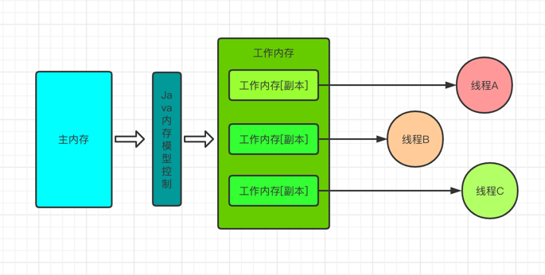

### JMM介绍

- JMM的全称是Java Memory Model，即java内存模型，而不是说到的java内存结构。因为在不同的硬件生产商和不同的操作系统下，内存访问有差异，所以会导致相同的代码在不同的系统上出现不各种问题，因此JMM屏蔽掉各种硬件和系统的内存访问差异，以实现实现java在各个平台下都能达到一致的并发效果

- java内存模型规定所有的变量都存储在内存里，包括了实例变量。静态变量，但是不包括局部变量和方法参数。**每个线程都有自己的工作内存，线程的工作内存保存了该线程用到的变量和主内存的副本拷贝，线程对变量的操作都在工作内存里进行，线程不能直接读写主内存的变量**

- 即每个线程的工作内存都是独立的，线程操作数据只是在工作内存中处理，然后再刷回内存。

### JMM定义了什么

JMM围绕着三个特征：原子性、可见性、有序性

- 原子性，每个操作都是不能分割的

    int j = 2   // 赋值操作、原子操作
    int j = i   // 先读取i值，然后再赋值，非原执行
    i ++        // 先读取i，i + 1, 然后赋值给i 非原子性
    i = i + 1   // 等价于 i ++, 非原子性

JMM只保证了基本的原子性，如果想保证一个代码的原子性，提供了monitorenter和mointorexit两个字节码指令，可以通过synchronized操作保证

- 可见性
  
    - 指当一个线程修改了共享变量的值，其他的线程能够立即知道被修改。java使用了volatile关键字提供了可见性。当变量使用volatile修饰的时候，这个变量会被修改后立即刷新到主内存，当其他线程需要读取的时候，会在主内存中读取新址

    - 除了volatile以外，final和synchronized也能实现可见性。

    - sync关键字的原理是，在执行完，进入Unlock之前，必须将共享变量同步到主内存。

    - final修饰的字段，一旦初始化完成，如果没有对象逸出（指对象为初始化完成就可以被别的线程使用），那么对于其他线程都是可见的。

- 有序性，可以使用synchronized或volatile保证线程之间操作的有序性
  
volatile可以使用内存屏障保证了禁止指令重排，而synchronized是一个线程lock以后，必须unlock后，其他线程才能lock,是的synchronized包住的代码必须是多线程之前是串行执行的

### Java内存操作

| 指令     | 作用范围 | 介绍                                     |
|--------|------|----------------------------------------|
| lock   | 主内存  | 将变量标识为线程独占的状态                          |
| read   | 主内存  | 将变量从主内存中读取到工作内存中                       |
| load   | 工作内存 | 将读取到变量加载到工作内存的变量副本中                    |
| use    | 工作内存 | 把工作内存的变量传输到执行引擎中，每一次使用到变量值的字节码指令都是用此操作 |
| assign | 工作内存 | 赋值操作                                   |
| store  | 工作内存 | 把工作内存的一个变量值传送到主内存中                     |
| write  | 主内存  | 将变量存放在主内存中                             |
| unlock | 主内存  | 把处于锁定的内存释放出来，然后让其他线程使用                 |

### volatile关键字

- 保证了线程间变量的可见性
- 禁止CPU进行指令重排

volatile不能保证了线程安全，因为操作非原子性不能保证，需要线程安全的话，使用synchronized关键字或者lock锁

### 什么是指令重

为了使指令更加符合CPU的执行特征，最大限度的发挥机器的性能，提高程序的执行效率，只要程序最终结果与它顺序化情况的结果相等，那么指令的执行顺序可以与代码逻辑顺序不同，这个过程就是执行的重排

重排序的种类分三种：编译器重排序、执行级并行的重排序、内存系统重排序。步骤如下

    源代码 --> 编译器重排 --> 指令级并行的重排序 --> 内存系统重排序 --> 最终执行的指令排序

所以在多线程环境下，就需要进制指令重排。而volatile禁止指令重排就有如下的意思：

- 当程序执行到volatile变量的读或者写操作的时候，在其前面的操作更改的肯定已经进行，且结果已经对后面的操作可见，在其后面的还没进行

- 在进行指令优化时，不能讲在对volatile变量访问的语句放在其后面执行，也不能把volatile变量后面的语句放在其前面执行

### volatile如何进制指令重排的呢

首先说内存屏障，内存平常可以分为以下几类

- LoadLoad屏障，对于这样的语句Load1,LoadLoad,Load2。在Load2及后续读取操作要读取的数据被访问前，保证Load1要读取的数据被读取完毕

- StoreStore屏障，对于这样的语句Store,StoreStore,Store2，在Store2即后续写入操作执行前，保证Store1的写入操作对其他处理器课件

- LoadStore屏障，对于这样的语句Load1，LoadStore, Store2, 在Store2后续写入操作被刷出前，保证Load1要读取的数据被读取完毕

- StoreLoad屏障，对于这样的语句Store1,StoreLoad，Load2，在Load2后续所有的读取操作执行前，保证Store1的写入对数据处理器可见

因此在每个volatile的读操作后插入LoadLoad屏障，在读操作后插入LoadStore操作。而每个volatile的写操作的前面插入一个StoreStore屏障，后面插入StoreLoad屏障。由此保证了禁止指令重排的问题

