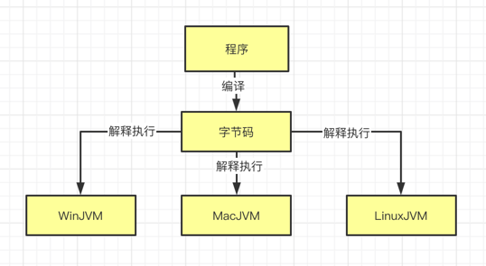
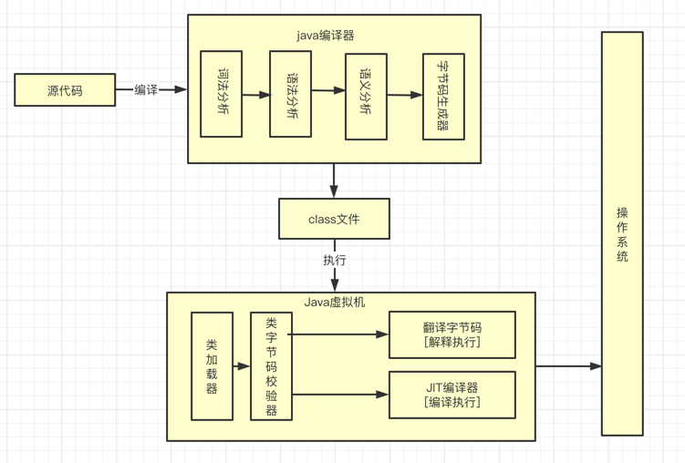
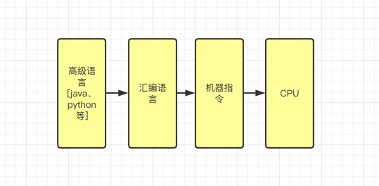
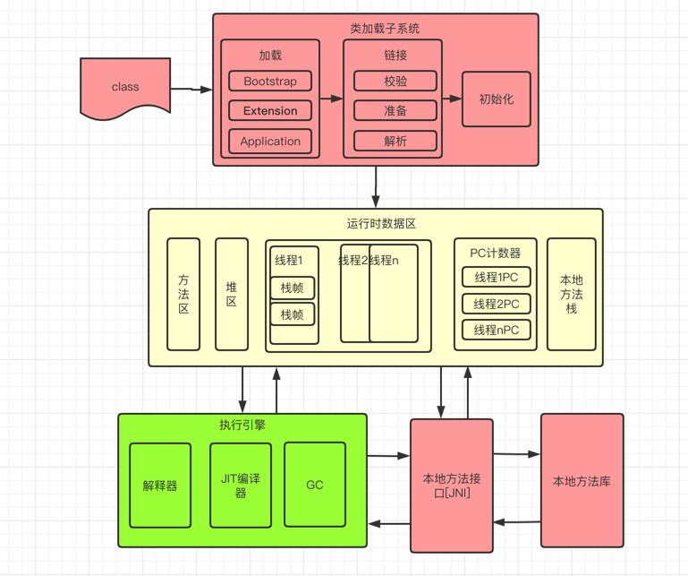

### Java程序的执行流程

- 编译流程

- 详细流程

- 语言执行流程

- 执行总流程

---

### Java栈空间架构

Java编译器输入的指令流基本上是一种基于栈的指令集架构、另一种是指令集架构基于寄存器的指令集架构

1. 基于栈架构的特点

- 设计和实现简单、适用于资源受限的系统
- 避开了寄存器的分配难题，使用零地址指令方式分配
- 指令流中的指令大部分都是领地址指令，执行过程依赖于操作栈。指令集更小，编译器更容易实现
- 不需要硬件支持，可移植性更好，更好实现跨平台

2. 基于寄存器架构的特别

- 典型的应用是X86的二进制指令集，如传统的PC和Android的Davlik虚拟机
- 完全依赖硬件、可移植性差
- 性能优秀和执行更高效
- 花费更少的指令去完成一项操作
- 大部分情况，指令集都以一地址指令集、二地址指令和三地址指令为主

---

### JVM的生命周期

1. 启动

通过引导类加载器(bootstrap class loader)创建一个启动类(initial class)完成的，这个类是由虚拟机具体实现的

2. 执行

- 任务: 执行java程序
- 程序开的时候运行，结束的时候停止
- 执行Java程序的时候，是执行了一个JVM的进程

3. 退出

- 正常执行结束
- 异常或者错误而异常终止
- 操作系统出错导致进程终止
- Runtime类或者System.exit()
