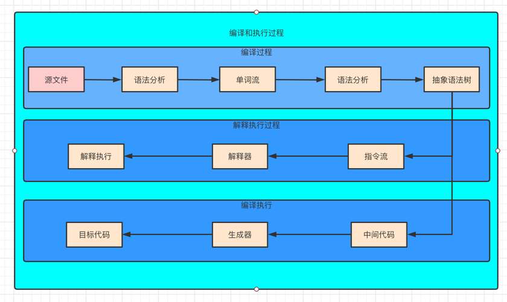
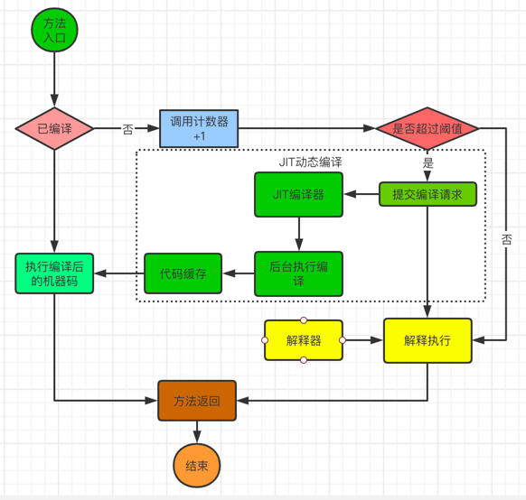

### 执行引擎概述

- 执行引擎是JVM核心组成部分之一
  
- 虚拟机是相对物理机的概念，都有执行代码的能力。区别是物理机的执行引擎建立在
处理器、缓存、指令集和操作系统层面的。而虚拟机的执行引擎则是由软件自行实现的，由于可以不受
物理机条件约束地定制指令集和执行引擎的结构体系，能够执行那些不被硬件直接支持的指令集格式
  
- JVM的主要任务就是装载字节码到其内部，但是字节码不能够直接运行在操作系统上，因为字节码指令
并非等价本地机器指令。只是被JVM识别的指令、符号表、以及辅助信息等
  
- 因此需要执行引擎来将字节码指令解释/编译成为平台能够识别的本地机器指令

### Java代码编译和执行过程

- 编译和执行过程

- 解释器和JIT编译器

    - 解释器: 当JVM启动的时候，会对字节码采用逐行解释的方式执行

    - JIT编译器: 将字节码翻译成为本地的机器指令，即物理机能够识别的指令进行执行

Note: 因此Java是半编译半解释型语言

### 机器码、指令、汇编语言

- 机器码，就是使用二进制编码方式表示的指令，执行速度最快，与CPU紧密相关

- 指令，因为机器码的可读性太差，因此简化成为指令，如mov、inc等，可读性稍好一些。

- 指令集，就是指令的集合，对应不同的CPU架构，是有差别的

- 汇编语言，使用助记符代替机器指令的操作码，也需要翻译成为机器码才能被识别

- 高级语言，更接近人类的语言，仍需要翻译成为机器码才能执行

### 解释器

- 解释器的角色类型与运行期的"翻译者"，将字节码翻译成平台的本地机器指令执行

- 当一条指令解释执行完以后，接着再更新PC寄存器中的记录，然后继续执行字节码指令

- 字节码解释器，通过纯软件代码模拟字节码的执行，效率低下

- 模板解释器，通过将每一条字节码和一个模板函数相关联，模板函数中直接产生这条字节码执行时的机器码，很大程度提升了解释器的性能

- 但是解释器仍然是低效的代名词，因此出现了JIT编译器，避免了函数被解释执行，而是将整个函数体便已成为机器码，每次执行的时候，执行机器码即可

### JIT编译器

主要是将字节码翻译成本地机器码，可以大大提高执行效率

- 是否启用JIT编译器主要是根据代码被调用到频率而定，"热点代码"会使用JIT编译器 ，一个被多次调用的方法，或者方法体内部循环多次的循环体都可以被称之为"热点代码"。目前Hotspot使用计数器的热点探测

    - 方法调用计数器，
    默认情况client默认是1500次，server的默认是10000次，-XX:CompileThreshold来设置
      
    - 回边计数器，主要是循环体的判断
      

### 命令解释

命令 | 解释
----|----
-Xint | 完全使用解释模式
-Xcomp | 完全使用即使编译模式启动
-Xmixed | 采用混合模式

也可以通过命令全局修改:

- java -Xint -version

- java -Xcomp -version

- java -Xmixed -version

