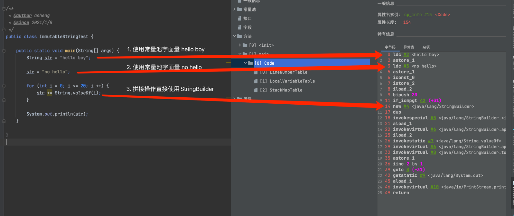

### String的基本特性

- 为final类型的，不可被继承
  
- 实现了Serializable接口，支持序列化，实现了Comparable接口，可以比较大小

- 不可变性，不可变的字符序列

- 通过字面量赋值以及new的方式赋值

- 字符串池中不会存储内容重复的字符串

  - StringTable本质上就是一个大小固定的的HashTable
  - 如果放入String很多的时候，就会造成Hash冲突，从而导致链表很长，而链表长的话会导致调用String.intern()的时候想能下降
  - -XX:StringTableSize可以设置StringTable的长度
  - Jdk6的StringTable大小是固定的，默认值是1009
  - Jdk7以及以后StringTable默认值是60013，其中Jdk8及以后中1009是可以设置的最小值

- jdk8以及之前使用final char[]用来存储，jdk9改成了byte[]来存储

  因为根据统计大部分的JVM中大部分对象是字符串类型，以及大部分类型的字符串中又以拉丁文以及ISO8859-1为主，这些都是占单个字节的，而char是两个字节，
  这样就会导致内存的浪费，因此在jdk9及以后把char[]改为了byte[]

---

### String对象的创建

- String s = ""， 对应的指令是ldc

  - [ldc指令](https://docs.oracle.com/javase/specs/jvms/se8/html/jvms-6.html#jvms-6.5.ldc)

  ldc的指令就是从运行时常量池中获取然后压入操作数栈中，因此遇到ldc指令，即后面的变量都是已经在编译器就确定的，可以通过Bytecode
  在常量池中获取到的。而运行的时候，可以在运行时常量池中获取到的

- new String("")，通过在ldc加载到字面量，然后在堆上new变量后赋值给引用句柄

  - new String("ab")

    - 对象1, new String()
    - 对象2，ldc "ab"，这个对象是常量池对象，字节码指令: ldc

  - new String("a") + new String("b")

    - 对象1, new StringBuilder()
    - 对象2, new String("a")
    - 对象3, ldc "a"
    - 对象4, new String("b")
    - 对象5, ldc "b"
    - 深入剖析, new StringBuilder().toString()中又产生了一个new String("ab")对象，但是"ab"不会进入常量池

---

### String的基本操作

    public class StringByteCodeExpression {

        public void concat1() {
            // 从常量池加载字面量 "a"
            String a = "a";
            // 从常量池加载字面量 "b"
            String b = "b";
            // new StringBuilder().toString()
            String c = a + b;
            // 从常量池加载 "ab"
            String d = "a" + "b";
    
            final String a1 = "a";
            final String a2 = "b";
            // 这里会加载常量 "ab" 和d2一个来源
            // 方法和c一样，但是由于变量是常量，所以c1也是常量
            String c1 = a1 + a2;
        }
    
        public void concat2() {
            // new String() 并从常量池中加载"a"用来做参数
            // 和上面concat1方法的"a"一个来源
            String a = new String("a");
            // new String() 并从常量池中加载"b"用来做参数
            // 和上面concat1方法的"b"一个来源
            String b = new String("b");
            // new StringBuilder().toString()
            String c = a + b;
        }
    }

---

### intern()的使用

- intern()是native方法，底层调用c++的StringTable::intern方法实现

- JVM会在当前的常量池中查找是否存在等值的string，如果存在则返回当前String的引用

- 如果不存在，存在两种情况
  
  - jdk6中，不存在就会创建一个等值的字符串，然后返回其引用，创建在perm区
  - jdk7及以后，创建在堆上，不存在的话，就会返回该参数在堆上的引用，并且复制引用到常量池中并返回。即最终指向的还是堆上的
  
- intern()确保字符串常量池中仅有一份

- 如何保证字符串指向字符串常量池中的数据呢
    
    - 字面量的方式，如 String s = "abc";
    - 通过new的方式，如 String s = new String("abc").intern(); / String s = new StringBuilder().appen("abc"").toString().intern();

    
    public class StringInternTest {
    
        public static void main(String[] args) throws InterruptedException {
            String str1 = new StringBuilder("计算机").append("软件").toString();
            // JDK1.7及以后返回true，因此str1是在堆上new出来的，然后intern后，只是添加到堆上的引用，因此intern返回的也是堆上的对象，因此相等
            System.out.println(str1.intern() == str1);
    
            String str2 = new StringBuilder("ja").append("va").toString();
            // JDK1.7及以后，返回false，因为str2是在堆上new出来的，而intern的对象是本身在常量池就已经存在的，因此返回false
            System.out.println(str2.intern() == str2);
        }
    }

---

### G1的String去重操作

- 当垃圾回收器工作的时候，会访问堆上存活的对象。对每一个访问的对象都会检查是否是候选的要去重的String对象
  
- 如果是，就把这个对象的一个引入插入到队列中等待后续处理。一个去重的线程在后台运行，处理这个队列。处理队列的一个元素意味着
从队列删除这个元素，然后尝试去重用它引用的String对象
  
- 使用一个hashtable来记录所有的被String对象使用的不重复的char数组。当去重的时候，会查这个hashtable，来看堆上是否已经存在一个一模一样的char数组

- 如果存在，String对象会被调整引用的那个数组，释放对原来的数组的引用，最终会被垃圾回收器回收掉

- 如果查找失败，char数组会被插入到hashtable，这样以后的时候就可以共享这个数组了

命令 | 解释
----|----
UserStringDeduplication:bool | 开启String去重，默认是不开启的
PrintStringDeduplicationStatistics:bool | 打印详情的去重统计信息
StringDeduplicationAgeThreshold:uint | 达到这个年龄的String对象被确认为去重的候选对象

