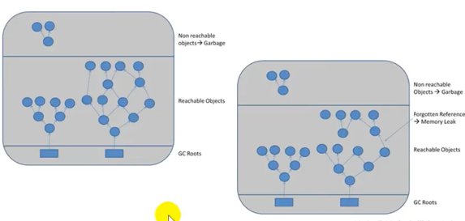

### 什么是垃圾

- 是运行程序中没有任何指针指向的对象，这个对象就是需要回收的垃圾

- 如果不及时回收内存中的垃圾，那么这些垃圾会一直保留到程序结束，如果没有可用空间就会导致OOM

---

### 为什么需要GC

- 内存是宝贵资源，如果不进行垃圾回收，内存迟早要被消耗完

- 除了释放没用的对象，还需要整理内存中的碎片，以便JVM将整理出的内存分配给新的对象

- 没有GC就不能保证业务程序的正常进行。而经常导致STW的GC又不能跟上实际的需求

---

### 早期的垃圾回收(C/C++)

通过new分配和通过delete关键字进行释放。虽然很灵活，但是会给开发人员带来了频繁的申请和释放内存的管理负担。
如果因程序员忘记回收的话，就会导致内存泄露，随着时间的流逝就会导致OOM的问题，由Linux内核抛出的异常，会直接杀掉进程

---

### Java的垃圾回收机制

- 优势
  
    - 自动内存管理，开发人员不需要自己参与内存的分配和管理
    - 将开发人员从内存管理中释放出来，更加关注业务

- 劣势
    
    - 类似于黑匣子，会弱化Java程序员在程序中内存溢出的问题定位以及解决问题的能力
    - 当垃圾回收成为系统达到更高并发的瓶颈时，我们就必须要对这些"自动化"的技术实时监控和调节

---

### System.gc()

- 通过System.gc()或者Runtime.getRuntime.gc()会显示触发Full GC

- 附带一个免责声明，无法保证对垃圾收集器的调用

- JVM实现者可以通过System.gc()调用来决定JVM的GC行为。而一般情况下，垃圾回收应该自动进行的，
而不是手动调用，否则太过于麻烦

---

### 内存溢出和内存泄露

- 内存溢出
  
  - OOM就是没有空闲内存，并且JVM垃圾回收以后也无法提供更多的内存

  - Java虚拟机的堆内存设置不够

  - 代码中创建了大量大对象，并且长时间不能被回收(存在被动引用)

  - 抛出OOM之前通常会进行垃圾回收，尽可能的清理出空间

- 内存泄露

  - 不被程序用到的对象，但是又不能被回收的情况，叫做内存泄露
  
  - 有些对象的生命周期很长甚至导致OOM，也可以叫做宽泛意义上的内存泄露
  
  - 尽管内存泄露不会立即引发程序崩溃，但是一旦发生内存泄露，程序内存被越用越少，直到内存被使用完导致OOM
  
  - 例如单例模式对象，一些提供close的资源未关闭导致的内存泄露(数据库链接(javax.sql.Connection)、网络链接(Socket)等)

---

### Stop The World

指GC事件中发生过程中，会产生应用程序的停顿。停顿的产生时整个应用的用户线程都会被暂停，没有
任何响应，有点像卡死的感觉，这个停顿成为STW

- 可达性分析算法中枚举根节点(GCRoots)会导致所有的Java执行线程停顿

  - 分析工作必须在一个能确保一致性的快照中进行
  - 一致性指整个分析期间整个执行系统看起来像冻结在某个时间点上
  - 如果出现分析过程中对象引用关系还在不断变化，则分析结果的准确性无法保证

- 被STW中断的应用程序线程会在完成GC之后恢复，频繁的STW会让用户体验很差，因此我们要减少STW的发生

- STW和任何一款的垃圾回收器无关，所有的垃圾回收器都会发生这个时间，只能说垃圾回收器的性能优秀，减少这个时间

- STW是JVM在后台自动发起和自动完成的

- System.gc()会导致STW的发生，因此开发中不建议使用

---

### 垃圾回收的并行和并发

- 程序意义上的并行和并发
  
  - 并发，是指一个时间段几个程序都处于已启动运行到运行完毕之间，切这几个程序都在一个处理器上完成。 
    并发不是真正意义的"并行"，任一时间CPU上只有一个任务，只是CPU把事件划分为很多个时间片，然后在这 
    几个时间片上切换，由于CPU处理的很快，让用户觉得在同时进行
  
  - 并行，系统有一个以上的CPU时，一个CPU执行一个进程时，另一个可以执行另一个，两个进行相互不抢占资源，
    可以同时进行，我们称之为并行。并行的核心因素是CPU的核数
  
- 垃圾回收的并行和并发

  - 并行，之多条垃圾收集器线程并行工作，但此时用户线程仍然处于等待状态。如ParNew、Parallel Scavenge、Parallel Old
  
  - 串行，相对于并行来说是单线程执行
  
  - 并发，用户线程和垃圾回收线程同时执行(但并不一定是并行的，可能是交替执行)，垃圾回收线程执行时不会
  停顿用户程序的运行，如CMS、G1

---

### 安全点和安全区域

#### 安全点:

程序在执行的时候，不是任意一个地方都能停下来进行GC。只有特定位置才能停顿下来进行GC，这个地方就是"安全点"。
安全点的选择很重要，如果太少就会导致GC等待时间太长，如果太频繁可能导致运行时性能问题。
"是否具有让程序长时间执行"的特征作为安全点的标准，比如选择一些执行时间较长的指令作为安全点，如方法调用、循环跳转和异常跳转等

如何保证在GC的时候，检查所有的线程都跑到最近的安全点停顿下来呢?

- 抢先式中断(目前JVM没有采用)，首先中断所有的线程，如果还有线程不在安全点，就恢复线程直到跑到安全点

- 主动式中断，设置一个中断标识，各线程运行到安全点的时候主动轮训这个标志，如果标志为真，就将当前自己的线程中断挂起

#### 安全区域:

安全点机制保证了程序执行时，在不太长的时间内就会遇到可进入GC的安全点。但是，程序"不执行"的时候呢，例如线程处于Sleep
状态或者Blocked状态，这个时候线程无法响应JVM的中断请求，"走"到安全点去中断挂起，JVM也不太可能等待线程被唤醒。对于这种
情况，就需要安全区域来解决

安全区域指的在一段代码片段中，对象的引用关系不会发生变化，这个区域的任何位置开始GC都是安全的。可以把安全区看做被扩展的
安全点

#### 实际执行过程:

- 当线程运行到安全区的代码时，首先标志已经进入了安全区，如果这段时间发生GC，JVM会忽略表示为安全区状态的线程

- 当线程离开了安全区，会检查JVM是否完成了GC，如果完成了，则继续运行，否则线程必须等待知道收到可以安全离开的信号位置

---

### Java对象引用(强、软、弱、虚)

- 强引用(Strong Reference)

  - 99%对象都是强引用，最常见普通的对象引用
  - 强引用的对象是可达的时候，垃圾回收器就永远不会回收掉的对象
  - 造成OOM的主要原因

- 软引用(Soft Reference)

  - 内存不足即回收
  - 通常用来实现内存敏感的缓存。比如，高速缓存就有用到软引用
  - 决定回收软可达的对象时候，会清理软引用，并选择性的把引用存放到一个引用队列中
  - JVM会尽可能的让软引用多存活一些时间，迫不得已才清理
  - 清理完以后依旧没有足够的空间就会OOM

- 弱引用(Weak Reference)

  - 发现即回收
  - 用来描述非必须对象，只能生存到下一次垃圾回收之前
  - 只要发生GC，无论空间是否充足都会被回收
  - 弱引用和软引用一样也可以指定一个引用队列，当弱引用对象被回收的时候，就会加入指定的引用队列，
    通过这个队列可以追踪对象的回收情况
  
- 虚引用(Phantom Reference)

  - 对象回收跟踪
  - 一个对象是否有虚引用的存在，完全不会对其生存时间构成影响，也无法通过虚引用来获得一个对象实例
  - 为一个对象设置虚引用的唯一目的就是能在这个对象被垃圾回收器回收的时候收到一个系统通知
  - 必须提供一个指定的引用队列
