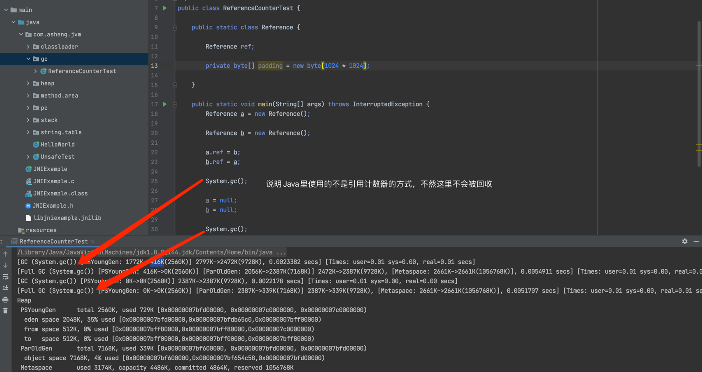
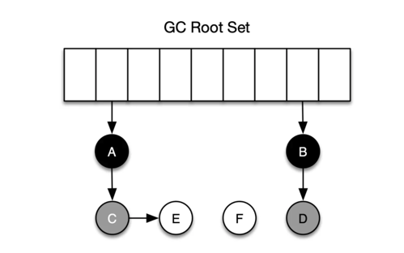
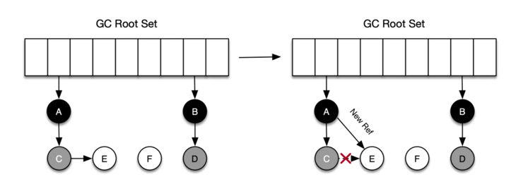
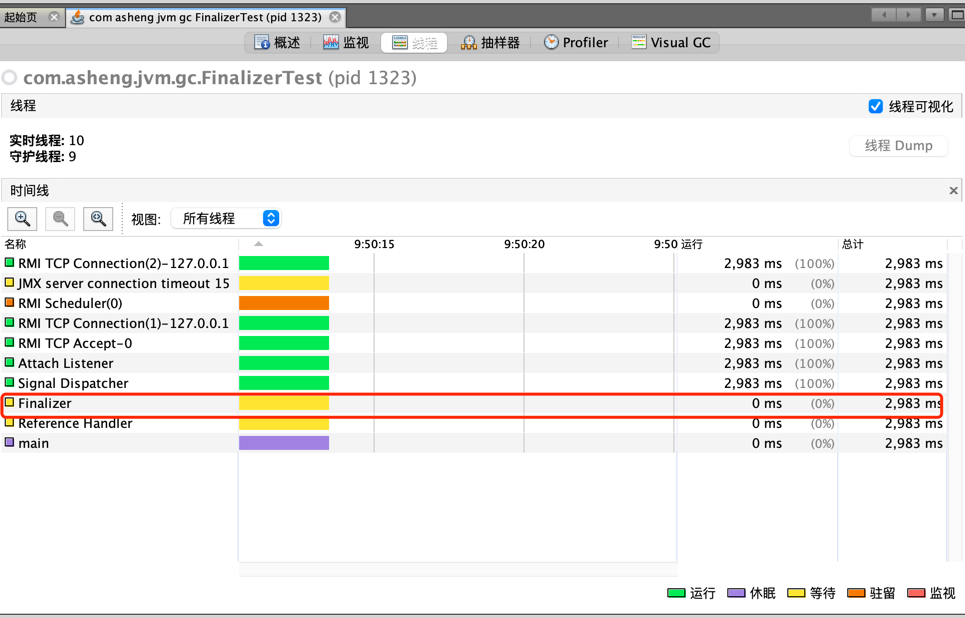
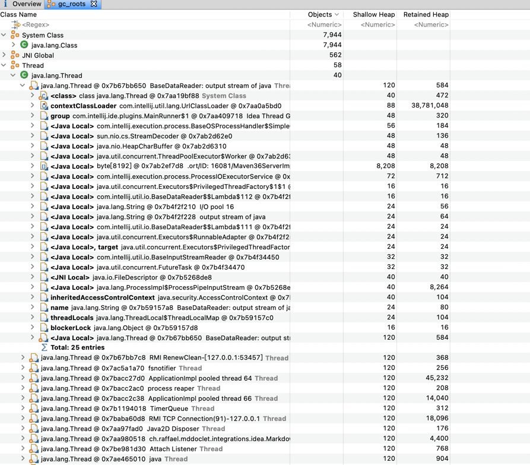

### 垃圾标记阶段: 对象存活判断

主要是区分出哪些内存对象是存活对象，哪些是已经死亡的对象。只有标记为已经死亡的对象，GC才能执行
垃圾回收的时候，释放其所占用的内存对象，因此此过程叫做垃圾标记阶段。判断对象存活一般有两种方式:

- 引用计数器

    - 优点，实现简单，垃圾对象容易识别。判断效率高，回收没有延迟性

    - 缺点
        - 需要单独的字段存储计数器，增加了内存的开销
        - 每次赋值都需要更新计数器，伴随加法和减法操作，增加了时间开销
        - 无法解决循环依赖问题，这才是致命的缺陷，倒是Java没有使用这种算法

对每一对象都保存一个整形的引用计数器属性，用来记录对象被引用的情况。被引用的时候就+1，引用失效的时候-1，为0的时候可以回收

- 可达性分析

    - 相当于引用计数而言，不仅仅具备实现简单和执行高效等特点。主要是能够有效的解决循环依赖问题，防止内存泄露的发生

    - Java、C#选择的都是此算法，这种算法也叫追踪性垃圾收集

    - 可达性分析就是以根对象(GCRoots)为起点，按从上至下的方式搜索被根对象集合所连接的目标对象是否可达

        - GCRoots就是一组必须活跃的引用

    - 内存中存活对象都会被跟对象直接或者间接引用，搜索走过的路径称为引用链

    - 如果目标对象没有被任何引用链连接，即是不可达，就可以被回收

    - 使用可达性分析算法来判断内存是否可以被回收，那么分析工作必须在一个能保证一致性的快照中进行，这点
      也是导致STW的主要原因。即便是号称不会发生停顿的CMS中，枚举根节点时也必须停顿的

---

### GCRoots有哪些(主要部分)

- 虚拟机栈中引用的对象

- 本地方法栈中引用的对象

- 方法区中类静态属性引用的对象

- 常亮池中引用的对象

- 同步锁synchronized持有的对象

- Java虚拟机内部的引用，基本数据类型对应的Class对象，一些常驻内存对象等，如系统加载器

小技巧:

指向的是堆上的内存，而本身不在堆上的对象，都可以作为GCRoots

---

### 三色标记法

可达性分析类GC都属于搜索型算法，这一类算法的过程都可以用三色标记算法来进行抽象。三色标记算法就是把
堆上的对象根据它们的颜色分到不同的集合中去，这三种颜色和含义分别如下

- 白色: 还未被垃圾回收器标记的对象
- 灰色: 自身已经被标记，但其拥有的成员还没有被标记
- 黑色: 自己已经被标记，切对象本身所有的成员已经被标记

在GC开始阶段，所有的对象都是白色的，在通过可达性分析时，首先会从根节点开始遍历，将GCRoots直接引用的对象A、B、C加入到灰色集合中。
然后丛灰色集合中取出A，将A的所有引用加入灰色集合，同时把A加入到黑色集合。最后灰色集合为空标识着可达性分析的结束。仍处于白色的对象就是
GCRoots不可达的对象，就可以进行回收了

---

### 读屏障和写屏障

在标记对象是否存活的过程中，对象间的引用关系是不能改变的，这对于串行垃圾回收器是可行的，因为此时处于STW状态。但是对于并发GC来说，在分析对象
引用关系期间，对象间引用关系的创建和销毁肯定是存在的，如果不存在补偿机制，就会出现多标和漏标的情况

- 多标

假如C被标记灰色，在进行下面的标记之前，A和C之间的引用关系解除了，按照三色标记法C和E都应该是垃圾，而实际上，C不会在本轮GC活动中被回收，这部分应该
回收但是没有护手，被称之为"浮动垃圾"

- 漏标

如下图所示，对象C被标记为灰色以后，对象C断开了和对象E之间的引用，同时对象A新建了和对象E之间的引用。在后面的标记时，因为C没有对E的引用，所以不会
把E放入到灰色集合中，虽然A引用了E，但是由于A已经是黑色，不会再重新遍历。结果就是，对象E会一直保存到白色集合中，最后当做垃圾回收，事实上E确实活动对象，
这种情况肯定不能接受的

- 多标是不会影响程序的正确性，只会推迟垃圾回收的时机，但是漏标会影响程序的正确性，需要引入读写屏障才能解决此问题

- GC里的读(Read Barrier)写屏障(Write Barrier)指程序在堆中读取引用和更新堆中引用的时候，GC需要执行一些额外操作，其本质就是一些同步的指令操作，
在读/写引用时，会额外执行这些指令。读写屏障实现的是对读写操作的环绕切面，类似于Spring中的切面

      void example(Foo foo) {    
          Bar bar = foo.bar;                  // 这里触发读屏障    
          bar.otherObj = makeOtherValue();   // 这里触发写屏障
      }

- 读写屏障发生漏标的充分必要条件
  
    - 应用线程插入了一个从黑色对象（A）到白色对象（E）的新引用
    - 应用线程删除了从灰色对象（C）到白色对象（E）的直接或者间接引用

- 解决方案
    
    - 方法1
        - 开启写屏障的时候，当新增引用关系后，触发写屏障，发出引用的黑色或者白色对象会被标记成为灰色，
    或者将被引用对象标记为灰色，为增量更新的方式
        - 开启读屏障的时候，当检测到应用即将要访问白色对象是，触发读屏障，GC会立即访问该对象并其标记为灰色
        - CMS使用了写屏障+增量更新的方式
        - ZGC使用了读屏障的方式
        
    - 方法2
        - 开启写屏障，当删除当前引用关系前，将所有即将被删除的引用关系的旧引用记录下来，最后将这些旧引用为根
    重新扫描一次，这种方法实际上是SATB算法的一种具体实现
        - G1和Shenandoah通过此方法

---

### 对象finalize的机制

- java对象提供了对象终止机制来允许开发人员提供对对象销毁前的自定义处理逻辑

- 回收前总会调用这个对象的finalize()方法

- 此方法允许被子类重写。用于对象被回收时进行资源释放，通常在这个方法中做一些资源释放和清理的工作。比如关闭文件、套接字和数据库连接等

- 永远不要主动调用这个方法，需要交给JVM的垃圾回收器去处理

    - 此对象会导致对象的复活
    - 执行时间是没法保障的，是GC线程决定的，极端情况下，若不发生GC，此方法没有执行机会。主要是因为这个方法是被回调的
    - 一个糟糕的finalize()会严重影响GC性能

- 从功能上和C++的虚构函数很相似，但是Java是自动内存管理机制

- 由于finalize()方法的存在，导致对象在虚拟机在对象中有三种状态

    - 可触及的，从根节点开始，可以达到此对象
    - 可复活的，对象的所有引用都被释放，但是对象有可能在finalize()中复活
    - 不可触及的，对象的finalize()被调用后，并且没有复活，那么就会进入不可触及状态。不可触及的对象不可能被复活，
      因此finalize()只会被调用一次。即最多也只能拯救一次

- 仅在不可触及的状态下才能被回收

    public class FinalizerTest {
    
        private static FinalizerSurvivor ref;
    
        public static class FinalizerSurvivor {
    
            @Override
            protected void finalize() throws Throwable {
                FinalizerTest.ref = this;
                System.out.println("拯救自己一次");
            }
        }
    
        public static void main(String[] args) throws InterruptedException {
            FinalizerSurvivor survivor = new FinalizerSurvivor();
    
            System.gc();
    
            survivor = null;
            System.gc();
    
            Thread.sleep(5000L);
    
            ref = null;
            System.gc();
        } 
    }

### 使用Eclipse查看GCRoots

- 导出dump文件

    - 通过jmap命令导出，jmap -dump:format=b,live,file=test.bin pid
    
    - 通过JVisualVM导出

- 通过Eclipse打开并解析

