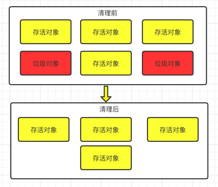
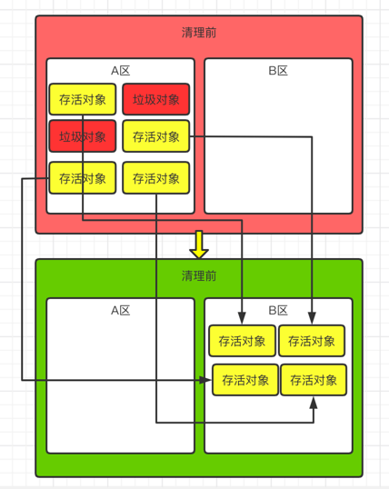
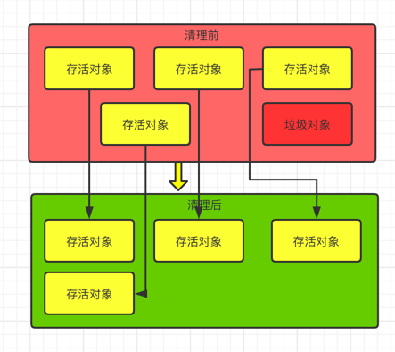

### 垃圾清除阶段

当成功区分出内存中存活对象和死亡对象后，GC接下来的任务就是执行垃圾回收，释放掉无用对象占用
的内存空间，以便有足够的可用内存空间为新对象分配内存

目前JVM主流的三种垃圾回收算法:

- 标记-清除算法(Mark-Sweep)

- 复制算法(Copying)

- 标记-压缩算法(Mark-Compact)

---

### 标记-清除算法

- 是一种非常基础和常见的垃圾回收算法，应用于Lisp语言

- 当内存被耗尽的时候，就会停止程序STW，然后进行两项工作，第一项是标记，第二项则是清除

    - 标记，从引用根节点开始遍历，标记所有被引用的对象，即标记非垃圾对象，一般是在对象的Header
    中，记录为可达对象
    
    - 清除，从堆内存的头到尾进行遍历，如果某个对象没有被标记，则进行回收

- 所谓的清除不是真的置为空，而是将垃圾对象的位置维护到空闲列表中，在以后分配内存的时候，如果垃圾的
大小足够的话，就把这块内存重置为新分配的数据

- 缺点
    
    - 效率比较低，因为需要遍历的原因
    - 在进行GC的时候，会造成STW，导致用户体验差
    - 主要是清理出的内存是不连续的，会产生内存碎片，需要维护一个空闲列表
    
- 优点，实现简单

---

### 复制算法

复制算法就是将活着的内存空间分为两块，每次仅适用一块。当进行垃圾回收的时候，将正在使用的内存中的
存活对象复制到未被使用的内存块中，之后清楚正在适用的内存块中的所有对象，交换两个内存的角色，最后
完成垃圾回收。目前survivor区使用的就是这种算法进行回收新生代

- 优点

    - 没有标记和清除的过程，实现简单，运行高效
    - 复制后的内存空间比较规整，不会产生碎片问题
    
- 缺点
    
    - 缺点明显，需要两倍的内存空间
    - 对于G1这种分拆为大量region的GC，复制而不是移动，意味着GC需要维护region之间的对象引用关系，
    不管是内存占用还是时间开销都不小
    - 复制算法需要复制的存活对象数量并不会太大，或者说存活对象比较低才行，否则运行效率比较低

---

### 标记-压缩算法

复制算法的高效是建立在存活对象少，垃圾多的场景，在新生代是比较符合的。但是在老年代，存活对象比较多
的场景，复制算法就不能做到高效。因此老年代就需要其他的算法

- 执行过程

    - 标记，和标记清除的标记阶段一致
    - 将所有存活对象亚索到内存的一段，按顺序排放
    - 之后，清理边界外所有的空间
    
- 效果等效于标记-清楚算法执行完成后，在进行一次碎片整理，因此也叫标记-清楚-整理算法

- 二者本质的区别在于标记-清楚是一种非移动式的回收算法，标记-压缩是移动式的

- 标记-压缩以后，不需要使用空闲列表，只需要使用指针碰撞即可，因此效率也比较高

- 优点
  
    - 消除了内存碎片的问题，分配对象的时候，只需要维护一个内存的起始地址指针
    - 清楚了复制算法中，浪费一半内存的高额代价
    
- 缺点

    - 效率上，标记-压缩算法低于复制算法
    - 如果对象被其他对象引用的时候，需要调整引用的地址
    - 引用过程中需要STW

---

### 基础算法比较

 \ | 标记-清除算法(Mark-Sweep) | 复制算法(Copying) | 标记-压缩算法(Mark-Compact) | 
----|----|----|----
速度 | 中等 | 最快 | 最慢 
内存开销 | 少[内存碎片] | 通常需要存活对象的2倍大小 | 少[没有内存碎片] 
移动对象 | 否 | 是 | 是

---

### 分代收集算法

结合15章的算法比较后，发现灭有一种算法可以完全替代其他的算法，他们都是具有自己的优势和特点，
因此分代算法应用而生。但是分代算法不是具体的算法，可以理解为一种思想

分代算法是基于JVM中对象的特点，不同的对象的生命周期都是不一样的，因此不同的生命周期对象使用
不同的算法。目前几乎所有的GC都采用分代收集算法执行垃圾回收的

- 年轻代，内存区域相对老年代比较小，对象生命周期短、存活率低，回收频繁

    - 这种情况复制算法是最合理的，效率和当前存活对象大小有关，因此很适合年轻代的回收
    - hotspot通过两个survivor的设计得到缓解

- 老年代，内存区域比较大，生命周期长、存活率高，回收频率低

    - 这种情况复制算法就不合适，一般是由标记-清楚或者标记-清楚与标记-压缩的混合实现

    - Mark阶段的开销和存活对象的数量成正比

    - Sweep阶段的开销和管理的区域大小成正比

    - Compact阶段的开销和存活对象的数量成正比

--- 

### 增量收集算法

上述现有的算法都存在STW的问题，如果收集时间比较长的话，应用程序就会被挂起很久，将严重影响
用户的体验或者系统的稳定性。为了解决这个问题，增量收集算法诞生了

- 如果一次将所有的垃圾进行处理，势必会造成更长时间的停顿。那么如果让垃圾收集线程和应用线程
  交替执行，每次都只收集一小片区域的内存空间，然后切换为用户线程，依次反复直到垃圾收集完成

- 基础仍然是传统的算法，增量收集算法通过对线程间冲突的妥善处理，允许垃圾收集线程以阶段的方式完成
  标记、清理或复制工作

- 优点，回收过程中，阶段的执行应用程序代码，减少系统的停顿时间，即低延迟

- 缺点，线程切换和上下文切换的消耗，会使得垃圾回收的总体成本上升，造成系统吞吐量下降

---

### 分区算法

一般来说，相同条件下，堆空间越大，一次GC时间就越长，有关GC产生的停顿就越长。为了更好的控制GC产生的停顿时间，
将一块大的内存区域划分为多个小块，根据目标的停顿时间，每次合理地回收若干个小区间，而不是整个堆空间，
从而减少一次GC产生的停顿时间

- 分代算法是按照对象的生命周期，而分区算法是将整个对空间划分为连续的不同小区间region

- 每个小区间都独立使用，独立回收的。便于控制一次回收多少个小区间

--- 

参考文档:

1. [阿里技术](https://mp.weixin.qq.com/s/iklfWLmSD4XMAKmFcffp9g)
