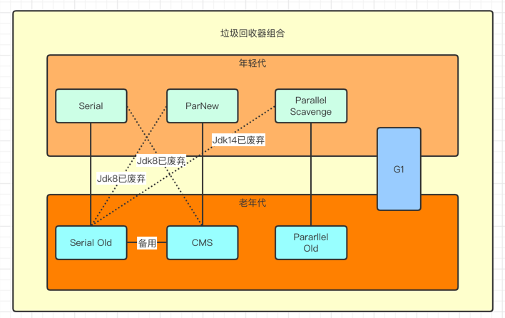
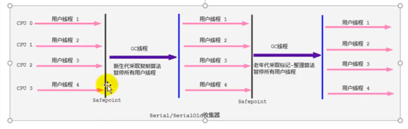
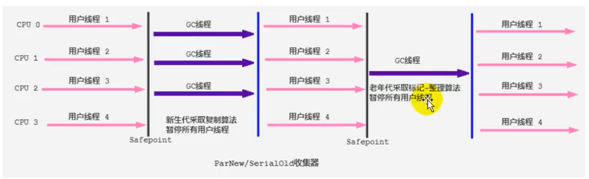
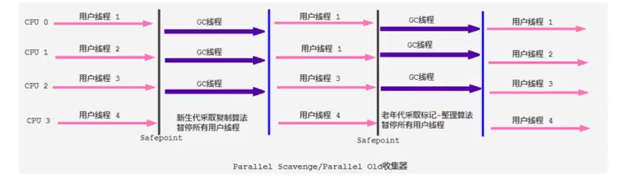
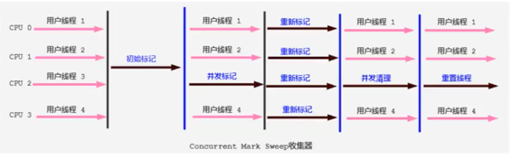
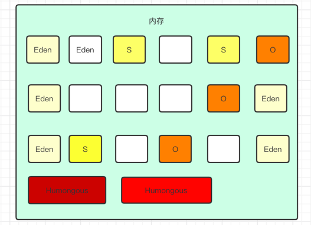
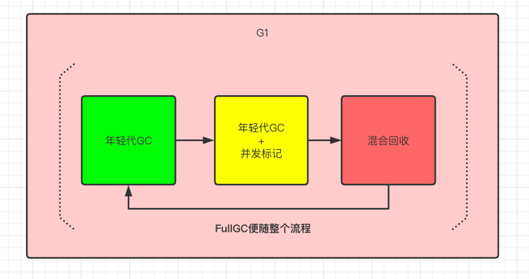
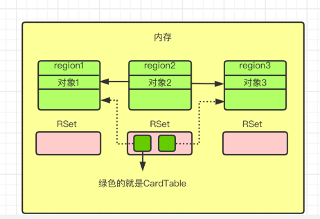
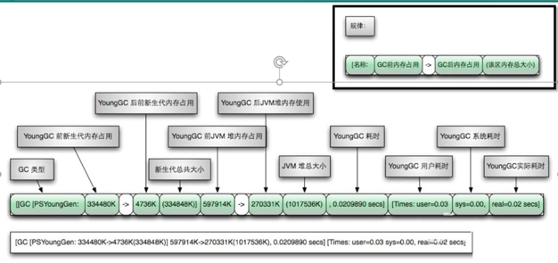

### GC的性能指标

- 吞吐量: 运行用户代码的时间占用总运行时间的比例

    - 高吞吐量可能就是每次GC的次数比较少，但是单单次GC时间相对比较长
    - 每次回收的内容比较多，所以单次回收时间长

- 暂停时间: 执行垃圾收集时，程序的工作线程被暂停的时间
    
    - 单次暂停时间短，但是可能就是回收频率高，用户体验比较好
    - 每次回收的内容相对少，所以频率高

- 内存占用: Java堆区所占的内存大小

- 垃圾收集的开销: 吞吐量的补数，垃圾收集器所用时间与总运行时间的比例

- 收集频率: 相对于应用程序的执行，收集操作发生的频率

- 快速: 一个对象从诞生到被回收所经历的时间

---

### 经典垃圾回收器概述

按并行和并发区分:

- 串行回收器: Serial、Serial Old
- 并行回收器: ParNew、Parallel Scavenge、Parallel Old
- 并发回收器: CMS、G1

按照区域划分:

- 新生代: Serial、Parallel Scavenge、ParNew、G1
- 老年代: Serial Old、Parallel Old、CMS、G1
- 其中G1既可以回收新生代，也可以回收老年代

---

### Serial回收器: 串行回收

- 是Hotspot中Client模式下默认新生代垃圾回收器
- 使用复制算法、串行回收以及STW的机制执行内存回收
- 对老年代提供了Serial Old收集器，也同样采用串行回收和STW机制，
  只不过内存的回收使用的是标记-压缩算法
  
    - Serial Old是Client模式下回收老年代的默认垃圾回收器
    - Serial Old在Server模式下主要有两个用途
      
        - 与新生代的Parallel Scavenge配合使用
        - 作为老年代CMS回收器的后备垃圾手机方案
    
- 优势: 简单而高效，这里的高效是在单核的场景下，在Client模式下是个不错的选择

- 劣势: 目前机器多为多核机器，多核场景下性能不行

命令 | 解释 | 
----|----
-XX:+UseSerialGC | 可以指定年轻代和老年代都使用串行垃圾回收器

---

### ParNew回收器: 并行回收

- ParNew可以看做Serial收集器的多线程版本，只能处理新生代

- 除了采用并行回收的方式外，基本上和Serial没有什么区别，同样采用复制算法以及STW机制

- 因此除了Serial外，目前只有ParNew能和CMS收集器配合使用

- JDK9及以后的版本已经被废弃

命令 | 解释 | 
----|----
-XX:+UseParNewGC | 指定年轻代的垃圾回收器，不影响老年代
-XX:ParallelGCThreads | 限制线程数量，默认和CPU数量相同的线程数

---

### Parallel Scavenge回收器: 吞吐量优先

- 和ParNew收集器不同，目标是一个可控制的吞吐量，也是吞吐量有限的垃圾回收器

- 自适应调节策略也是和ParNew的一个重要区别

- 高效的利用CPU时间，尽快完成程序的运算任务，主要适用于在后台计算而不需要太多交互的任务

- 年轻代也是并行回收，也是采用复制算法、并行回收以及STW机制

- Parallel收集器在老年代提供了Parallel Old收集器，用来替换老年代的Serial Old收集器

- Parallel Old收集器采用了标记-压缩算法，同样基于并行回收和STW机制

- JDK8的默认垃圾回收器

命令 | 解释 | 
----|----
-XX:+UseParallelGC | 启动新生代的回收器 
-XX:+UseParallelOldGC | 启动老年代的回收器
-XX:+UseParallelThreads | 设年轻代并行收集器的线程数，CPU个数小于8的时候线程数都等于CPU个数，CPU个数大于8的时候等于3+[5*CPU/8]
—XX:MaxGCPauseMillis | 设置垃圾回收器最大的停顿时间，该参数的使用要谨慎
-XX:GCTimeRation | 设置垃圾收集时间占总时间的比例，用于衡量吞吐量的大小
-XX:+UseAdaptiveSizePolicy | 设置自适应调节策略，这个时候年轻代大小、Eden和Survivor的比例和晋级老年代等参数会自动调整，以便尽量满足设置的吞吐量

---

### CMS回收器: 低延迟

- 第一次实现了让垃圾收集器与用户线程同时执行的回收器

- CMS关注点是尽可能缩短垃圾收集时用户线程的停顿时间。目前很大一部分的Java应用集中在B/S系统的服务端开发中，
这类服务尤其重视服务的相应速度，希望系统停顿时间最短，CMS就很满足这类应用的需求
  
- CMS的垃圾收集算法采用标记-清除算法，并且会STW

- CMS作为老年代的垃圾回收器，不能和Parallel Scavenge配合使用，只能和ParNew或Serial收集器配合使用

- 执行流程

    - 初始标记: 这个阶段，工作线程STW，这个阶段仅仅只是标记处GCRoots能直接关联到的对象，一旦标记完成就结束STW，速度很快
    - 并发标记: 从GCRoots的直接关联的对象开始遍历整个树，这个阶段耗时长，但是不需要停顿用户线程，可以并发运行
    - 重新标记: 因为并发标记用户线程执行的时候产生了新的数据和修改的数据，因此需要修正并发标记阶段的数据，这个阶段也比较短，也会出现STW，远比并发标记时间短
    - 并发清除: 清除掉已经死亡的对象，释放内存空间，和用户线程同同时执行
    
- 初始标记和重新标记都需要STW，但是时间很短。最耗时的并发标记和并发清除是可以并行的

- 由于用户线程没有中断，因此CMS回收过程中，还要确保应用线程有足够的内存可用。因此CMS不能和其他垃圾回收器一样
满了才回收，需要设定一个阈值，当达到阈值就开始回收。如果没有预留足够的内存，就会出现一次"Concurrent Mode Failure"失败，
这个时候虚拟机就会使用预备方案，临时启用Serial Old收集器重新回收老年代垃圾，这样停顿时间就比较久了
  
- 使用了CMS算法所以会导致内存碎片的问题，因此需要使用空闲列表的方式进行分配内存

- 因为在清除阶段用户线程和清理线程一同执行，所以不能使用标记-压缩算法

- 优点
  
    - 并发收集
    - 低延迟

- 缺点
    
    - 会产生内存碎片，在无法分配大对象的情况下，不得不提前触发Full Gc
    - CMS对CPU资源很敏感，并发阶段，虽然不会STW，但是会占用一部分线程导致总吞吐量降低
    - CMS无法处理浮动垃圾，并发标记阶段如果产生新的垃圾，CMS将无法对这些垃圾对象进行标记，最终导致
    这些新产生的垃圾对象没法被及时回收，重置导致"Concurrent Mode Failure"问题，重而使用最慢的Serial Old回收器
      
- JDK9以后该垃圾回收器被废弃了，JDK14删除了该垃圾回收器

命令 | 解释 | 
----|----
-XX:+UseConcMarkSweepGC | 指定使用CMS作为老年代的垃圾回收，默认使用-XX:+USerParNewGC打开
-XX:CMSInitiatingOccupanyFaction | 设置堆内存的使用率阈值，一旦超过该阈值进行回收，JDK6及以上默认值是92
-XX:+UseCMSCompactAtFullCollection | 用于指定执行完FullGC后对内存空间进行压缩整，以此避免内存碎片的产生
-XX:CMSFullGCsBeforeCompaction | 设置多少次FullGC后对内存空间进行压缩整理
-XX:ParallelCMSThreads | 设置CMS线程数量，默认线程数=(ParallelGCThreads+3)/4

---

### G1回收器: 区域分代化

- G1的目标是在延迟可控的情况下获得尽可能高的吞吐量，所以担当起"全功能收集器"的重任和期望

- G1是一个并行的回收器，把堆内存划分为很多的不同的区域(物理上不连续)。使用不同的Region来表示Eden、
幸存者0区、幸存者1区和老年代等
  
- G1 GC有计划的避免在整个Java堆中进行全区域的垃圾回收。G1跟踪各个Region里的垃圾堆积的价值(回收后获得
的空间大小以及回收所需时间的经验值)，在后台维护一个优先列表，每次根据允许的收集时间，优先回收价值最大的Region
  
- 这种方式的侧重点在于回收垃圾最大量的区间，所以给G1一个名字垃圾优先

- 面向服务端的服务器，主要针对配备多核CPU以及大容量内存的机器，以极高的概率满足停顿的同时，并且有高吞吐量

- JDK9以后是模式的垃圾回收器，取代了CMS回收器以及Parallel + Parallel Old组合。官网称"全功能的垃圾收集器"

- 优点
  
  - 并行和并发
  
    - 并行性: G1在回收期间，可以有多个GC线程同时工作，有效利用多核计算能力，此时用户线程STW
    - 并发性: G1拥有与应用程序交替执行的能力。一般来说，不会在整个回收阶段发生完全阻塞应用的情况
    - G1回收器可以采用应用线程承担后台运行的GC工作，即当JVM的GC线程处理速度慢时，系统会调用应用
    程序线程帮助加速垃圾回收过程
  
  - 分代收集
  
    - G1仍然属于分代垃圾回收器，但是从堆的结构上开，它不要求整个Eden区、年轻代、或者老年代都是连续的，也不再坚持
    固定大小和固定数量
    - 将堆划分为若干个区，这些区域逻辑上包括了老年代、新生代和Eden等
    - 和之前的回收器不同的是，它同时兼顾年轻代和老年代
    - G1中增加了H区，即Humongous区用来存放大对象。对于大对象，默认直接分配到老年代，但是如果是一个短期存在的大对象，会对垃圾收集器造成负面影响。
      如果H区装不下一个大对象，你们G1会寻找连续的H区来存储，为了找到连续的H区，有时候不得不启用FullGC
  
  - 空间整合

    - CMS: 标记-清除，存在内存碎片，多少次FullGC后进行一次整理
    - G1的回收以Region为基本单位，Region之间都是复制算法，但整体上可以看做标记-压缩算法。都能避免碎片法问题，
    比较有利于程序长时间运行，分配内存的时候不会因为大对象没有内存分配而导致的GC。尤其当Java堆大的时候，优势更
    加明显
    
  - 可预测的停顿时间模型

    - 除了追求低延迟外，还可以建立可预测的停顿事件模型，能让使用者明确指定一个长度为M毫秒的事件片段内，消耗在垃圾
    回收的事件不超过N毫秒
    - 因为只用选择部分的区域，缩小了回收的范围
    - G1跟踪各个Region里的垃圾堆积的价值(回收后获得的空间大小以及回收所需时间的经验值)，在后台维护一个优先列表，每次根据允许的收集时间，优先回收价值最大的Region
    - 相比于CMS，G1未必做到CMS在最好情况下的停顿，但是最差情况要好很多
    
- 缺点

  - 相较于CMS，G1还不具备压倒性优势。G1无论是为了垃圾回收产生的内存占用还是程序运行时的额外执行负载都要比CMS高
  - 经验上来看，在小内存应用上CMS的表现大概率会优于G1，而G1在大内存应用上发挥更加优秀。平衡点是6-8GB之间

- G1的设计原则简化JVM性能调优，开发人员只需要简单的三步即可完成调优

  - 开启G1垃圾回收器
  - 设置堆的内存，-Xmx和—Xms
  - 设置最大的停顿时间，-XX:MaxGCPauseMillions

- G1的使用场景

  - 服务器端，针对大内存和多处理器，在普通大小的堆里表现并不惊喜
  - 主要是GC低延迟并且有大堆的应用场景
  
- 垃圾回收过程

  - 年轻代GC(Young GC)，当Eden区使用完的时候，使用一个并行的独占式的收集器，然后把存活对象放到S区或者老年代
  - 老年代并发标记过程(Concurrent Marking)当堆内存使用达到阈值(默认45)，开始老年代并发标记过程
    - 这个阶段会STW
    - 还会计算相关Region的价值
  - 混合回收(Mixed GC)
    - 从老年代开始移动存活的对象到空闲区域，这些空闲区间也称为老年代的一部分
    - G1的老年代不需要整个回收，一次只需要扫描/回收一部分的Region
    - 同时，老年代Region和年轻代一起被回收
  - 必要时候单线程、独占式、高强度的FullGC还是继续存在的，是GC评估失败提供一种失败保护机制，即强力回收

命令 | 解释 | 
----|----
-XX:+UseG1GC | 启用G1垃圾回收器
-XX:G1HeapRegionSize | 设置每个Region的大小，值是2的幂，范围1M-32M之间，目标是根据最小的Java堆大小划分出约2048个区域。默认是堆空间的1/2000
-XX:MaxGCPauseMillions | 设置期望达到最大的GC停顿时间指标，默认是200ms
-XX:ParallelGCThread | 设置STW工作线程的值，最多设置为8
-XX:ConcGCThreads | 设置并发标记的线程数，将n设置为并行垃圾回收线程的1/4左右，即ParallelGCThreads/4
-XX:InitiatingHeapOccupanyPercent | 设置触发并发GC周期Java堆占用率阈值，达到此值触发GC，默认45

---

### 记忆集 Remembered Set

- 问题
  - 一个对象被不同区域对象引用
  - 一个Region不可能是孤立的，一个Region中的对象可能被其他Region中的对象引用，判断它是否存，
    是否需要扫描整个Java堆才能保证准确
  - 在其他的垃圾回收器中，也存在这个问题，不过G1尤为突出
  - 回收新生代也不得不同是扫描老年代
  - 这样的话会降低MinorGC的效率

- 解决方案
  - 无论是G1还是其他的分代垃圾回收器都存在这个问题，都是使用Remembered Set解决的
  - 每个Region都有一个对应的Remembered Set
  - 每次Reference类型数据写操作的时候，都会产生一个写屏障暂时中断操作，写屏障在这里可以简单的理解为切面
  - 然后检查将要写入的引用指向的对象是否和该引用类型数据在不同的Region
  - 如果不同，通过CardTable把相关引用信息记录到引用指向对象的所在Region对应的Remembered Set中，可以理解CardTable就是一个数据结构
  - 当进行垃圾收集时候，在GC根节点的枚举范围加入Remembered Set，就可以保证不进行全局扫描

--- 

### 垃圾回收器总结

垃圾回收器 | 分类 | 回收区域 | 算法 | 特点 | 场景 |
----|----|----|----|----|----
Serial | 串行 | 新生代 | 复制算法 | 响应速度优先 | 单CPU的Client模式
ParNew | 并行 | 新生代 | 复制算法 | 响应速度优先 | 多CPU的Server模式下，和CMS配合使用
Parallel | 并行 | 新生代 | 复制算法 | 吞吐量优先 | 适用于后台运算且不需要太多交互的场景
Serial Old | 串行 | 老年代 | 标记-压缩算法 | 响应速度优先 | 单CPU的Client模式
Parallel Old | 并行 | 老年代 | 标记-压缩算法 | 吞吐量优先 | 适用于后台运算且不需要太多交互的场景
CMS | 并行 | 老年代 | 标记-清除算法 | 响应速度优先 | B/S系统
G1 | 并行、并发 | 新生代、老年代 | 标记-压缩、复制算法 | 响应速度优先 | 服务端开发，多CPU，大内存

---

### GC日志解析

命令 | 解释 | 
----|----
-XX:+PrintGC | 输出GC日志
-XX:+PrintGCDetails | 输出GC的详细日志
-XX:+PrintGCTimeStamps | 输出GC的时间错
-XX:+PrintGCateStamps | 输出GC的日期
-XX:+PrintHeapAtGC | 在进行GC的前后打印出堆的信息
-Xloggc:../logs/gc.log | 指定GC日志文件的输出位置

在线日志分析[地址](https://gceasy.io/)
