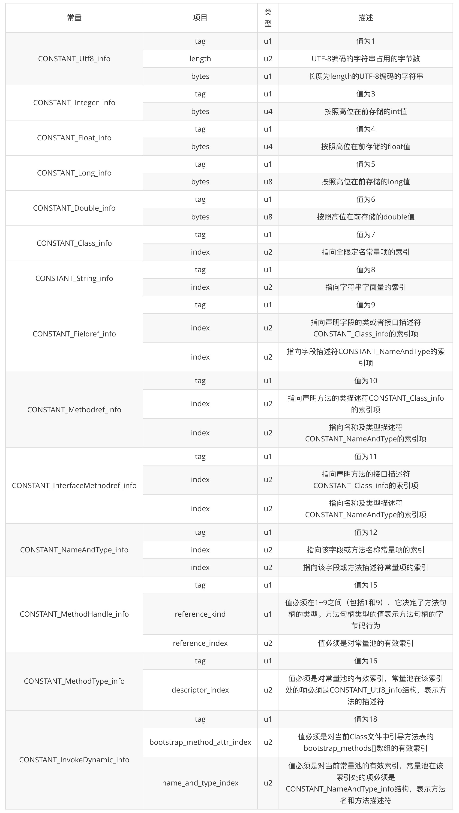

## Class文件结构

Class文件中包含了java虚拟机指令集和符号表以及其他若干辅助信息。Class文件是一组以8
位字节为基础单位的二进制流，当遇到8位字节以上单位的数据时，则会按照高位在前的方式分割成为
若干个8位字节进行存储

- Class文件由无符号数和表构成

- 无符号数: u1、u2、u4、u8分别表示1个字节，2个字节，4个字节和八个字节。无符号数用来描述数字、
索引引用、数量值、按照UTF-8编码构成的字符串值
  
- 表: 以多个无符号或者其他表作为数据构成的复杂数据类型，所有的表都习惯性的以_info结尾

数据描述 | 数据类型 | 备注 
----|:----:|----
magic | u4 | 魔数，标识是0xCAFEBABE
minor_version | u2 | 小版本号
major_version | u2 | 大版本号
constant_pool_count | u2 | 常量池大小
constant_pool[constant_pool_count-1] | cp_info | 常量池信息
access_flag | u2 | 访问标识，public、private、protect
this_class | u2 | 类索引
super_class | u2 | 父类索引
interface_count | u2 | 接口个数
interface[interface_count] | u2| 接口类索引
fields_count | u2 | 字段个数
fields[fields_count] | field_info | 字段表信息
method_count | u2 | 方法个数
method[method_count] | method_info | 方法信息
attributes_count | u2 | 属性个数
attributes[attributes_count] | attribute_info | 属性表信息

---

### Magic魔数

- 为了确定这个文件是否能够被虚拟机识别的Class文件

- 值是固定的"0xCAFEBABE"

---

### Class文件版本号

紧接着魔数的四个字节存储的是Class文件的版本号，同样四个字节，5-6表示的是编译的副版本号minor_version，
而7-8个字节表示主版本号major_version

- 主版本为M，副版本为m，则版本号为M.m

- 对应的是16进制数据，自己进行映射

- 不同版本的编译器的Class文件对应的版本是不一样的，低版本执行器的不能执行高版本的class文件，但是高版本的执行器可以
执行低版本的class文件。否则会抛出java.lang.UnsupportedClassVersionError

---

### 常量池

- 常量池是Class文件中最为丰富的区域之一，常量池对于Class文件中的字段和方法解析也有至关重要的作用
  
- 常量池的内容日渐丰富，是整个Class文件的基石

- 版本号后紧跟的就是常量池个数和常量池信息

- 常量池中常量的个数不是固定的，所以需要一个u2类型的无符号数代表常量池容量计数值
  
- 与Java语言习惯不同，这个计数是从1开始而不是0，即当constant_pool_count=1的时候表示常量池中有0个常量项

- 为什么不从0开始呢，因为把第0项空出来了，这个为了满足后面某些指向常量池索引值的数据在特定情况下需要表达"不引用任何一个常量池项目"的含义，
这种情况可用索引值0来表示

- 常量池表项
    
    - 主要用于存放编译器生成的各种字面量和符号引用
    - 加载后进入方法区的运行时常量池中存放

类型 | 标识 | 备注
----|:----:|----
CONSTANT_utf8_info | 1 | UTF-8编码的字符串
CONSTANT_Integer_info | 3 | 整形字面量
CONSTANT_Float_info | 4 | 浮点型字面量
CONSTANT_Long_info | 5 | 长整形字面量
CONSTANT_Double_info | 6 | 双精度浮点型字面量
CONSTANT_Class_info | 7 | 类或接口的符号引用
CONSTANT_String_info | 8 | 字符串类型字面量
CONSTANT_Fieldref_info | 9 | 字段的符号引用
CONSTANT_Methodref_info | 10 | 类中方法的符号引用
CONSTANT_InterfaceMethodref_info | 11 | 接口方法的符号引用
CONSTANT_NameAndType_info | 12 | 字段或方法的符号引用
CONSTANT_MethodHandle_info | 15 | 表示方法句柄
CONSTANT_MethodType_info | 16 | 标志方法类型
CONSTANT_InvokeDynamic_info | 18 | 表示一个动态方法调用点

------

### 访问标识

- 使用两个字节表示，用来标识一些类或者接口层次的访问信息，如是否是Abstract类，是否是public类型，是否被声明为final类型

- 每一种类型的表示都是通过设置访问标识的32位中的特定位来实现，如public final的类，则标记为ACC_PUBLIC | ACC_FINAL

- 使用ACC_SUPER可以让类更加准确的定位到父类的方法super.method()，现代编译器都会设置并且使用这个标记

标识名称 | 标记值 | 备注
----|:----:|----
ACC_PUBLIC | 0x0001 | 表示为public类型
ACC_FINAL | 0x0010 | 表示被声明为final，只有类可以设置
ACC_SUPER | 0x0020 | 允许使用invoke special字节码指令的新语义，JDK1.0.2之后编译出的类这个标记默认为真
ACC_INTERFACE | 0x0200 | 表示这是一个接口
ACC_ABSTRACT | 0x0400 | 是否为abstract类型，对于接口或者抽象类来说，这个标记值为真，其他均为假
ACC_SYNTHETIC | 0x1000 | 表示此类并非由用户代码产生（即：由编译器产生的类，没有原码对应）
ACC_ANNOTATION | 0x2000 | 表示这是一个注解
ACC_ENUM | 0x4000 | 表示这是一个枚举

---

### 类索引、父类索引、接口索引集合

- 在访问标识之后，会指定该类的类别、父类的类别、以及实现的接口

长度 | 含义 
----|----
u2 | this_class
u2 | super_class
u2 | interface_count
u2 | interfaces[interface_count]

- 这三项数据来确定这个类的继承关系

  - 类索引用来确定类的全限定名
  - 父类索引用于确定父类的全限定名，由于Java不存在多继承，因此只有一个，因此除了java.lang.Object之外，所有的Java类都有父类，
  因此除了java.lang.Object之外，其他的均不为0
  - 接口索引集合确定了类实现了哪些接口，这些被实现的接口将按implements语句的接口顺序存放到接口集合中
  
- this_class

当前类索引，指向常量池索引集合

- super_class

父类的索引，指向常量池索引集合，仅有java.lang.Object的此索引值为0

- interface

- 指向常量池索引集合，它提供了一个符号引用到所有已实现的接口
- 由于一个类可以实现多个接口，因此需要以数组的形式保存多个接口的索引，表示接口的每个索引也是一个指向常量池的CONSTANT_Class

  - interface_count，表示当前类或者接口的直接父接口数量
  - interfaces[]，接口索引集合，每个成员的值必须是对常量池中某项的有效索引值

---

### 字段表集合

- 用于描述接口或类中声明的变量，字段包括类变量以及实例级变量，但是不包括方法内部、代码块内部方法的局部变量

- 字段叫什么、字段被定义为什么数据类型、这些都是无法固定的，只能引用常量池的常量来描述

- 指向常量池索引集合，描述每个字段的完整信息，比如字段的标识符、访问修饰符、是类变量还是实例变量、是否是常量等

- 不会出现继承而来的字段，但是有可能列出原来Java代码中不存在的字段，比如在内部类中为了保持对外部类的访问性，会自动添加指向外部类实例的字段

- 在Java语言中，字段是没法被重载的

- fields_count，字段计数器，两个字节表示 u2，表示字段的个数

- fields[]，字段表

名称 | 标记值 | 备注 | 数量
----|:----:|----|----
access_flag | u2 | 访问标志 | 1
name_index | u2 | 字段名索引 | 1
descriptor_index | u2 | 描述符索引 | 1
attributes_count | u2 | 属性计数器 | 1
attributes | attribute_info | 属性集合 | attributes_count

名称 | 标记值 | 备注 
----|:----:|----
ACC_PUBLIC | 0x0001 | 字段是否为public
ACC_PRIVATE | 0x0002 | 字段是否为private
ACC_PROTECTED | 0x0004 | 字段是否为protected
ACC_STATIC | 0x0008 | 字段是否为static
ACC_FINAL | 0x0010 | 字段是否为final
ACC_VOLATILE | 0x0040 | 字段是否为volatile
ACC_TRANSIENT | 0x0080 | 字段是否为transient
ACC_SYNTHETIC | 0x1000 | 字段是否由编译器自动产生
ACC_ENUM | 0x4000 | 字段是否为Enum

---

### 方法表集合

- 指向常量池索引集合，它完整描述了每个方法的签名

- 在字节码文件中，每一个method_info项都对应着一个类或接口中的方法信息，比如方法的访问修饰符，
方法的返回值类型以及方法的参数信息
  
- 如果这个方法不是抽象的或者不是Native的，那么字节码中会体现出来

- 一方面，methods表只描述当前类或接口中声明的方法，不包括从父类或者父接口继承的方法，另一方面，methods表有可能
会出现由编译器自动添加的方法，最典型的便是编译器产生的方法信息初始化方法clinit()和实例初始化方法init()

- methods_count，方法计数器，由2个字节u2表示

- methods

名称 | 标记值 | 备注 | 数量
----|:----:|----|----
access_flag | u2 | 访问标志 | 1
name_index | u2 | 字段名索引 | 1
descriptor_index | u2 | 描述符索引 | 1
attributes_count | u2 | 属性计数器 | 1
attributes | attribute_info | 属性集合 | attributes_count

名称 | 标记值 | 备注
----|:----:|----
ACC_PUBLIC | 0x0001 | 字段是否为public
ACC_PRIVATE | 0x0002 | 字段是否为private
ACC_PROTECTED | 0x0004 | 字段是否为protected
ACC_STATIC | 0x0008 | 字段是否为static

---

### 属性表集合

- 方发表集合之后的属性表集合，指的是class文件所携带的辅助信息，比如该class文件的源文件的名称以及任何带有RetentionPolicy.CLASS或者
RetentionPolicy.RUNTIME的注解。这类信息通常被用于Java虚拟机的验证和运行，以及Java程序的调试，一般无须深入了解

- attributes_count，属性计数器，表示当前class文件属性表的成员个数，属性表中的每一项都是一个attribute_info结构

- attribute[]，属性表

名称 | 标记值 | 备注 | 数量
----|:----:|----|----
attribute_name_index | u2 | 属性名索引 | 1
attribute_length | u4 | 属性长度 | 1
info | u1 | 属性表 | attribute_length

