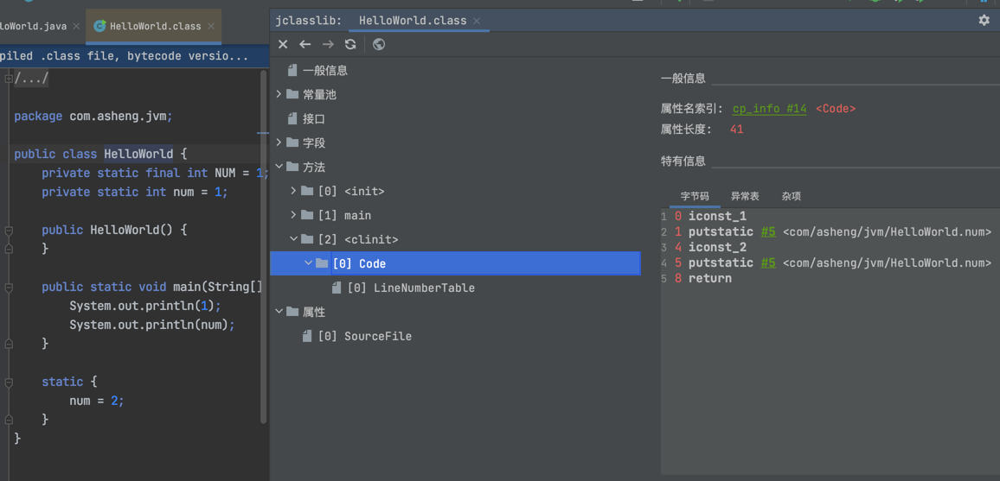
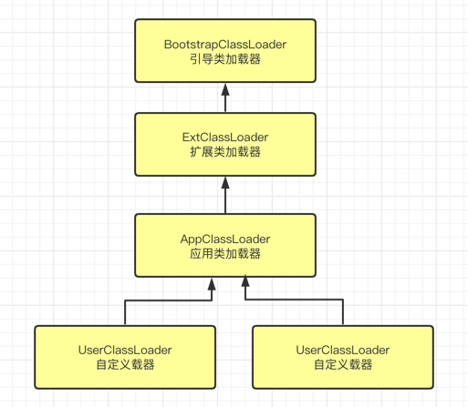
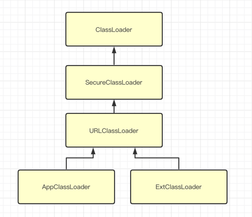

### 开始准备

Idea安装jclassLib ByteCode viewer插件

---

### 什么是类加载器

类加载器子系统负责从文件系统或者网络中加载class文件，class文件在文件开头以特定的文件标识

ClassLoader只负责class的加载，至于是否能运行，则由ExecutionEngine决定

加载的类信息存放于一块称为方法区的内存空间，除了类的信息外，方法区还会存放运行时常量池信息，
可能还包括字符串字面量和数字常亮

----

### 类加载过程


#### 加载

流程: 

- 通过类的全限定名，获取此类的二进制流
- 将这个字节流代表的静态结构转化为方法区的运行时数据结构
- 在内存中生成一个代表这个类的java.lang.Class对象，作为方法区这个类的各种数据的访问入口

文件来源:
- 本地磁盘
- 网络获取
- 从ZIP包读取，如jar、war等
- 运行时获取，如动态代理等
- 其他文件生成，如JSP应用
- 数据库提取、加密文件中获取等

#### 链接

1. 验证

确保class文件是否符合虚拟机都要求，确保被加载类的正确性，不存在危害虚拟机的安全

主要有四种验证

- 文件格式验证
- 元数据验证
- 字节码验证
- 符号引用验证

2. 准备

为类变量分配内存并且设置该类变量的默认初始化值，即赋零值

    public class HelloWorld {
        // final修饰的static变量不会被赋零值，在准备阶段进行的初始化
        private static final int NUM = 1;
        // prepare阶段会被赋予零值，即num=0
        // 直到初始化阶段才会被重新赋值为1，即num=1
        private static int num = 1;
    
        static {
            num = 2;
        }

        public static void main(String[] args) {
            System.out.println(NUM);
            System.out.println(num);
        }
    }

- static被final修饰的时候就不会被赋零值，常量准备阶段会显示的初始化
- 这里不会为实例变量分配初始值，类变量会分配在方法区，而实例变量会随着对象分配到堆中

3. 解析

- 将常量池的符号引用转为直接引用

符号引用是一组符号用来描述所引用的目标。符号引用的字面量形式明确定义在虚拟机规范的Class文件格式中，
直接引用就是直接指向目标的指针、相对偏移量或一个简洁定位到目标的句柄

- 解析操作往往会伴随JVM在执行完初始化后在执行

解析动作主要针对类或接口、字段、类方法、接口方法、方法类型等，对应常量池中的
CONSTANT_Class_Info、CONSTANT_Fieldref_info、CONSTANT_Methodref_info等

#### 初始化

- 初始化阶段就是执行类构造器方法clinit()的过程

- clinit()方法不同于类构造器，类构造器方法是init()

- 此方法不需要定义，是javac编译器自动收集类中所有的**类变量的赋值动作和静态代码块中**的语句合并而来

- 构造器方法中指令按照语句在源文件中出现的顺序执行

- 若该类有父类，JVM会保证子类的clinit()执行之前先调用父类的clinit()方法

- 虚拟机必须要保证一个类的clinit()方法在多线程下被同步加锁



---

### 类加载器

类加载器的结构:



**这里的结构并不是实现和继承，而是表示父加载器**

#### 引导类加载器

- 由C和C++实现的，嵌套在JVM中
- 加载核心类库，rt.jar、resources.jar或者sun.boot.class.path路径下的内容，用于提供JVM自身需要的类
- 不是继承自java.lang.ClassLoader，没有父加载器
- 加载扩展类和应用类加载器，并指定为他们的父加载器
- 出于安全考虑，只加载java、javax、sun等开头的类

#### 自定义加载器

将所有派生于抽象类ClassLoader的加载器都划分为自定义加载器

1. 扩展类加载器

- java语言实现，派生自ClassLoader类
- 父类加载器是启动类加载器
- 从java.ext.dirs系统属性所指定的目录中的类

2. 系统类加载器

- java语言实现，派生自ClassLoader类
- 父类加载器是扩展类加载器
- 负载加载环境变量Classpath或者系统属性java.class.path指定路径下的类库
- 程序中默认的类加载器
- 通过ClassLoader.getSystemClassLoader()方法可以获取到该加载器

3. 用户自定义类加载器

平时，使用上面三种就已经足够了。在必要的时候需要自定义加载器

为什么要自定义类加载器:

- 隔离加载类
- 修改类加载的方式
- 扩展加载源
- 防止源码泄露

如何实现自定义类加载器:

- 继承ClassLoader实现自定义的类加载器
- Jdk1.2之前需要写loadClass()方法，Jdk1.2以后字需要编写findClass()方法
- 如果没有特别复杂需求可以通过继承URLClassLoader实现


    // 查看类加载器的关系
    public class ClassLoaderTest1 {
        public static void main(String[] args) {
    
            // sun.misc.Launcher$AppClassLoader@7f31245a
            ClassLoader systemClassLoader = ClassLoader.getSystemClassLoader();
            System.out.println(systemClassLoader);
    
            // sun.misc.Launcher$ExtClassLoader@45ee12a7
            ClassLoader extClassLoader = systemClassLoader.getParent();
            System.out.println(extClassLoader);
    
            // null，获取不到引导类加载器
            ClassLoader bootstrapClassLoader = extClassLoader.getParent();
            System.out.println(bootstrapClassLoader);
    
            // 对用用户自定义的类: sun.misc.Launcher$AppClassLoader@7f31245a
            ClassLoader classLoader = ClassLoaderTest1.class.getClassLoader();
            System.out.println(classLoader);
    
            // 获取String类的加载器: null -> java核心类库都是通过引导类加载器加载的
            ClassLoader stringClassLoader = String.class.getClassLoader();
            System.out.println(stringClassLoader);
        }
    }

Note: 其中null就是系统加载器，由于系统加载器不是使用java实现，所以获取不到

    // 获取类加载器加载的文件内容
    public class ClassLoaderTest2 {
    
        public static void main(String[] args) {
            // 获取启动类加载器能够加载的api路径
            // file:/Library/Java/JavaVirtualMachines/jdk1.8.0_144.jdk/Contents/Home/jre/lib/resources.jar
            // file:/Library/Java/JavaVirtualMachines/jdk1.8.0_144.jdk/Contents/Home/jre/lib/rt.jar
            // file:/Library/Java/JavaVirtualMachines/jdk1.8.0_144.jdk/Contents/Home/jre/lib/sunrsasign.jar
            // file:/Library/Java/JavaVirtualMachines/jdk1.8.0_144.jdk/Contents/Home/jre/lib/jsse.jar
            // file:/Library/Java/JavaVirtualMachines/jdk1.8.0_144.jdk/Contents/Home/jre/lib/jce.jar
            // file:/Library/Java/JavaVirtualMachines/jdk1.8.0_144.jdk/Contents/Home/jre/lib/charsets.jar
            // file:/Library/Java/JavaVirtualMachines/jdk1.8.0_144.jdk/Contents/Home/jre/lib/jfr.jar
            // file:/Library/Java/JavaVirtualMachines/jdk1.8.0_144.jdk/Contents/Home/jre/classes
            URL[] urLs = Launcher.getBootstrapClassPath().getURLs();
            for (URL urL : urLs) {
                System.out.println(urL.toExternalForm());
            }
    
            // 扩展类加载器加载的路径
            // file:/Library/Java/JavaVirtualMachines/jdk1.8.0_144.jdk/Contents/Home/jre/lib/resources.jar
            // file:/Library/Java/JavaVirtualMachines/jdk1.8.0_144.jdk/Contents/Home/jre/lib/rt.jar
            // file:/Library/Java/JavaVirtualMachines/jdk1.8.0_144.jdk/Contents/Home/jre/lib/sunrsasign.jar
            // file:/Library/Java/JavaVirtualMachines/jdk1.8.0_144.jdk/Contents/Home/jre/lib/jsse.jar
            // file:/Library/Java/JavaVirtualMachines/jdk1.8.0_144.jdk/Contents/Home/jre/lib/jce.jar
            // file:/Library/Java/JavaVirtualMachines/jdk1.8.0_144.jdk/Contents/Home/jre/lib/charsets.jar
            // file:/Library/Java/JavaVirtualMachines/jdk1.8.0_144.jdk/Contents/Home/jre/lib/jfr.jar
            // file:/Library/Java/JavaVirtualMachines/jdk1.8.0_144.jdk/Contents/Home/jre/classes
            String extDirs = System.getProperty("java.ext.dirs");
            for (String path : extDirs.split(":")) {
                System.out.println(path);
            }
        }
    }


### ClassLoader

是一个抽象类，所有的类加载器都继承自ClassLoader，但是不包括启动类加载器

| 方法                                                    | 解释                     |
|-------------------------------------------------------|------------------------|
| getParent()                                           | 获取超类加载器                |
| loadClass(String name)                                | 根据类名，加载Class类的实例       |
| findClass(String name)                                | 根据类名，查找Class类的实例       |
| findLoadedClass(String name)                          | 根据类名，查找已经加载过的Class类的实例 |
| defineClass(String name, byte[], int off, int length) | 根据字节流加载Class类的实例       |
| resolveClass(Class<?> c)                              | 链接指定的一个Java类           |

继承关系: 



### 双亲委托机制

JVM对Class是按需加载，使用到的时候才会加载到内存生成Class对象。而且加载某个类文件时，JVM采用
双亲委派模式，即把请求交由父加载器处理，这是一种任务委派模式

比如自定义一个java.lang.String类，但是在使用String类的时候，不会加载自己的

工作原理:

- 收到加载请求的时候，不是自己去加载，而是交给父加载器去加载
- 如果父加载器存在父加载器，则继续向上委托，直到启动类加载器
- 如果父加载器可以完成加载任务，如果可以完成，则由父类完成；如果父类不能完成，则自己做

优势:

- 避免类的重复加载
- 保护程序安全，防止核心api被修改


两个类Class是否是同一个类的要求:

- 全限定名必须一样
- 加载该类的加载器也必须是想通的

类的主动加载和被动加载:

主动使用和被动使用的区别最大的区别在于是否会初始化clinint()被执行，
Class.forName就是主动加载，ClassLoader.loadClass就是被动加载，详细更多内容可以参考此[链接](../Classloader和Class.forName的区别.md)

### 使用自定义ClassLoader来实现隔离

#### 项目结构

    - classloader-learning
        - loader-v1
            - src/main/java
                - com.asheng.classloader
                    - LoaderTest.java
        - loader-v2
            - src/main/java
                - com.asheng.classloader
                    - LoaderTest.java
        - loader-test
            - src/main/java
                - com.asheng.classloader.test
                    - ClassLoaderTest.java

#### 代码


```java
package com.asheng.classloader;

/**
 * @author asheng
 * @since 2022/02/22
 */
public class LoaderTest {

    public static void load() {
        // 这里在loader-v2的地方改成"loader-v2 begin load"
        System.out.println("loader-v1 begin load");
    }

}
```

```java
package com.asheng.classloader;

import java.io.File;
import java.lang.reflect.InvocationTargetException;
import java.lang.reflect.Method;
import java.net.MalformedURLException;
import java.net.URL;
import java.net.URLClassLoader;
import java.util.concurrent.CountDownLatch;

/**
 * @author asheng
 * @since 2022/02/22
 */
public class DemoClassLoader extends URLClassLoader {

    public DemoClassLoader(URL[] urls) {
        super(urls, null);
    }

    public static void main(String[] args) throws MalformedURLException, InterruptedException {
        File fileV1 = new File("/Volumes/MacinstoshSSD/IdeaProjects/classloader-learning/loader-v1/target/loader-v1-1.0-SNAPSHOT.jar");
        DemoClassLoader classLoaderV1 = new DemoClassLoader(new URL[] {fileV1.toURI().toURL()});

        File fileV2 = new File("/Volumes/MacinstoshSSD/IdeaProjects/classloader-learning/loader-v2/target/loader-v2-1.0-SNAPSHOT.jar");
        DemoClassLoader classLoaderV2 = new DemoClassLoader(new URL[] {fileV2.toURI().toURL()});

        CountDownLatch countDownLatch = new CountDownLatch(2);

        new Thread(() -> {
            Thread.currentThread().setContextClassLoader(classLoaderV1);
            try {
                Class<?> clazz = classLoaderV1.loadClass("com.asheng.classloader.LoaderTest");
                Method method = clazz.getDeclaredMethod("load");
                method.invoke(clazz);
            } catch (ClassNotFoundException | NoSuchMethodException | InvocationTargetException | IllegalAccessException e) {
                e.printStackTrace();
            }
            countDownLatch.countDown();
        }).start();


        new Thread(() -> {
            Thread.currentThread().setContextClassLoader(classLoaderV2);
            try {
                Class<?> clazz = classLoaderV2.loadClass("com.asheng.classloader.LoaderTest");
                Method method = clazz.getDeclaredMethod("load");
                method.invoke(clazz);
            } catch (ClassNotFoundException | NoSuchMethodException | InvocationTargetException | IllegalAccessException e) {
                e.printStackTrace();
            }
            countDownLatch.countDown();
        }).start();

        countDownLatch.await();

    }

}
```
