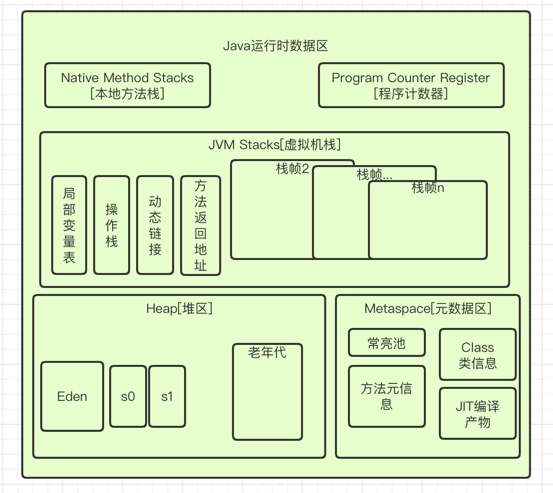

### 运行时数据区

JVM定义了若干程序运行期间会使用到的运行时数据区，其中有些随着虚拟机启动而创建，随着虚拟机退出而
销毁。另一些则是和线程一一对应，这些与线程对应的数据区域会随着线程开始和结束而创建和销毁

线程共享:

- 堆
- 堆外空间，例如永久代或元空间、代码缓存(JIT编译产物)等

线程私有:

- 程序计数器
- 栈
- 本地栈

一个JVM实例对应一个Runtime实例，即运行时环境，相当于内存结构中的最外层的框: 运行时环境

---

### 线程

线程是一个程序里的执行单元，JVM允许一个应用有多个线程并行的执行。在Hotspot中，每个线程
都和操作系统的本地线程直接映射。当一个Java线程准备好执行后，此时一个操作系统的本地线程也同时创建，
Java线程执行中止后，本地线程也会回收。操作系统负责所有线程的安排调度到任意一个可用的CPU上，一旦本地线程
初始化成功，就会调用Java线程的Run()方法

JVM的线程: 

- 虚拟机线程

需要JVM达到安全点的时候出现。这种线程执行的类型包括"stop-the-world"的垃圾收集、线程收集，
线程挂起以及偏向锁撤销

- 周期任务线程

这种线程是时间周期时间的体现，比如中断，他们一般用于周期性操作的调度执行

- GC线程

这种线程对在JVM里不同种类的垃圾回收行为提供了支持

- 编译线程

在运行时将字节码编译成本地代码

- 信号调度线程

接收信号并发送给JVM，在它内部通过调用适当的方法进行处理
