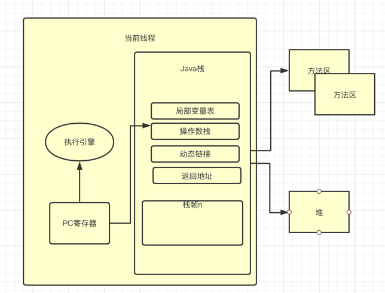
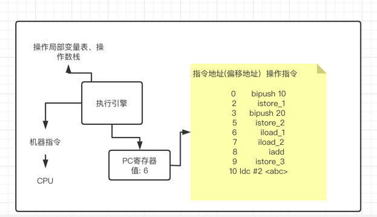

### 介绍

JVM的程序计数器中(Program Counter Register)，也叫PC寄存器。主要是存储指令相关
的现场信息，CPU只有把数据装载到寄存器中才能运行

---

### 作用

- PC寄存器是用来存储指向下一条指令的地址，也即将要执行的指令代码。由执行引擎读取下一条指令

- 因为CPU需要不停的切换各个线程，这个时候切换回来，就需要知道接着从哪个地方开始继续执行

- JVM的字节码解释器就需要通过改变PC寄存器的值来确定下一条该执行那个指令

---

### 特点

- 空间小、运行快的内存区域
- 每个线程都有自己的PC计数器，是线程私有，生命周期和线程生命周期一致
- 任意时间一个线程都只有一个方法在执行，也就是当前方法。程序计数器会存储当前
线程正在执行的Java方法的JVM指令地址，或者如果正在执行native方法，则是未指定值(undefined)
- 程序控制流程指示器，分支、循环、跳转、异常处理、线程恢复等都要依赖这个计数器完成
- 字节码解释工作就是通过改变这个计数器的值来选取下一条需要执行的字节码指令
- 唯一一个Java虚拟机规范中没有规定任何OutOfMemoryError的区域

---

### 分析

源代码:

    public class PCRegisterTest {
    
        public static void main(String[] args) {
            int j = 10;
            int i = 20;
            int k = j + i;
    
            String x = "abc";
            System.out.println(x);
            System.out.println(k);
        }
    }

对应的字节码:

    0 bipush 10
    2 istore_1
    3 bipush 20
    5 istore_2
    6 iload_1
    7 iload_2
    8 iadd
    9 istore_3
    10 ldc #2 <abc>
    12 astore 4
    14 getstatic #3 <java/lang/System.out>
    17 aload 4
    19 invokevirtual #4 <java/io/PrintStream.println>
    22 getstatic #3 <java/lang/System.out>
    25 iload_3
    26 invokevirtual #5 <java/io/PrintStream.println>
    29 return

