### 虚拟机栈概述

#### 栈和堆的介绍

栈是运行时的单位，而堆是存储的单位。栈解决了运行的问题，即程序如何执行，或者说如何处理数据。
而堆则是数据怎么放，放在哪等

#### 栈的特点

- 栈的优点

由于跨平台的需求，所以基于栈的架构方式。指令集小，编译器容易实现

- 栈的缺点

性能下降，实现同样的功能需要的指令多

#### Java虚拟机栈

每个线程创建的时候都会创建一个虚拟机栈，其内部保存一个个的栈帧，对应一次次Java方法的调用。是线程私有的

- 生命周期

生命周期和线程一致，因此不存在垃圾回收问题

- 作用

主管Java程序的运行，保存方法的局部变量（基础类型和对象的引用地址），
部分结果，并参与方法的调用和返回

- 可能出现的异常

1. OOM

如果java虚拟机栈是可以动态扩展的，当尝试扩展的时候无法申请到足够的内存，或者在创建新的线程时，
没有足够的内存区创建对应的虚拟机栈的时候，就会抛出OutOfMemoryError异常

2. SOF

如果采用固定大小的java虚拟机栈，如果线程请求分配栈的容量超过java虚拟机要求的最大容量，
就会抛StackOverflowError异常

- 设置栈的大小

1. -Xss（单位K、M、G）

这个是标准的HotSpot虚拟机参数，应使用此参数为主

每个线程的栈大小，Jdk1.5以后每个线程的栈的大小为1M，使用-Xss1M，即为每个线程的栈最大容量设置为1M

2. -XX:ThreadStackSize

和-Xss的作用一样，不过单位不一样

单位是KB，-XX:ThreadStackSize=256

---

### 栈的存储单位

每个线程都有自己的栈，而栈的数据都是以栈帧的格式存在的，在线程中每个执行的方法都对应一个栈帧。
栈帧是内存区块，是一个数据集，维系着方法执行过程中的各种数据信息

#### 特点

- 只有两个操作，出栈和入栈
- 每个线程的任意时刻，仅有一个当前栈帧是有效的
- 执行引擎的字节码指令仅对当前栈帧进行操作
- 如果调用了别的方法，别的栈帧就会入栈成为当前栈帧
- 不同线程的栈帧是不能相互引用的，毕竟栈是线程私有的
- 如果调用一个方法，并执行结束后会传回此方法的结果给当前栈帧
- 有两种结束方式，return指令或者抛出异常

#### 栈帧的内部结构

- 局部变量表
- 操作数栈
- 动态链接
- 方法返回地址
- 一些附加信息

  
    public class StackInvokeTest {
      public static void main(String[] args) {
          StackInvokeTest test = new StackInvokeTest();
          test.method1();
      }
      private void method1() {
        method2();
      }
      private void method2() {
      }
    }

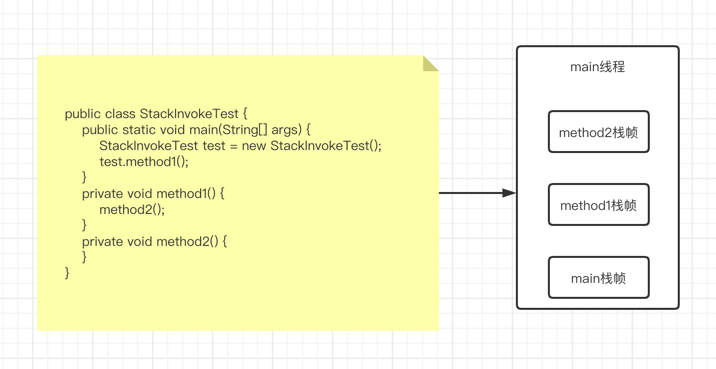

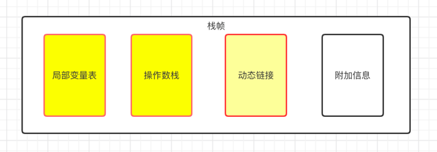
---

### 局部变量表

- 定义为一个数字数组，存的数据主要是方法的参数和定义在方法体内的局部变量，这些数据类型包括各类
基本数据类型、对象引用、以及ReturnAddress类型
  
- 局部变量表建立在线程的栈上，不存在线程安全问题，仅对当前方法调用有效

- 所需要的容量大小在编译器确定下来的，保存在方法的Code属性的Maximum local variables数据项中，在方法运行期间是不会改变的，嵌套次数由栈的大小决定的

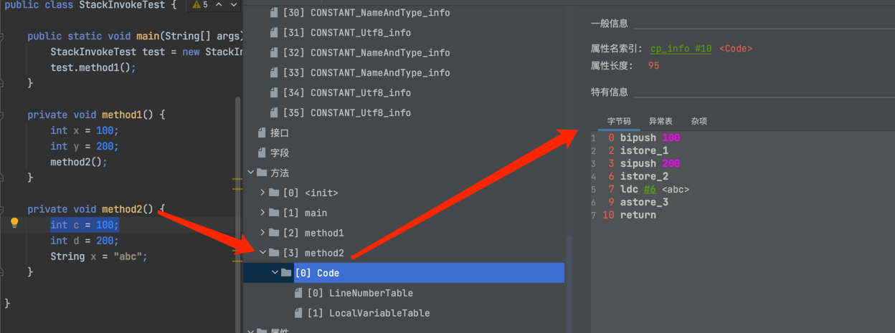

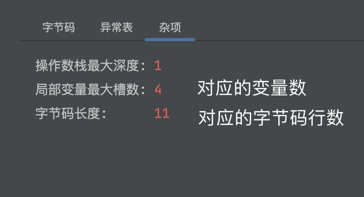

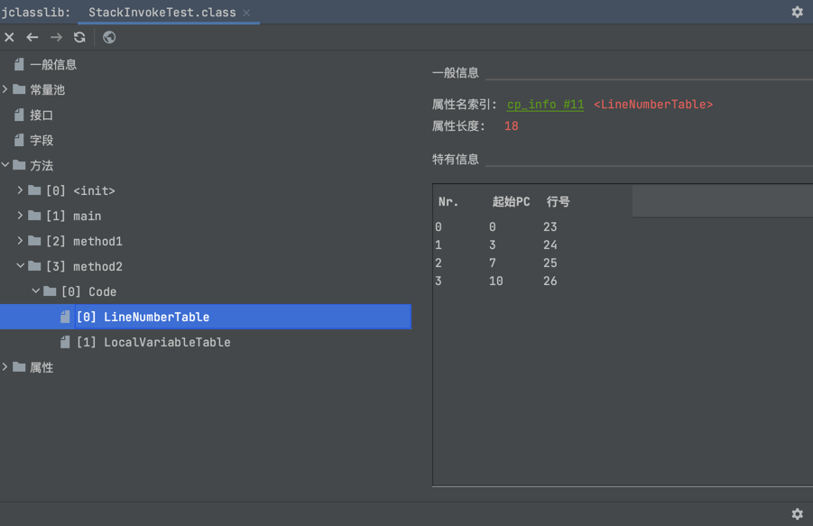

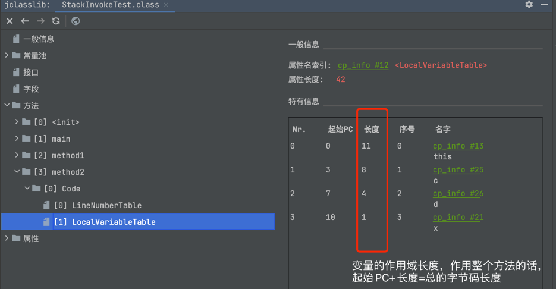

1. 什么是Slot

- 存放总是在局部变量数组的Index0开始，到数组长度-1的索引结束
- 局部变量表中，最基本的存储单位就是Slot(槽)
- 局部变量表中存放编译器可知的各种数据类型(8种)、引用类型、ReturnAddress类型的变量
- 在局部变量表，32位以内的占用一个Slot(包括ReturnAddress类型)，64位的占用两个slot(long和double)
- JVM会为每个Slot都分配一个索引，通过索引就可以访问到局部变量表中的局部变量值
- 非静态的方法会多一个槽位和变量，用来存储this指针

byte、short、char在存储前被转换成int，boolean也被转换为int，0为false，非0位true。而long和double则占用两个slot

2. Slot的重复利用

有些变量出了自己的作用域后，就会被销毁，这个时候让出的槽位就可以供给其他的变量使用

---

### 操作数栈

- 每个独立的栈帧内除了局部变量表之外，还包含一个**后进入先出**的操作数栈，也称之为表达式栈
- 在方法执行的过程中，根据字节码指令，往栈内写入数据和提取数据，即Push和Pop
- 主要是保存中间结果和变量的临时存储结构
- 操作数栈就是JVM执行引擎的一个工作区，当一个方法刚开始执行的时候，一个新的栈帧也就被创建，这个方法的**操作数栈是空的**
- 数据是空的，但是已经被创建，一旦被创建就会明确栈深度用于储存数值，其所需最大的深度在编译器就被定义好了，保存在方法的Code属性中，为MaxStack的值
- 任何一个元素都是可以为任意java类型，32bit占一个深度，64bit占两个深度
- java虚拟机执行引擎基于虚拟机栈的
- 如果被调用的方法带有返回值，其返回值会被压入当前栈帧的操作数栈中，并更新PC寄存器中下一条需要执行的字节码指令
- 栈顶缓存技术，HotSpot中提出了此技术，就是把栈顶元素全部缓存在物理CPU的寄存器中，以此减少对内存的读/写的操作，提升执行引擎的技术

    javap -verbose ClassName

    public class StackOperatorTest {
        public void sum() {
            int a = 10;
            int b = 20;
            int c = getVal();
            int d = a + b + c;
            System.out.println(d);
        }
        public int getVal() {
            return 10;
        }
    }

    istore指令就是保存到局部变量表中
    ipush指令是加载到操作数栈中

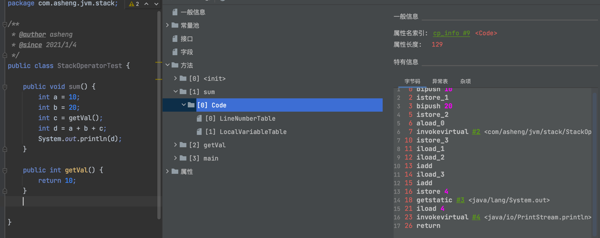

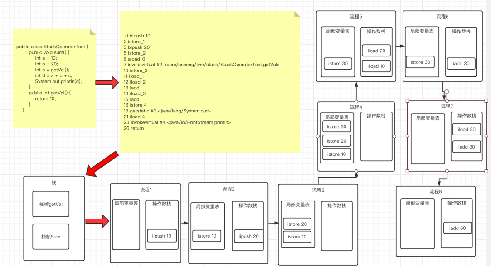

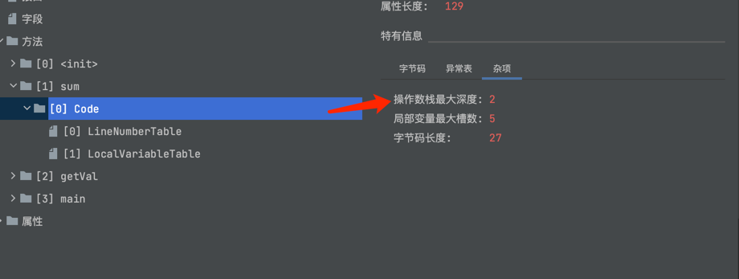    

### 动态链接

- 每个栈帧都内部都包含一个指向运行时常量池中该栈帧所属方法的引用

包含这个引用的目的就是为了支持当前方法的代码能够实现动态链接，比如invoked dynamic指令

- java源代码被编译到字节码文件中，所有的变量方法引用都作为符号引用保存在class文件的常量池中

编译成为bytecode的时候，第一列是指令偏移量，第二列是指令，第三列如果不为空，就是#开头的，指向的就是常量池的地址

- 动态链接的作用就是将符号引用转换为调用方法的直接引用

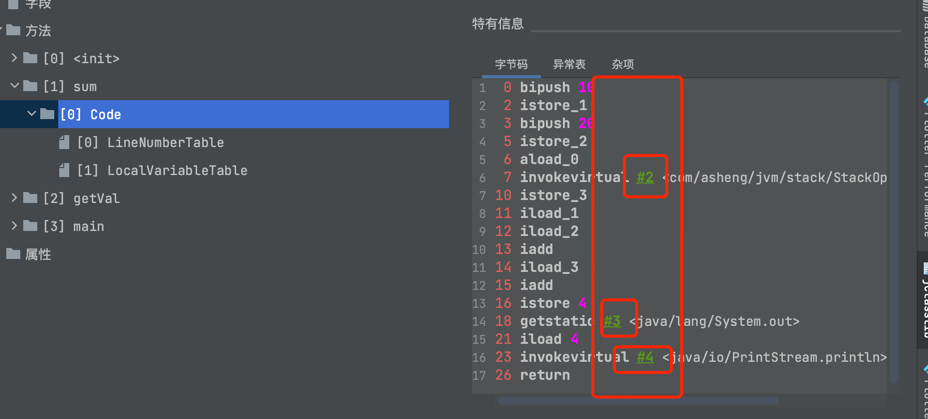

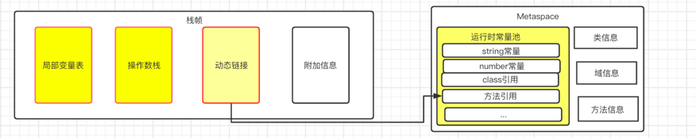

#### 小技能: 方法的调用

在JVM中，将符号引用转换为调用方法的直接引用与方法的绑定机制相关

- 静态链接

当一个字节码文件被装载到JVM内部时，如果被调用的目标方法在编译器可知，且运行期保持不变时。
这种情况下降调用方法的符号引用转为直接引用的过程称之为静态链接

- 动态链接

如果被调用的方法在编译器无法被确定下来，也就是说只能够在程序运行期将调用方法的符号引用转为直接引用，
由于这种引用转换过程具备动态性，因此也就被称之为动态链接

##### 小技能: 方法的绑定

绑定是一个字段、方法或者类在符号引用被替换为直接引用的过程，仅发生一次

- 早起绑定

早起绑定是指目标方法如果在编译器可知，且运行期间不变

- 晚期绑定

编译期无法被确定下来，只能够在运行期间根据实际的类型绑定相关方法

##### 小技能: 动态类型语言和静态类型语言

动态语言和静态语言的区别就是对类型的检查是在编译期间还是运行期间，满足前者就是静态语言，
反之是动态类型语言，整体而言Java是静态类型语言。静态类型语言是判断变量自身的类型信息，动态语言
是判断变量值的类型信息，变量没有类型信息，变量值才有类型信息

#### 小技能: 分派的实质

- 首先从自己的方法表里进行查询
- 如果有则检查权限，如果权限不足则会抛出IllegalAccessException，如果有权限则执行
- 如果没有则从父类的方法进行查询，如果父类有，则调用；没有则抛出NoAbstractMethod

不过为了增加性能，JVM增加了本地虚方法表，在类初始化clinit阶段生成的。通过此表进行查询，
增加效率并实现了分派

##### 小技能: 总结

在面向对象的语言中，主要的三个特征: 封装、继承、多态。而多态方法的实现就是晚期绑定，
类似于C++语言中的虚函数，因此这个指令为invoke virtual，而类似于类本身的方法，如
构造函数、静态方法、私有方法、final方法、和父类的方法等（非虚方法），就是早期绑定

- invoke static: 非虚方法，调用静态方法
- invoke special: 非虚方法，调用私有方法，构造器方法
- invoke virtual: 除去被final修饰的，都是虚方法
- invoke interface: 虚方法，调用接口方法
- invoke dynamic: 动态解析出要调用的方法，然后执行

invoke dynamic是JDK1.7后出现的，这是Java为了实现动态类型语言支持而做的一种改进，
Jdk1.7并没有提供直接生成invoke dynamic指令的方法，需要借助ASM这种底层字节码工具来
产生invoke dynamic指令，直到Jdk1.8的Lambda表达式的出现，invoke dynamic才能被直接的生成

### 方法返回地址

- 存放调用该方法的PC寄存器的值
- 方法结束的两种方式，正常执行结束和出现未处理的异常
- 方法退出后都返回到该方法被调用的位置。方法正常退出时，调用者的PC计数器的值作为
返回地址，即调用该方法的指令的下一条指令地址。而通过异常退出的时候，返回地址是通过异常表
来确定的
- 正常退出和异常退出的区别是是否会给调用者方法返回值

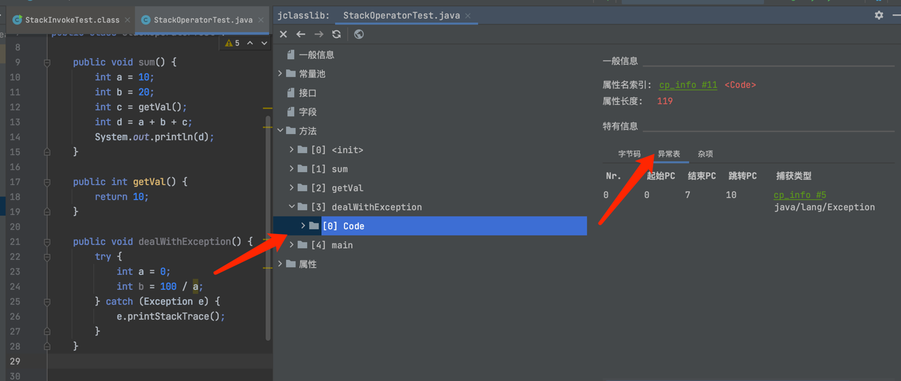

### 附加信息

比如对程序调试的附加信息，可以忽略