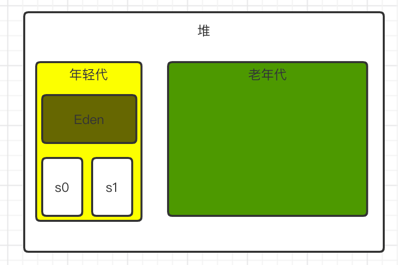
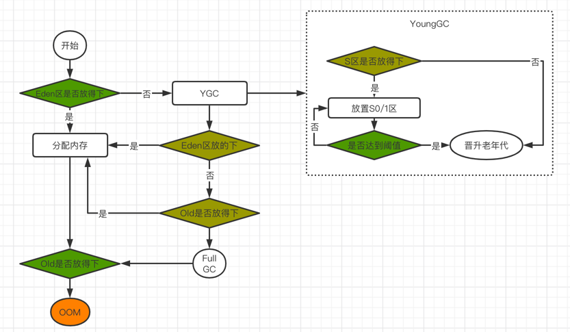
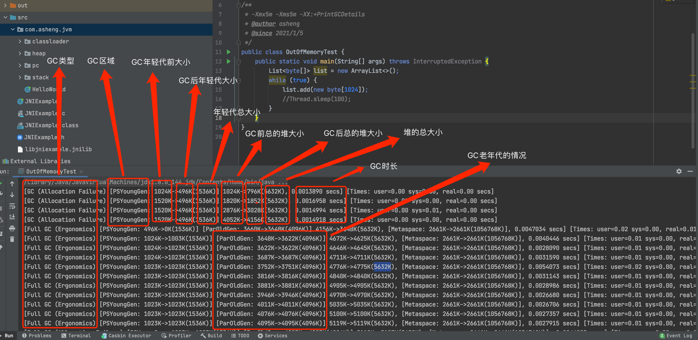
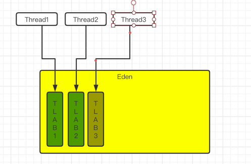
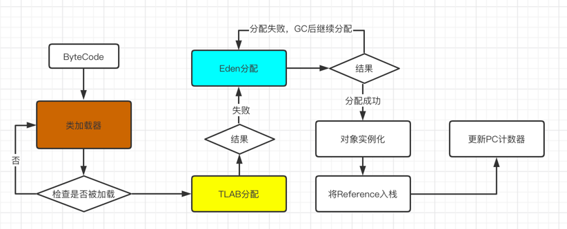
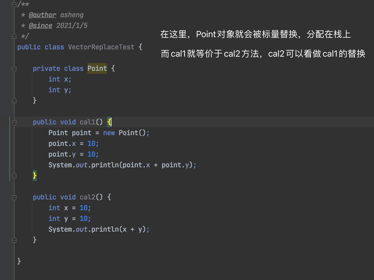

### 堆的概述

- 一个JVM实例只存在一个堆内存，也是内存管理的核心区域

- 堆区在JVM启动的时候即被创建，其空间大小也就确定了，是JVM管理的最大的一块内存空间

    - 堆内存的大小可以调整的

- 规范中对顶，堆可以处于物理上不连续的内存空间中，但是逻辑上它应该被视为连续的

    - 这块的知识点主要是操作系统的虚拟技术，Linux三级映射等
    - 通过虚拟内存和映射把不连续的空间，在逻辑上连续

- 所有的线程共享堆，在这里还可以划分线程私有的缓存区[Thread Local Allocation Buffer, TLAB]

- 所有的数据实例以及数组都应该在运行时分配到堆上，"几乎"所有的对象都分配在堆上

- 数组和对象可能永远都不会分配到栈上，因为栈帧中保存引用，这个引用指向对象或者数组在堆中的位置

    - 这里的"几乎"和"可能永远"的原因，是因为JVM目前引入了逃逸分析等技术，可能会直接分配到栈里

- 在方法结束后，堆中的对象不会马上被移除，仅仅在垃圾收集的时候才会被移除

- 堆是GC执行垃圾回收的重点区域

- JDK1.6以及以前的版本，intern字符串的缓存和静态变量曾被分配到永久代上，后来永久代被替换了。但是intern
字符串缓存和静态变量并不是被转移到元空间，而是直接分配到堆上

---

### 堆的内存细分

现代的垃圾回收器大部分都是基于分代收集理论设计的，堆空间详细分为:

- Jdk1.7逻辑上分为: 新生待+老年代+永久代

    - 新生代: Young/New
        - Eden区
        - Survivor区，又分为s0和s1
    - 老年代: Old/Tenure
    - 永久代: Perm

- Jdk1.8逻辑上分为: 新生代+老年代+元空间
  
    - 新生代: Young/New
        - Eden区
        - Survivor区，又分为s0和s1
    - 老年代: Old/Tenure
    - 永久代: Metaspace

---

### 设置堆的大小和OOM

- 设置堆空间大小(年轻代+老年代)，单位K、M、B，开发中建议将两个参数设置成为一样的值

    - Xms: 设置堆区的起始内存，等价于-XX:InitialHeapSize
    - Xmx: 设置堆区的最大内存，等价于-XX:MaxHeapSize
    
- 一旦堆区的内存大小大于-Xmx的时候，就会抛出OOM异常

- 默认情况，初始内存是物理内存/64，最大内存是物理内存/4

    // 通过Runtime获取最大和最小内存，这里只能获取到近似值，因为S0和S1只算了一个
    Runtime.getRuntime().totalMemory();
    Runtime.getRuntime().maxMemory();

    /**
     * -Xmx10m -Xms10m
     * @author asheng
     * @since 2021/1/5
     */
    public class OutOfMemoryTest {
      public static void main(String[] args) {
        List<byte[]> list = new ArrayList<>();
        while (true) {
          list.add(new byte[1024]);
        }
      }
    }

---

### 年轻代和老年代

- JVM中的Java对象根据生命周期分为两种

    - 一种转瞬即逝的对象，这些对象创建和消亡都非常迅速
    - 另一种声明周期特别长的，极端情况和JVM的生命周期一致

- Java堆进一步细分可以分为年轻代(YoungGen)和老年代(OldGen)

- 其中年轻代又分为Eden空间、Survivor0和Survivor1空间(有时候也叫From区和To区)

- 配置新生代和老年代的比例，默认-XX:NewRatio=2即新生代占1，老年代占2，新生代占1/3，老年代2/3
  可以修改为-XX:NewRatio=4，即新生代占1，老年代占4，新生代占1/5
  
- 默认情况下，Eden区和两个Survivor区空间所占的比如为8:1:1，可以通过-XX:SurvivorRatio来进行调整，默认-XX:SurvivorRation=8

    - 但是我们自己打开机器看到以后发现并不是默认情况，因为我们打开了自适应策略 
    - -XX:-UseAdaptiveSizePolicy 关闭自适应策略
    - -XX:+UseAdaptiveSizePolicy 打开自适应策略
    
- 几乎所有的对象都在Eden区分配的

- 绝大对象的销毁也是在新生代进行的，据研究80%的对象是"朝生夕死"的

- 可以通过-Xmn设置新生代的空间大小，和—XX:NewRatio两个一起使用的时候，以-Xmn为准

---

### 对象分配过程

- 流程:

    - 新生的对方存放在Eden区

    - 当Eden区满的时候，发生MinorGC（YoungGC）会把Eden区的垃圾回收，并把依旧使用的对象放入到Survivor区中，
并把对象年龄赋值为1

    - 当Eden区再次满的时候，会发生MinorGC的时候，会把依旧使用的对象放入到Survivor的另一个区中，并且年龄赋值为1，
并把另一个Survivor区的依旧使用的对象迁移到新的Survivor区中，年龄+1
  
    - 并且重复此操作，直到Survivor区中的对象达到15的时候，就会晋升到老年代中，并且年龄+1，这里的15就是阈值，
可以通过—XX:MaxTenuringThreshold=N进行设置，默认是15
      
    - 有些对象超级大，在Eden区发生完GC后还是放不下，就会直接放入老年代
      
    - 如果老年代也放不下的时候，就会触发FullGC或则MajorGC进行回收
    
    - 如果老年代GC后也存不下的话，就会直接OOM

- 注意: 

    - Survivor区满的时候不会发生GC，而是Eden区满的时候发生回收的时候，也会把Survivor区回收掉
    - Survivor区中，复制交换后，谁是空的 谁就是To区 
    - 频繁在新生代收集，很少在老年代收集，几乎不再永久代/元空间发生收集
    - FullGC和MajorGC发生在老年代
    

---

### Minor GC、Major GC、Full Gc

JVM进行GC的时候，并不是每次都对新生代、老年代和永久代进行GC的，大部分都是发生在新生代，针对HotSpot虚拟机，垃圾回收器按回收区域分为
三大种类: 一种是部分回收，一种是全部回收

- 部分回收: 不是完整的收集整个Java堆的垃圾

  - 新生代收集(MinorGC/YoungGC): 只对新生代的垃圾回收

    - 当年轻代不足的时候，就会触发MinorGC。而Survivor区满的时候，不会触发回收    
    - MinorGC发生的频率比较高
    - MinorGC会引起STW，虽然执行频率高，但是由于年轻代内存小，所以比较快

  - 老年代收集(MajorGC/OldGC): 只对老年代的垃圾回收
    
    - 目前只有CMS GC会对老年代单独回收    
    - 很多时候MajorGC和FullGC是混淆使用，需要分辨是老年代回收还是整体回收
    - 当老年代空间不足的时候，会尝试触发MinorGC，如果之后空间还不足，就会触发MajorGC
    - 由于老年代的空间比较大，因此STW的时间比较长
    - 如果GC后空间仍不足，就会OOM
    
  - 混合收集(MixedGC): 收集整个新生代以及部分老年代的垃圾
    - 目前只有G1 GC会有这种行为

- 全部回收(FullGC): 对整个堆空间和方法区的垃圾收集

  - 调用System.gc()的时候会触发FullGC，但是不必要执行
  - 老年代空间不足
  - 方法区空间不足
  - 通过MinorGC后进入老年代的平均大小大于老年代的可用空间
  - 由Eden区，From区向To区复制时，对象大小大于To区的可用内存，则把该对象转存到老年代，且老年代的可用空间小于该对象大小
  - Full GC在开发和调优的过程中，应当尽量避免，这样STW的时间会短一些

---

### 内存分配策略

- 优先分配到Eden区

- 大对象直接分配到老年代，因此尽量避免代码里有大对象

- 长期存活的对象分配到老年代

- 动态对象年龄判断，当年龄达到阈值一定会进入到老年代，但是也不是必须要达到阈值才行，**如果Survivor区中
相同年龄的所有对象大小之和大于Survivor区的一半**，年龄大于或者等于该年龄的对象直接进入到老年代，无需等待阈值的要求

- 空间分配担保
  
  - -XX:HandlePromotionFailure

    /**
    * -Xms5m -Xmx5m -XX:+PrintGCDetails
    * @author asheng
    * @since 2021/1/5
    */
    public class BigObjectTest {
      public static void main(String[] args) {
        List<byte[]> list = new ArrayList<>();
        while (true) {
          list.add(new byte[1024 * 3]);
        }
      }
    }

---

### 为对象分配内存: TLAB

- 为什么有TLAB

  - 堆是被多个线程共享的，任何线程都能访问共享数据
  - 对象实例的创建在JVM中很频繁，因此并发环境下从对重划分内存很不安全
  - 虽然通过加锁等机制能解决，但是会影响分配速度
  
- 什么是TLAB
  
  - 在Eden区域，会为每个线程划分配一个私有缓存区域，包含在Eden区内
  - 多线程同事分配内存时，使用TLAB可以避免一些列的非线程安全问题，同时还能提升内存分配的效率，
  因此我们把这种分配方式称之为快速分配方式
  
- TLAB再说明

  - 尽管不是所有对象都能在TLAB中成功分配，但是JVM还是把TLAB作为内存分配的首选
  - 通过-XX:UseTLAB选项来开启TLAB空间，默认开启的
  - 默认情况，TLAB空间非常小，仅占用整个Eden空间的1%，可以通过-XX:TLABWasteTargetPercent来设置所占Eden区的百分比
  - 一旦对象在TLAB空间分配失败的时候，JVM就会尝试通过加锁机制来确保数据操作的原子性，从而直接在Eden区中分配
  

---

### 堆空间的参数设置

命令 | 解释
----|----
-XX:PrintFlagsInitial | 查看所有参数默认初始值
-XX:PrintFlagsFinal | 查看所有参数的最终值
-Xms | 初始化堆空间，默认物理机内存1/64
-Xmx | 最大对空间，默认物理机内存1/4
-Xmn | 新生代大小
-XX:NewRatio | 配置新生代与老年代在堆结构的占比
-XX:SurvivorRatio | 配置新生代中Eden和S0/S1的比例，默认8:1:1
-XX:MaxTenuringThreshold | 设置新生代垃圾的最大年龄
-XX:PrintGCDetails | 打印详细信息
-XX:+PrintGC / -verbose:gc | 打印简要信息
-XX:HandlePromotionFailure | 是否设置空间分配担保

---

### 堆是分配对象的唯一选择吗

随着JIT编译器的发展与逃逸分析技术的逐渐成熟，栈上分配、标量替换优化技术将会导致一些微妙的变化，使得
在堆上分配对象变的不在那么绝对了

- 经过逃逸分析后，一个对象没有逃逸出方法的话，那么就可能被优化成栈上分配
  
  - 一个对象在方法中定义后，对象只在方法内部使用
  - 一个对象被方法定义后，被外部方法所引用，则认为发生逃逸
  - 没有发生逃逸的对象就会分配到栈中，随着方法执行的结束，栈空间被移除
  - JDk1.7以后默认开启逃逸分析
  
- TaoBaoVM会有off-heap（GCIH），这块内存是机器的物理内存，GC不能进行回收

- 基于逃逸分析的代码优化

  - 栈上分配，如成员变量赋值、方法返回值、实例引用传递
  - 同步省略，如果一个对象只能从一个线程访问，就会把同步代码块消除，也叫锁消除
  - 标量替换，有些对象不需要作为连续的内存结构存储也能被访问到，那么对象的部分或者全部可以不存储在内存，而是存储在CPU寄存器中。即不存在堆上，存在栈里。
  通过-XX:+EliminateAllocations开启，默认是开启的

---

### Mac下使用jvisualvm

  
    cd /Library/Java/JavaVirtualMachines/jdk1.8.0_144.jdk/Contents/Home
    cd bin
    ./jvisualvm
