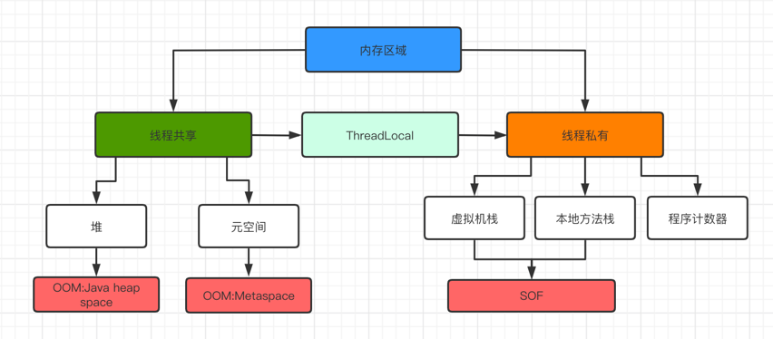
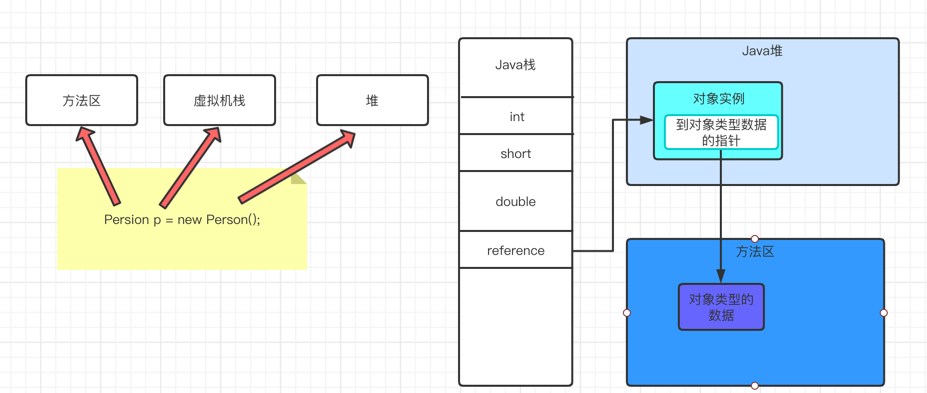
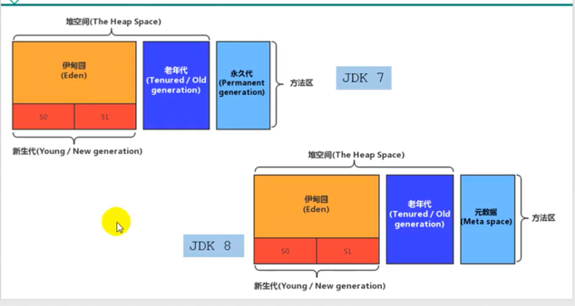
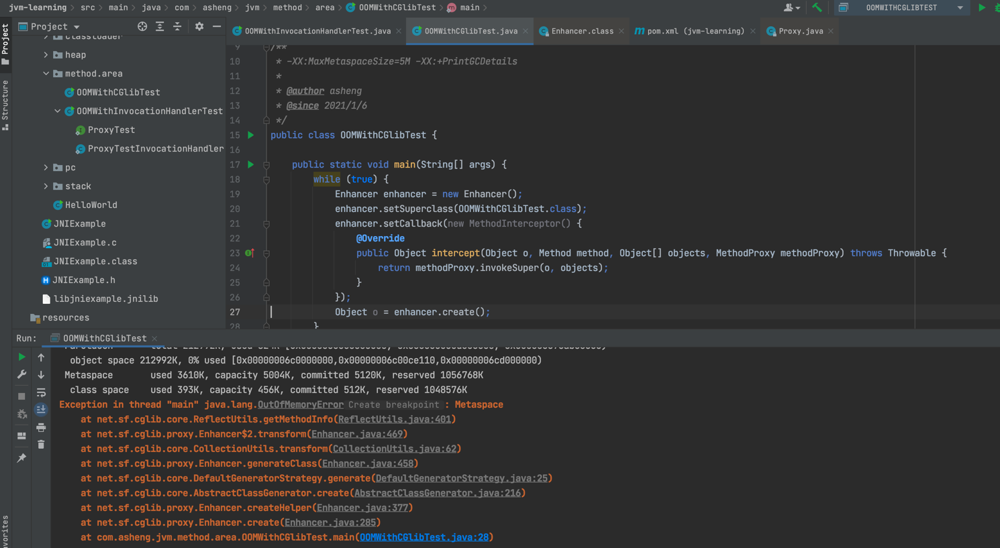
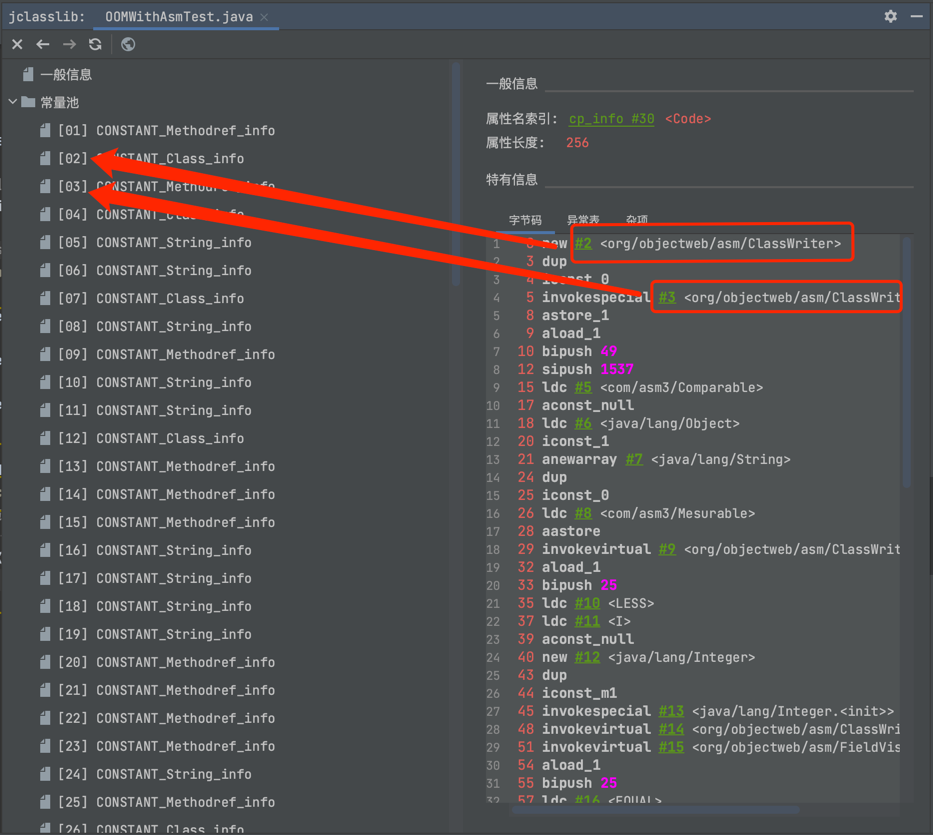
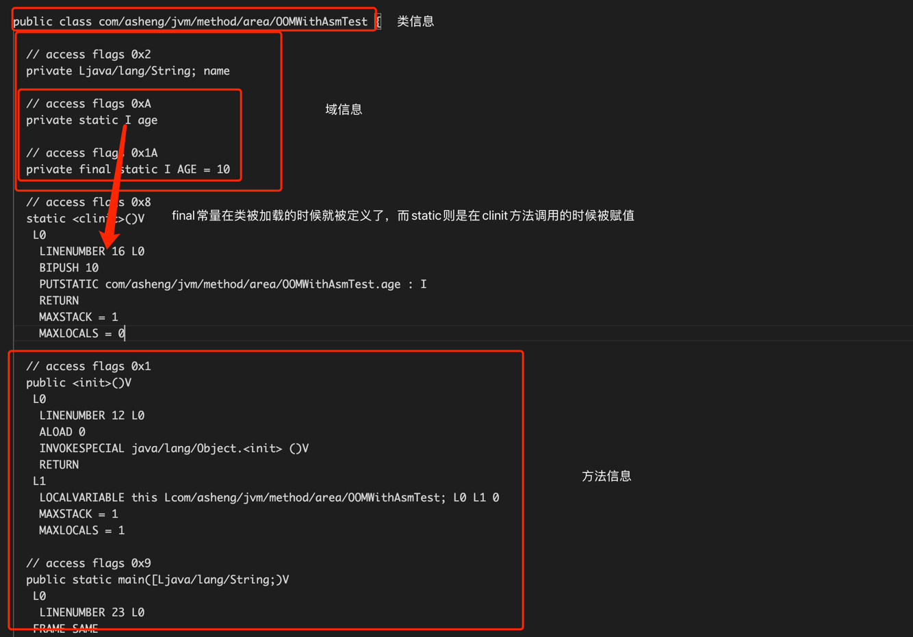
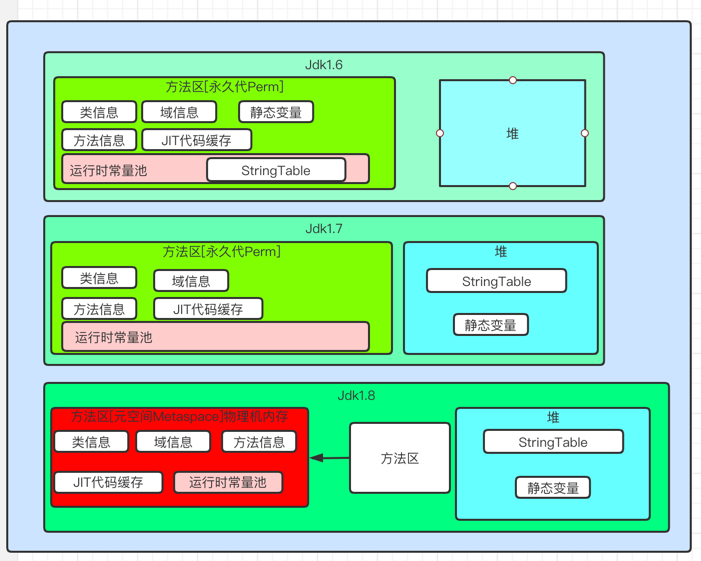

### 栈、堆、方法区的关系和交互

---

### 方法区的理解

方法区可以看做独立于Java堆的内存空间。虚拟机规范中定义，可以简单实现选择不进行垃圾回收和压缩

- 方法区和堆一样可以被共享
  
- 在JVM启动的时候被创建，可以是不想连续的内存

- 可以设置固定大小或者扩展
  
- 方法区的大小决定了系统可以保存多少个类，如果定义了太多的类，导致方法区移除，虚拟机也会抛OOM
    - java.lang.OutOfMemoryError: PermGen space
    - java.lang.OutOfMemoryError: Metaspace
    
- 关闭虚拟机就释放了这个区域的内存
  
- Jdk1.8以后使用元空间代替了Jdk1.7之前的永久代，Jdk1.7之前习惯把方法区叫做用永久代

- 方法区可以看做接口，元空间和永久代看做实现，所以方法区和永久代不等价

- 元空间和永久代的最大区别在于：元空间不再虚拟机设置的内存中，而是本地内存

- 永久代、元空间不仅是名字上的改变，内部结构发生了调整

- 如果无法满足内存的分配，就会抛出OOM

---

### 设置方法区大小和OOM

- 方法区的大小不是固定的，可以动态调整的
  
    - Jdk1.7之前
      - -XX:PermSize来分配初始化空间，默认20.75M，以Byte为单位
      - -XX:MaxPermSize来分配最大的空间，32位默认是64M，65位默认是82M，以Byte为单位
    
    - Jdk1.8以后
      - -XX:MetaspaceSize来分配初始化空间
      - -XX:MaxMetaspaceSize来分配最大的空间，默认值-1，即没有限制
    
- 如何解决OOM
    
个人开发经验看来，大部分是由于动态代理或者是编译Groovy脚本等导致的，好的解决方案就是使用缓存，减少运行时类的编译

---

### 常量池

即运行时常量池和常量池是不一样的，常量池就是类文件中的ConstantPool，常量池可以看做一张表，虚拟机指令根虎额这张常量表找到要执行的类名、方法名、参数类型、字面量等类型。
常量池不是方法区的内容，而运行时常量池才是方法区的内容

- 运行时常量池和常量池
    - 方法区内部包含了运行时常量池
    - 字节码文件内部包含了常量池
    - 要弄清楚方法区，需要理解清楚ClassFile，因为加载类的信息都在方法区
    - 要弄清楚运行时常量池必须要理解ClassFile中的常量池

- 常量池内存储的数据类型
    - 数量值
    - 字符串值
    - 类引用
    - 字段引用
    - 方法引用

 

---

### 方法区的内部结构

<<虚拟机规范>>中描述是主要存储已经被虚拟机加载的类型信息、常量、静态变量、即时编译器编译后的代码缓存等。但是具体的实现会发生变化，以下都是规范

- 类信息

    - 这个类的完整有效名(全限定类名=包.类名)
    - 这个类直接父类的完整有效名
    - 这个类的修饰符(public、abstract、final)
    - 这个类的直接接口的一个有序列表

对于每个加载的类型(Class、Interface、Enum、Annotation)，JVM必须在方法区中存储以下类型信息

- 域(Field)信息

    - JVM必须在方法区内保存类型的所有域的相关信息以及域的声明顺序
    - 域的相关信息，域名称、类型、修饰符等
    - non-final的类变量 static
        - 静态变量和类关联在一起，随着类的加载而加载，它们成为类数据在逻辑上的一部分
        - 类变量被类的所有实例共享，即使没有类实例时也能访问它
    - 全局常量 static final
        - 被生命为final的类变量的处理方式不同，每个全局常量在编译的时候就被分配了

- 方法信息

    - 方法名称
    - 方法返回类型
    - 方法的修饰符
    - 方法的字节码、操作数栈、局部变量表以及大小
    - 异常表
    
- 运行时常量池

    - 运行时常量池是方法区的一部分
    - 常量池表是Class文件的一部分，用于存放编译期生成的各种字面量与符号引用。这些内容将在类加载后
    存放到方法区的运行时常量池中
    - 运行时常量池，在加载类和接口到虚拟机中，就会创建对应的运行时常量池
    - JVM会为每个已加载的类型都维护一个常量池，通过索引进行访问，这里访问的话，通过指针访问，因此虽然每个类都维护了一个常量池，但是指向的是同一块地址
    - 运行时常量池中包含多种不同的常亮，编译期就已经明确的数值字面量、包括到运行期间解析后才能获得
    的方法或字段引用，因此不再是常量池中的符号地址了，这里就转换为真实的地址。相对Class的常量池表多了一个特征，动态性
    - 运行时常量池类似于传统编程语言的符号表
    - 如果构造运行时常量池超过了方法区所提供的最大值，则JVM就会抛出OOM

### 方法区的演变

- 目前只有Hotspot有永久代，JRockit和J9不存在有就带的概念

- Hotspot的方法区变化

版本 | 特性
----|----
JDK1.6及以前 | 有永久代，静态变量存放在永久代(static变量)
JDK1.7 | 有永久代，但已经逐步的"去永久代"，字符串常量池、静态变量移除，保存在堆上
JDK1.8 | 无永久代，类型信息、方法、字段、常量保存在本地内存(物理内存)的元空间，但字符串常量池、静态变量仍在堆上

- 永久代替换的原因

    - 永久代的大小很难确，动态加载类比较多的时候，Perm区容易OOM
    - 对永久代进行调优比较麻烦，主要回收废弃的常量和类信息

