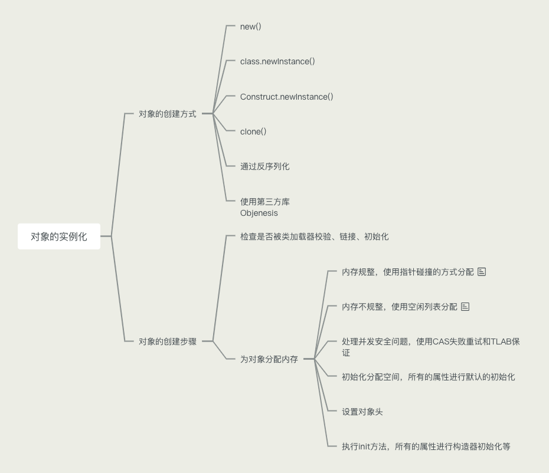
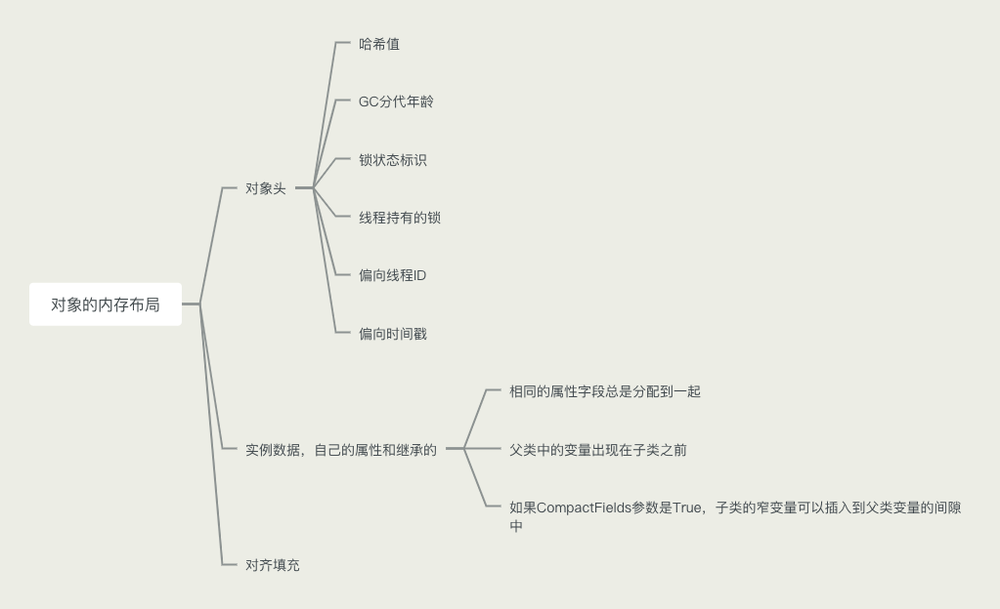
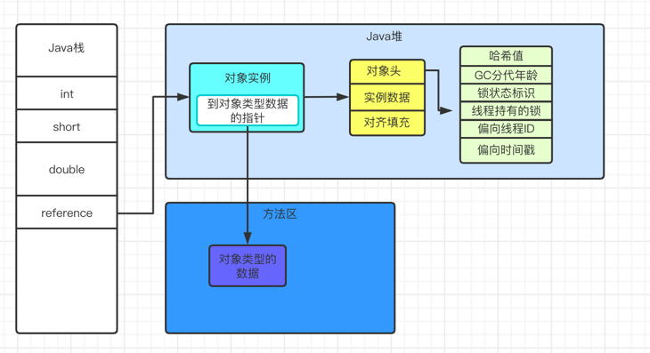

### 对象的实例化

- 对象创建的方式
    - new()
    - class.nwInstance()
    - Constructor.newInstance()
    - 使用Clone()
    - 使用反序列化
    - 第三方库Objenesis
    
- 创建对象的步骤
    - 判断对象对应的类是否校验、链接、初始化
    - 为对象分配内存，其中又分为内存是否规整，其中内存规整的话使用指针碰撞，不规则的话使用空闲列表分配。主要取决于垃圾收集器
    - 处理并发安全问题，TLAB和使用CAS保证失败重试的原子性
    - 初始化分配到的空间，所有的属性进行默认初始化
    - 设置对象的对象头
    - 执行init方法，所有的属性进行构造器初始化等操作

    

### 对象的内存布局

- 对象头
    - 运行时元数据
        - 哈希值HashCode
        - GC分代年龄
        - 锁状态标志
        - 线程持有的锁
        - 偏向线程ID
        - 偏向时间戳
      
    - 类型指针，指向类元数据，确定该数据的类型
    - 如果是数组需要记录数组长度
    
- 实例数据，存储真正有效的信息，包括代码里定义的以及从父类继承的
    
    - 相同宽度的字段总是被分配到一起的
    - 父类中定义的变量会出现在子类之前
    - 如果CompactFields参数为true(默认是false)，子类的窄变量可以插入到父类变量的空隙

- 对齐填充，不是必须的，没特殊意义，仅起到占位作用

### 对象的访问定位

JVM如何通过栈帧中的对象引用访问到其内部的对象实例的呢

通过栈上的reference访问到的，栈上记录的是引用对象的内存地址。Hotspot使用的是直接引用，而不是句柄指针！！！

