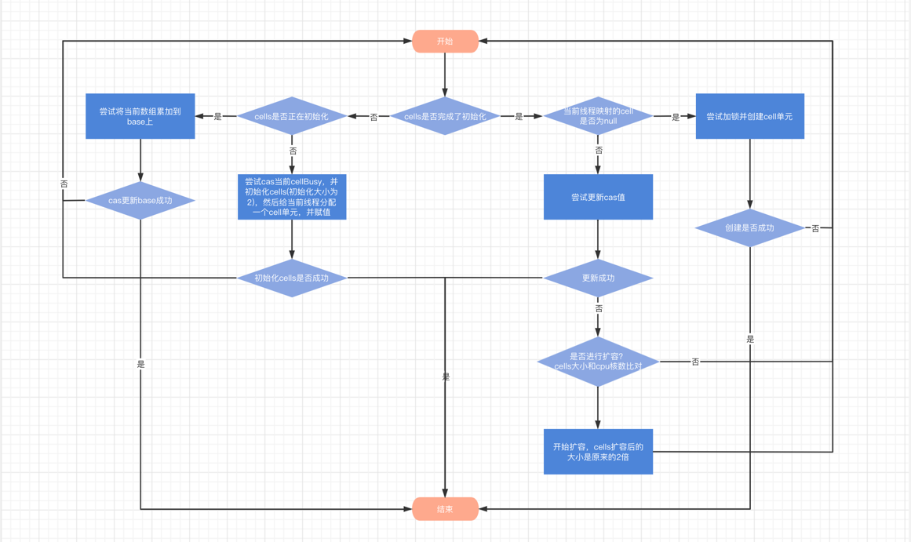
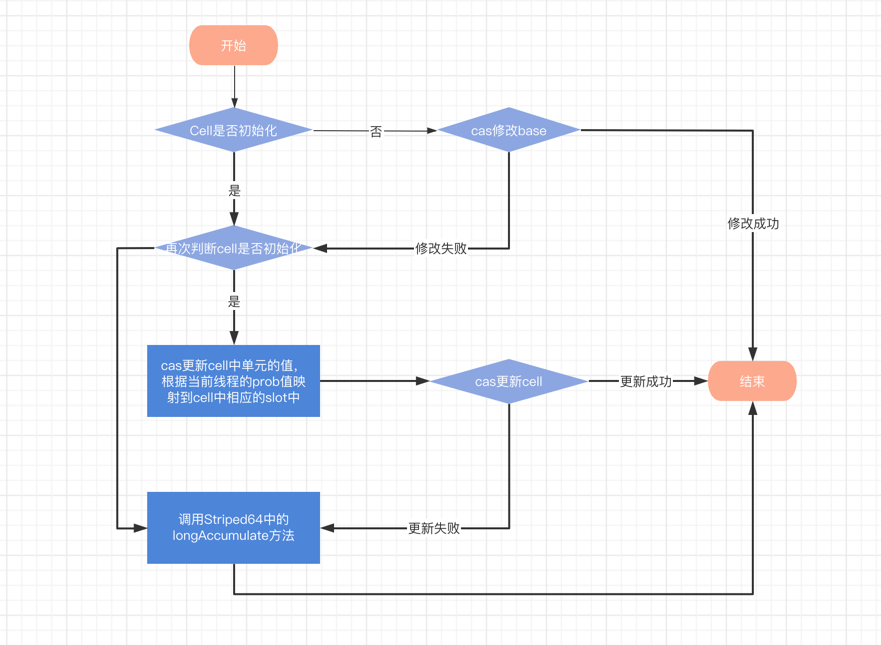

## LongAdder详解

### LongAdder的诞生原因

LongAdder是Jdk1.8的新功能，在此之前我们实现线程安全的方式主要是有如下方式

- 锁(synchronized和ReentrantLock)
- Atomic类

但是这些实现方式都有一些弊端。首先是锁的实现方式比较重量级，性能差。其次是Atomic类通过CAS的实现，
在并发度低的情况下是可以的，但是并发度高起来的话也会有性能问题，因为高并发情况，大部分的线程会因
CAS而一直处于自旋，自旋是不会放弃CPU的占用，因此导致CPU资源的浪费

而在官方文档里的描述，LongAdder的在低并发情况下和AtomicLong的性能差不多的，但是在高并发的情况下，
LongAdder的性能就比AtomicLong好很多，因此我们引入LongAdder的原因就是如此

### AtomicLong代码详解

```java

public class AtomicLong extends Number implements java.io.Serializable {
    
    // ...

    private static final Unsafe unsafe = Unsafe.getUnsafe();

    private static final long valueOffset;
    
    private volatile long value;

    static {
        try {
            // 获取value字段在该类中的内存偏移量
            valueOffset = unsafe.objectFieldOffset
                    (AtomicLong.class.getDeclaredField("value"));
        } catch (Exception ex) { throw new Error(ex); }
    }

    public final long getAndIncrement() {
        return unsafe.getAndAddLong(this, valueOffset, 1L);
    }
    
    // ...
}

public final class Unsafe {
    
    // ...

    /**
     * 这里首先是对volatile类型进行读取，因为使用volatile保证了多线程的读取一致性
     * 其次通过CAS的自旋保证最终成功修改值
     * 
     * @param var1 要查询变量所在的类对象
     * @param var2 查询变量的内存地址偏移量
     * @param var4 需要加的值delta
     * @return 修改后的值
     */
    public final long getAndAddLong(Object var1, long var2, long var4) {
        long var6;
        do {
            var6 = this.getLongVolatile(var1, var2);
        } while(!this.compareAndSwapLong(var1, var2, var6, var6 + var4));

        return var6;
    }

    public final native boolean compareAndSwapObject(Object var1, long var2, Object var4, Object var5);
    
    //...
}

```

### LongAdder的思想

LongAdder的思想是自己维护一个基础值，以及维护了一个cell数组，每个cell都有自己的一个初始值。在没有锁竞争的前提下，都是通过对基础值的cas完成操作，
如果并发度高的情况下，线程就映射到相应的cell中，对cell进行操作，最后通过对base以及各个cell的累加完成计算。这里主要使用多cell减少线程对单个元素的
竞争，可以理解为分别治理的概念

### LongAdder代码详解

看LongAdder之前不得不看Striped64这个类

***Striped64源码截图***

```java
abstract class Striped64 extends Number {

    // 内部类，Cell，目前只有初始值，以及提供通过cas修改初始值的方法
    @sun.misc.Contended
    static final class Cell {
        // 初始值
        volatile long value;
        Cell(long x) {
            value = x;
        }
        
        // 通过CAS更新值
        final boolean cas(long cmp, long val) {
            return UNSAFE.compareAndSwapLong(this, valueOffset, cmp, val);
        }
        
        private static final sun.misc.Unsafe UNSAFE;
        private static final long valueOffset;
        static {
            try {
                // 获取初始值字段的内存偏移地址
                UNSAFE = sun.misc.Unsafe.getUnsafe();
                Class<?> ak = Cell.class;
                valueOffset = UNSAFE.objectFieldOffset
                        (ak.getDeclaredField("value"));
            } catch (Exception e) {
                throw new Error(e);
            }
        } 
    }
    
    // CPU的个数，将绑定表的大小
    static final int NCPU = Runtime.getRuntime().availableProcessors();
    
    // cell表，非空的时候，表长度为2的幂
    transient volatile Cell[] cells;
    
    // 基础值，在两种情况下使用
    // 1. 没有遇到并发情况下，直接累加
    // 2. 初始化cells数组时，必须要保证cells数组只被初始化一次(即只有一个线程能初始化)，其他的竞争失败的线程会将数值累加到base上
    transient volatile long base;
    
    // 自旋锁(锁通过CAS)时使用调整和/或创建cell
    // cells初始化或者扩容时，通过CAS操作将此状态为设置为1加锁状态，初始化或扩容完成后，重置为0
    transient volatile int cellsBusy;

    private static final sun.misc.Unsafe UNSAFE;
    
    // 基础值的内存偏移量 
    private static final long BASE;
    // cellBusy的内存偏移量
    private static final long CELLSBUSY;
    // Thread中threadLocalRandomProbe变量的偏移量，可以看做Thread的一个hash值
    // 主要是和cells的元素对应起来，如果发生争抢后，通过advanceProb修改探针hash值
    private static final long PROBE;
    static {
        try {
            UNSAFE = sun.misc.Unsafe.getUnsafe();
            Class<?> sk = Striped64.class;
            BASE = UNSAFE.objectFieldOffset
                    (sk.getDeclaredField("base"));
            CELLSBUSY = UNSAFE.objectFieldOffset
                    (sk.getDeclaredField("cellsBusy"));
            Class<?> tk = Thread.class;
            PROBE = UNSAFE.objectFieldOffset
                    (tk.getDeclaredField("threadLocalRandomProbe"));
        } catch (Exception e) {
            throw new Error(e);
        }
    }

    // CAS修改基础值
    final boolean casBase(long cmp, long val) {
        return UNSAFE.compareAndSwapLong(this, BASE, cmp, val);
    }

    // CAS修改cellBusy值从0到1，来获取锁
    final boolean casCellsBusy() {
        return UNSAFE.compareAndSwapInt(this, CELLSBUSY, 0, 1);
    }

    // 获取当前线程的探测值，可以看做当前线程的hash值
    static final int getProbe() {
        return UNSAFE.getInt(Thread.currentThread(), PROBE);
    }


    final void longAccumulate(long x, LongBinaryOperator fn,
                              boolean wasUncontended) {
        int h;
        // Thread中threadLocalRandomProbe变量的偏移量，可以看做Thread的一个hash值
        // 主要是和cells的元素对应起来，如果发生争抢后，通过advanceProb修改探针hash值
        if ((h = getProbe()) == 0) {
            ThreadLocalRandom.current(); // 强制初始化Thread的prob值，否则为0
            h = getProbe();
            wasUncontended = true;
        }
        // 如果hash取模映射的到的cell单元不是null，则为true，表明可以扩容
        boolean collide = false; 
        for (;;) {
            Cell[] as; Cell a; int n; long v;
            // 说明这里已经被初始化过了
            if ((as = cells) != null && (n = as.length) > 0) { 
                // 当前线程映射的到cell单元为null，说明这个cell没被使用
                if ((a = as[(n - 1) & h]) == null) {
                    if (cellsBusy == 0) { // cells目前处于空闲状态，没有扩容
                        Cell r = new Cell(x); // 创建一个cell单元
                        if (cellsBusy == 0 && casCellsBusy()) { // 尝试加锁，成功后cellBusy=1
                            boolean created = false;
                            try {               // 重新校验
                                Cell[] rs; int m, j;
                                // 增加新的节点
                                if ((rs = cells) != null && (m = rs.length) > 0 && rs[j = (m - 1) & h] == null) {
                                    rs[j] = r;
                                    created = true;
                                }
                            } finally {
                                cellsBusy = 0;
                            }
                            if (created) // 增加成功，则退出
                                break;
                            continue; // 创建失败，可能重新校验的时候失败了
                        }
                    }
                    collide = false;
                }
                else if (!wasUncontended) // 这个表示前一次cas更新失败，当一个线程第一次该方法的时候肯定为true，当重入访问的时候为false，详细见子类
                    wasUncontended = true; // 重置为true，最后会修改线程的hash值，然后重来来过
                else if (a.cas(v = a.value, ((fn == null) ? v + x : fn.applyAsLong(v, x)))) // 这里表示线程映射的cell已存在，尝试更改单元值
                    break;
                else if (n >= NCPU || cells != as) // 当Cell数组的大小大于CPU核数后，不在扩容
                    collide = false;            // At max size or stale
                else if (!collide)
                    collide = true;
                else if (cellsBusy == 0 && casCellsBusy()) { // 如果当前线程扩容也失败，而且cas修改也失败，那么重新整理cells表，拿到最新数据以后继续重复上面的操作
                    try {
                        if (cells == as) {      // Expand table unless stale
                            Cell[] rs = new Cell[n << 1];
                            for (int i = 0; i < n; ++i)
                                rs[i] = as[i];
                            cells = rs;
                        }
                    } finally {
                        cellsBusy = 0;
                    }
                    collide = false;
                    continue;                   // Retry with expanded table
                }
                h = advanceProbe(h); // 当线程冲突，修改thread的probe值，然后可以映射到其他的cell中
            }
            // cells没加锁，且没初始化，则尝试对他加锁并进行初始化
            else if (cellsBusy == 0 && cells == as && casCellsBusy()) { 
                boolean init = false;
                try {                           // Initialize table
                    if (cells == as) {
                        Cell[] rs = new Cell[2]; // 初始化cell，初始化大小为2，2的幂次
                        rs[h & 1] = new Cell(x); // 将其中的值赋初值
                        cells = rs;
                        init = true;
                    }
                } finally {
                    cellsBusy = 0;
                }
                if (init)
                    break;
            }
            // cells正在进行初始化，则尝试直接在基础值上累加
            else if (casBase(v = base, ((fn == null) ? v + x : fn.applyAsLong(v, x)))) 
                break;                          // Fall back on using base
        }
    }
    
}
```




***LongAdder的源码截取***

```java
import java.io.Serializable;

public class LongAdder extends Striped64 implements Serializable {

    public void add(long x) {
        Cell[] as; long b, v; int m; Cell a;
        // 当cell已经初始化过以后，或者base自旋失败
        // 即当cell初始化后，就不再使用简单的尝试base的cas，减少锁冲突
        if ((as = cells) != null || !casBase(b = base, b + x)) {
            boolean uncontended = true;
            // 如果cell为空，或者当前线程的位置映射槽位为空，或者槽位cas失败，则进入striped64的方法
            if (as == null || (m = as.length - 1) < 0 || (a = as[getProbe() & m]) == null || !(uncontended = a.cas(v = a.value, v + x)))
                longAccumulate(x, null, uncontended);
        }
    }

    // 就是把base + cell的各值
    public long sum() {
        Cell[] as = cells; Cell a;
        long sum = base;
        if (as != null) {
            for (int i = 0; i < as.length; ++i) {
                if ((a = as[i]) != null)
                    sum += a.value;
            }
        }
        return sum;
    }
}
```

