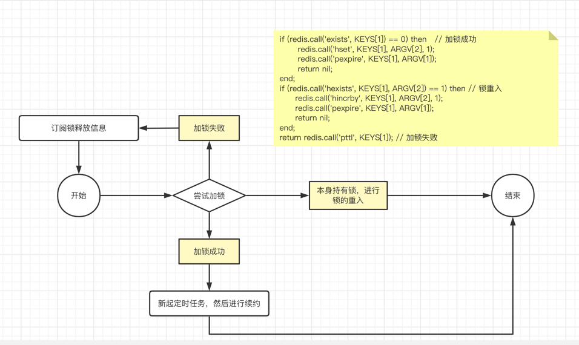
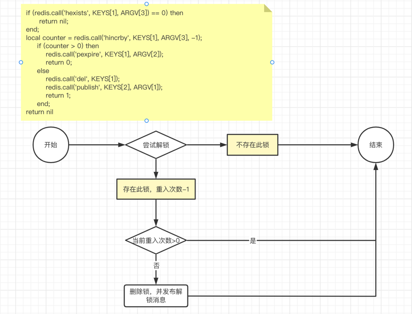

## Redisson分布式锁

### Redisson简介

Redisson是一个在Redis的基础上实现Java驻内存网格。它不仅仅提供了一系列的分布式的Java常用对象，
还实现了可重入锁(ReentrantLock)、公平锁(FairLock)、联锁(MultiLock)、红锁(RedLock)、读写锁(ReadWriteLock)等，还提供了很多分布式服务。

### Redisson用法

```java

/**
 * 分布式锁[分别使用了Redis和Zookeeper进行了实现]
 * Note: 使用分布式锁的时候，请注意如下情况
 * {@link this#lock(String, String, long, long)} 此方法中valid字段，仅对Redis有效，Zookeeper版本永久锁定，由于zk有临时节点的概念，会自己删除
 *
 * @author asheng
 * @since 2019/7/19
 */
public interface DistributeLock {

    /**
     * 加锁，即不设置超时时间，推荐使用此方法！！！
     * 注意和{@link this#lock(String, String, long, long)}的区别
     *
     * @param key 锁的key
     * @param val 锁的val用于解锁
     * @return {@code true}加锁成功 {@code false}加锁失败
     */
    boolean lock(String key, String val);

    /**
     * 尝试加锁，在尝试时间内会一直尝试获取锁
     * 如果尝试时间小于等于0的时候，等同于{@link this#lock(String, String)}方法
     *
     * @param key     锁的key
     * @param val     锁的val用于解锁
     * @param valid   锁有效持有时间[单位毫秒]，Zookeeper版本此字段无效
     * @param tryTime 尝试获取锁的时间[单位毫秒] 当tryTime <= 0 的时候，会一直获取
     * @return {@code true}加锁成功 {@code false}加锁失败
     */
    boolean lock(String key, String val, long valid, long tryTime);

    /**
     * 解锁，即释主动放锁，用完锁的时候都要进行主动释放，建议放在finally块中
     *
     * @param key 锁的key
     * @param val 锁的val，仅和加锁的val相同时才能解锁
     */
    void release(String key, String val);

}

/**
 * 使用Redisson做的分布式锁，Redis的分布式锁推荐使用这种做法
 *
 * @author asheng
 * @since 2020/12/10
 */
public class RedissonDistributeLock implements DistributeLock {

    private static final Logger LOG = LoggerFactory.getLogger(RedissonDistributeLock.class);
    private static final String KEY_PATTERN = "%s_%s";
    private final RedissonClient client;

    public RedissonDistributeLock(Config config) {
        this.client = Redisson.create(config);
    }

    @Override
    public boolean lock(String key, String val) {
        try {
            RLock lock = client.getLock(getKey(key, val));
            lock.lock();
            return true;
        } catch (Exception e) {
            LOG.error("lock failed. key: [{}]. val: [{}]. cause: [{}]", key, val, ExceptionUtils.getFullStackTrace(e));
            return false;
        }
    }

    @Override
    public boolean lock(String key, String val, long valid, long tryTime) {
        try {
            RLock lock = client.getLock(getKey(key, val));
            return lock.tryLock(tryTime, valid, TimeUnit.MILLISECONDS);
        } catch (Exception e) {
            LOG.error("lock failed. key: [{}]. val: [{}]. cause: [{}]", key, val, ExceptionUtils.getFullStackTrace(e));
            return false;
        }
    }

    @Override
    public void release(String key, String val) {
        RLock lock = client.getLock(getKey(key, val));
        if (lock.isLocked() && lock.isHeldByCurrentThread()) {
            lock.unlock();
        }
    }

    private String getKey(String key, String val) {
        return String.format(KEY_PATTERN, key, val);
    }
}
```

### 流程图

- 加锁流程





### 源码分析

```java

import java.util.LinkedHashMap;
import java.util.Map;
import java.util.concurrent.ConcurrentHashMap;

/**
 * RedissonLock继承了RedissonExpirable、实现了RLock
 * RedissonExpirable主要是对key进行进行过期操作处理等，如过期操作、获取TTL时间
 * RLock是实现了一些锁的接口，如lock、tryLock等
 */
public class RedissonLock extends RedissonExpirable implements RLock {

    /**
     * 该类主要是记录线程id和重入次数的映射关系，其提供的方法也多为操作此属性
     * 且该属性为LinkedHashMap形式，会存在先后情况
     */
    public static class ExpirationEntry {

        private final Map<Long, Integer> threadIds = new LinkedHashMap<>();
        private volatile Timeout timeout;
        // ...
    }

    private static final ConcurrentHashMap<String, ExpirationEntry> EXPIRATION_RENEWAL_MAP = new ConcurrentHashMap<>();
    
    /** 锁的续约时间，默认30s */
    private long internalLockLeaseTime;
    /** ConnectionManager Id */
    final String id;
    /** 上面的id + ":" + 锁的key */
    final String entryName;
    /** Redis Channel的发布订阅 */
    protected final LockPubSub pubSub;
    /** 线程池 */
    final CommandAsyncExecutor commandExecutor;
    
    //...
    
    /** 获取订阅pubsub的通道名 */
    String getChannelName() {
        return prefixName("redisson_lock__channel", getName());
    }
    
    /** 获取锁的名字，即当前ConnectionManagerId + threadId */
    protected String getLockName(long threadId) {
        return id + ":" + threadId;
    }
    
    //...

    /**
     * 首先会进行尝试加锁，会有2种结果：加锁成功（开始定时任务进行续约）、加锁失败
     * 其次，如果加锁成功直接返回，加锁失败的话那么就会订阅释放锁的消息，当锁释放的消息发出的时候进行抢锁
     */
    public void lock(long leaseTime, TimeUnit unit, boolean interruptibly) {
        long threadId = Thread.currentThread().getId();
        Long ttl = tryAcquire(leaseTime, unit, threadId);
        if (ttl == null) { // 加锁成功，直接返回
            return;
        }

        // 
        RFuture<RedissonLockEntry> future = subscribe(threadId);
        if (interruptibly) {
            commandExecutor.syncSubscriptionInterrupted(future);
        } else {
            commandExecutor.syncSubscription(future);
        }
        
        try {
            while (true) {
                ttl = tryAcquire(leaseTime, unit, threadId);
                // lock acquired
                if (ttl == null) {
                    break;
                }

                // waiting for message
                if (ttl >= 0) {
                    try {
                        future.getNow().getLatch().tryAcquire(ttl, TimeUnit.MILLISECONDS);
                    } catch (InterruptedException e) {
                        if (interruptibly) {
                            throw e;
                        }
                        future.getNow().getLatch().tryAcquire(ttl, TimeUnit.MILLISECONDS);
                    }
                } else {
                    if (interruptibly) {
                        future.getNow().getLatch().acquire();
                    } else {
                        future.getNow().getLatch().acquireUninterruptibly();
                    }
                }
            }
        } finally {
            // 最终抢到锁，进行取消订阅
            unsubscribe(future, threadId);
        }
        
    }

    /** 使用redis的pub sub功能，进行订阅 */
    protected RFuture<RedissonLockEntry> subscribe(long threadId) {
        return pubSub.subscribe(getEntryName(), getChannelName());
    }


    private Long tryAcquire(long leaseTime, TimeUnit unit, long threadId) {
        return get(tryAcquireAsync(leaseTime, unit, threadId));
    }

    /** 续租时间为-1，那么就使用默认的续约时间。如果获取到锁并且会新启动一个定时任务进行，然后进行定时续约 */
    private <T> RFuture<Long> tryAcquireAsync(long leaseTime, TimeUnit unit, long threadId) {
        if (leaseTime != -1) {
            return tryLockInnerAsync(leaseTime, unit, threadId, RedisCommands.EVAL_LONG);
        }
        RFuture<Long> ttlRemainingFuture = tryLockInnerAsync(commandExecutor.getConnectionManager().getCfg().getLockWatchdogTimeout(), TimeUnit.MILLISECONDS, threadId, RedisCommands.EVAL_LONG);
        ttlRemainingFuture.onComplete((ttlRemaining, e) -> {
            if (e != null) {
                return;
            }

            // lock acquired
            // 如果获取到锁，那么就会进行续约
            if (ttlRemaining == null) {
                scheduleExpirationRenewal(threadId);
            }
        });
        return ttlRemainingFuture;
    }
    
    /**
     * 使用lua脚本进行加锁，主要分为三个分支流程
     * 1. 如果锁不存在，那么就通过hset进行加锁，值为线程的id，并且设置过期时间
     * 2. 如果锁存在，而且就是当前线程加的锁，那么就会将锁重入次数+1，然后重新设置过期时间
     * 3. 如果锁存在，并且不是当前线程持有，那么就会返回ttl时间
     */
    <T> RFuture<T> tryLockInnerAsync(long leaseTime, TimeUnit unit, long threadId, RedisStrictCommand<T> command) {
        internalLockLeaseTime = unit.toMillis(leaseTime);

        return commandExecutor.evalWriteAsync(getName(), LongCodec.INSTANCE, command,
            "if (redis.call('exists', KEYS[1]) == 0) then " +
                "redis.call('hset', KEYS[1], ARGV[2], 1); " +
                "redis.call('pexpire', KEYS[1], ARGV[1]); " +
                "return nil; " +
                "end; " +
                "if (redis.call('hexists', KEYS[1], ARGV[2]) == 1) then " +
                "redis.call('hincrby', KEYS[1], ARGV[2], 1); " +
                "redis.call('pexpire', KEYS[1], ARGV[1]); " +
                "return nil; " +
                "end; " +
                "return redis.call('pttl', KEYS[1]);",
            Collections.<Object>singletonList(getName()), internalLockLeaseTime, getLockName(threadId));
    }


    @Override
    public void unlock() {
        try {
            get(unlockAsync(Thread.currentThread().getId()));
        } catch (RedisException e) {
            if (e.getCause() instanceof IllegalMonitorStateException) {
                throw (IllegalMonitorStateException) e.getCause();
            } else {
                throw e;
            }
        }
    }

    /**
     * 如果解锁成功，则释放续约的定时任务
     */
    @Override
    public RFuture<Void> unlockAsync(long threadId) {
        RPromise<Void> result = new RedissonPromise<Void>();
        RFuture<Boolean> future = unlockInnerAsync(threadId);

        future.onComplete((opStatus, e) -> {
            if (e != null) {
                cancelExpirationRenewal(threadId);
                result.tryFailure(e);
                return;
            }

            if (opStatus == null) {
                IllegalMonitorStateException cause = new IllegalMonitorStateException("attempt to unlock lock, not locked by current thread by node id: "
                    + id + " thread-id: " + threadId);
                result.tryFailure(cause);
                return;
            }

            cancelExpirationRenewal(threadId);
            result.trySuccess(null);
        });

        return result;
    }

    /**
     * 解锁流程
     * 1. 如果这个锁都不存在了，那么直接返回
     * 2. 如果锁还在，那么会对锁的重入次数-1，如果当前的次数还是大于0，那仅仅是续约，如果小于等于0，那么久会删除key，然后发布新消息(解锁消息)
     */
    protected RFuture<Boolean> unlockInnerAsync(long threadId) {
        return commandExecutor.evalWriteAsync(getName(), LongCodec.INSTANCE, RedisCommands.EVAL_BOOLEAN,
            "if (redis.call('hexists', KEYS[1], ARGV[3]) == 0) then " +
                "return nil;" +
                "end; " +
                "local counter = redis.call('hincrby', KEYS[1], ARGV[3], -1); " +
                "if (counter > 0) then " +
                "redis.call('pexpire', KEYS[1], ARGV[2]); " +
                "return 0; " +
                "else " +
                "redis.call('del', KEYS[1]); " +
                "redis.call('publish', KEYS[2], ARGV[1]); " +
                "return 1; "+
                "end; " +
                "return nil;",
            Arrays.<Object>asList(getName(), getChannelName()), LockPubSub.UNLOCK_MESSAGE, internalLockLeaseTime, getLockName(threadId));

    }
    
}

```