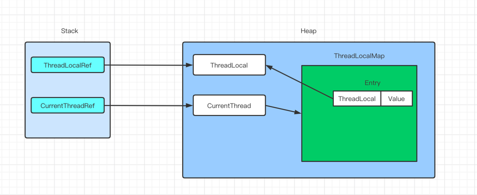

### 1.ThreadLocal简介

ThreadLocal可以实现每个线程都有自己专属的本地变量。ThreadLocal类主要解决的就是让每个线程绑定自己的值，可以将ThreadLocal比喻成为存放数据的盒子，盒子中可以存放每个线程的私有数据

如果你创建了一个ThreadLocal变量，那么访问这个变量的每个线程都会有这个变量的本地副本，这也是ThreadLocal变量名的由来，可以通过get()和set()方法获取默认值或者将值更改为当前线程所存的副本值，从而避免了线程安全问题

### 2.ThreadLocal原码

首先看一下ThreadLocalMap，其中ThreadLocalMap是一个包内访问的静态类，只提供给Thread进行使用，ThreadLocalMap是为ThreadLocal定制化的一个HashMap

    static class ThreadLocalMap {
        static class Entry extends WeakReference<ThreadLocal<?>> {

            Entry(ThreadLocal<?> k, Object v) {
                super(k);
                value = v;
            }
        }

        private static final int INITIAL_CAPACITY = 16;
        private Entry[] table;
        private int size = 0;
        private int threshold; // Default to 0

        private void setThreshold(int len) {
            threshold = len * 2 / 3;
        }

        private static int nextIndex(int i, int len) {
            return ((i + 1 < len) ? i + 1 : 0);
        }

        private static int prevIndex(int i, int len) {
            return ((i - 1 >= 0) ? i - 1 : len - 1);
        }

        ThreadLocalMap(ThreadLocal<?> firstKey, Object firstValue) {
            table = new Entry[INITIAL_CAPACITY];
            int i = firstKey.threadLocalHashCode & (INITIAL_CAPACITY - 1);
            table[i] = new Entry(firstKey, firstValue);
            size = 1;
            setThreshold(INITIAL_CAPACITY);
        }
    }

然后查看Thread中对ThreadLocalMap的引用，查看得知Thread中保存了对ThreadLocalMap的两种运用，其中threadLocals由ThreadLocal维护，而inheritableThreadLocals是由InheritableThreadLocals维护，默认的时候都是空的

    public class Thread {
     
        ThreadLocal.ThreadLocalMap threadLocals = null;

        ThreadLocal.ThreadLocalMap inheritableThreadLocals = null;
    }

最后查看ThreadLocal原码，这里我们能看到，获取值的时候，会先获取当前线程，然后根据当前线程获取线程里的ThreadMap对象，获取到ThreadMap对象后，在根据ThreadLocal本身对象this指针作为key去获取value，如果获取到的ThreadLocalMap为空，则去创建一个ThreadLocalMap复制给当前Thread，其子类也对其做了实现

    public class ThreadLocal<T> {
        protected T iniialValue() {
            return null;
        }
        public static <S> ThreadLocal<S> withInitial(Supplier<? extends S> supplier) {
            return new SuppliedThreadLocal<>(supplier);
        }
        
        public ThreadLocal() {
        }
        
        public T get() {
            Thread t = Thread.currentThread();
            ThreadLocalMap map = getMap(t);
            if (map != null) {
                ThreadLocalMap.Entry e = map.getEntry(this);
                if (e != null) {
                    @SuppressWarnings("unchecked")
                    T result = (T)e.value;
                    return result;
                }
            }
            return setInitialValue();
        }
        
        private T setInitialValue() {
            T value = initialValue();
            Thread t = Thread.currentThread();
            ThreadLocalMap map = getMap(t);
            if (map != null)
                map.set(this, value);
            else
                createMap(t, value);
            return value;
        }
        
        public void set(T value) {
            Thread t = Thread.currentThread();
            ThreadLocalMap map = getMap(t);
            if (map != null)
                map.set(this, value);
            else
                createMap(t, value);
        }
        
        public void remove() {
            ThreadLocalMap m = getMap(Thread.currentThread());
            if (m != null)
                m.remove(this);
        }
        
    }

其中Thread、ThreadLocal、ThreadLocalMap的关系

### 3.ThreadLocal的内存泄露

ThreadLocalMap中的Key为ThreadLocal的弱引用，而value是强引用。所以如果ThreadLocal没有被外部引用的情况下，在垃圾回收的时候，key会被回收，而value不会被清除掉，这样一来就会导致ThreadLocalMap中出现了key为null的Entry。假如我们不做任何处理的话，value永远都不会被GC回收，这个时候就会产生内存泄露。ThreadLocalMap考虑到了这种情况，因此在ThreadLocal使用完以后最好收到调用remove方法

其中ThreadLocalMap使用ThreadLocal的弱引用作为key，如果一个ThreadLocal不存在外部引用的时候，Key在下一次GC的时候就会被回收，这个时候就会导致ThreadLocalMap
的key为null，而value还存在强引用，只有线程退出以后，value的引用连才会断掉。如果Thread没有结束，那么key为null的Entry的value就会一直存在一条引用链

其中关于引用的关系可以产考《JAVA的四种引用》文档
