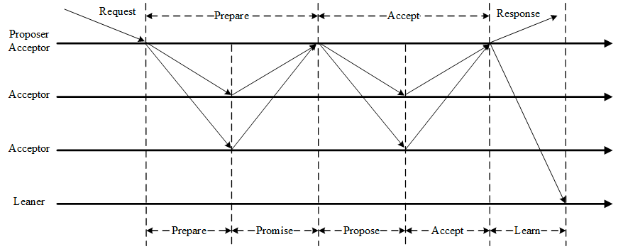
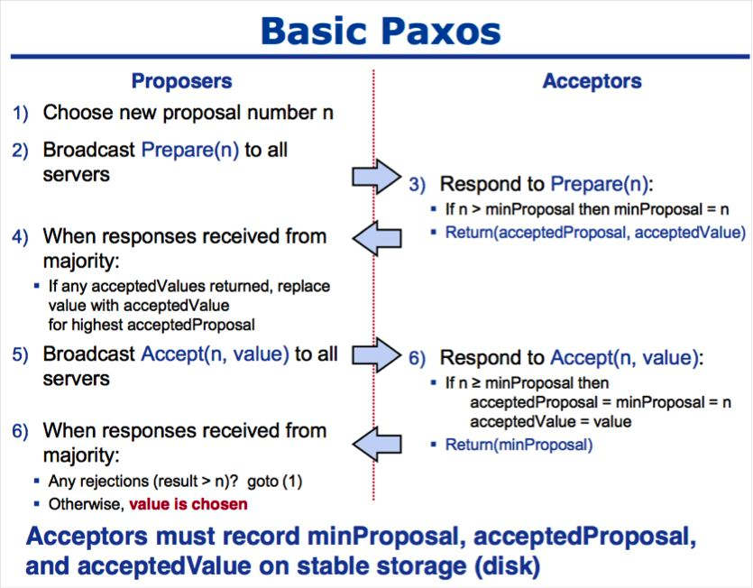

### 为什么需要一致性算法

- 数据不能存在单个节点上，存在单点故障问题
- 多个节点需要保障具有相同的数据

### 什么事一致性算法

一致性就是保障数据一致，在分布式系统中，可以理解为多个节点中数据的值是一致的

### 分类

- 强一致性，保证系统改变提交后立即改变集群的状态
  - 模型：Paxos、Raft、ZAB
  
- 弱一致性，系统不会保证修改完立即修改集群状态，但是随着时间的推移最终状态是一致
  - DNS协议、Gossip协议

### 业界有名的协议实现

- Google的Chubby分布式锁，使用Paxos
- Etcd使用的是Raft
- Zookeeper使用的是ZAB

### Gossip算法

- 介绍

Gossip协议是由种子节点发起的，当一个种子有状态信息需要同步到网络中其他节点时，它会选择周围的节点广播消息，
收到消息的节点也会重复该过程，直到最终网络中所有的节点都收到消息。这个过程可能会需要一定的时间，不能保证
某个时刻所有的节点都收到数据，但是理论上最终所有的节点都会收到消息

<video id="video" controls="" preload="none">
      <source id="gossio_spread.mp4" src="../Images/gossip_spread.mp4" type="video/mp4">
</video>

- 通讯方式

    - PUSH，节点A将数据(key,value,version)推送给节点B，节点B更新A中比自己新的数据
    - PULL，节点A仅将数据(key,version)推送给节点B，节点B将本地比A新的数据发送给A，A更新本地
    - PUSH/PULL，与PULL类似，只是多了一步，节点A再次将比节点B新的数据推送给B，B更新本地
    
- 开源框架
    
    - [java开源框架](https://github.com/apache/incubator-retired-gossip)
    - [go开源框架](https://github.com/hashicorp/memberlist)

### Paxos算法

- 介绍

Paxos算法允许在允许宕机故障的异步系统中，不要求可靠的消息传递，可容忍消息丢失、延迟、乱序以及重复的情况。
利用率大多数(Majority)机制保证了2F+1的容错能力，即2F+1个节点的系统中最多允许F个节点同时发生故障

一个或多个提议进程(propose)可以发起提案(proposal)，Paxos算法似的所有的提案中的某一个提案在所有进程中达成一致。
系统中的多数派同时认可该提案，即达成了一致。

- 概念

Paxos将系统中的角色分为提议者(propose)、决策者(acceptor)、最终决策学习者(learner)

| 角色       | 职责                                                                      |
|----------|-------------------------------------------------------------------------|
| propose  | 提出提案(proposal)，提案信息包括编号(proposalId)和信息值(value)                          |
| acceptor | 参与决策，回应proposes的提案，收到提案后可以接收天，若proposal获得多数的acceptors的接受，则称该proposal被批准 |
| learner  | 不参与决策，从proposal/acceptor学习最新达成一致的提案                                     |

在多副本的状态机中，每个副本同时具备propose、acceptor以及learner三种角色

- 阶段
    
    1. prepare阶段，proposer向acceptors发出prepare请求，acceptors针对收到的prepare请求进行promise承诺
    2. accept阶段，proposer收到多数acceptors承诺的promise后，向acceptors发出propose请求，acceptors针对收到的propose请求进行accept处理
    3. learn阶段，proposer在收到多数acceptors的accept之后，标志着本次accept成功，决议形成，将形成的决议发送给所有的learners

- 两个承诺

    1. 不再接受proposalId **小于等于** 当前请求的prepare请求
    2. 不再接受proposalId **小于** 当前的propose请求

- 一个应答

不违背以前做出的承诺下，回复已经accept过的提案中proposalId最大的那个提案的value和proposalId，没有则返回空值

propose:收到多数acceptors的promise应答后，从应答中选取proposalId最大的提案value，作为本次要发起的提案。如果所有应答的提案value均为控制，
则可以自己随意决定提案value，然后携带当前proposalId，向所有acceptors阿松propose请求

accept:收到propose请求后，在不违背自己之前做的承诺下，接受并持久化当前的proposalId和提案value

learn:proposer收到多数acceptor的accept后，决议形成，将形成的决议发送给所有的learners

- 流程

    1. 获取一个proposalId n，为了保证全局唯一性，可以采用时间戳+serverId
    2. proposer向所有的acceptors广播prepare(n)请求
    3. acceptor比较n和minProposal，如果n>minProposal，minProposal=n，并且将acceptedProposal和acceptedValue返回
    4. proposer接收到过半数回复后，如果发现有acceptedValue返回，将所有回复中acceptedProposal最大的acceptedValue作为本次提案的value，否则可以任意决定本次提案的value
    5. 然后广播accept(n, value)到所有的节点
    6. acceptor比较n和minProposal，如果n>=minProposal，则acceptedProposal=minProposal=n，acceptedValue=value，本地持久化后，返回。否则，返回minProposal
    7. proposer收到半数请求后，如果发现有返回值result>n，标识有更新的提议，跳转到1；否则value达成一致

- 存在的问题

假如系统中存在多个proposer，他们不断向acceptor发提案，还没等上一个提案被多数确定，然后又提新的就会导致acceptor转而处理下一个提案，于是所有的提案都别想通过了

- 开源框架
  - [java语言实现](https://github.com/wuba/WPaxos)

### Multi Paxos算法

- 概念

根据Paxos算法优化而来，整个系统中只有一个proposer，称之为leader

- 流程

    1. 若集群中没有leader，则在集群中选出一个节点并声明它为leader，leader的确定也是一次决议的形成
    2. 集群中的acceptor只表决最新的leader发出的最提案
    3. 其他步骤和basic paxos相同

- 开源框架

  - [go语言实现](https://github.com/hashicorp/raft)

### Raft算法

- 介绍

Raft算法是对Paxos算法的简化和改进，将一致性问题分解为两个问题，leader选举和状态复制

- 概念

  1. leader节点，负责发出提案
  2. follower节点，负责接收leader发出的提案
  3. candidate节点，候选人节点负责争夺leader

- leader选举

  1. 每个follower都持有一个定时器
  2. 当定时器到了而集群中没有leader的话，follower将生命自己是candidate并参与leader选举中，同时将消息发送给其他节点来争取他们的投票，若其他节点长时间没有响应消息将重新发送选举消息
  3. 集群中其他节点将给candidate投票
  4. 获得多数派支持的candidate将会成为第M任leader
  5. 任期内leader会不停的发送心跳给其他节点证明自己还活着，其他节点收到心跳后清空自己的计时器并回复leader的心跳，这个机制保证其他节点不会在leader任期内参与leader选举
  6. 当leader掉线的时候，其他的follower因为没有收到心跳消息进程成为candidate并进入下一轮leader选举
  7. 如果出现两个candidate同事获得了相同的票数，你们这两个candidate将随机推迟一段时间后再向其他节点发出投票请求，这保证了再次发送投票请求以后不冲突

- 状态复制

  1. leader负责接收来自外部的提案请求
  2. 提案内容将包括在leader发出的下一个心跳中
  3. follow收到心跳后回复leader心跳
  4. leader接收到多数follower的回复后确定提案并写入自己的存储空间并回复client
  5. leader通知follow节点确认提案并写入自己的存储空间，随后其他的节点都拥有相同的数据
  6. 若集群中出现了网络异常，导致集群被分割，将会出现多个leader
  7. 被分割除的非多数派集群将无法达成共识，即脑裂
  8. 当集群再次连通的时候，将只听从最新任期的leader指挥，旧的leader将退化为follower

- 开源框架
  - [go语言实现](https://github.com/hashicorp/raft)

### ZAB算法

- ZAB是对Multi Paxos算法的改进，大部分和raft相同
- 和raft最大的区别
  1. 对于leader的任期，raft叫term，而zab叫epoch
  2. 在状态复制过程中，raft的心跳从leader向follower发送，而zab相反

- 开源框架
  - [go语言实现](https://github.com/hashicorp/raft)