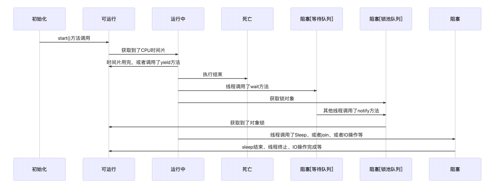

### 进程

进程，直观的说，程序运行以后会在内存空间里形成一个独立的内存体，这个内存体有自己独立的地址空间，有自己的堆，上级挂靠单位是操作系统。操作系统会以进程为单位，分配系统资源（CPU时间片、内存等资源），进程是资源分配的最小单元

### 线程

线程，有时会被称为轻量级进程，是操作系统调度(CPU调度)的最小单元，注意和进程的区别

1.新建New:即创建了一个线程对象

2.可运行Runnable:线程对象创建后，调用了该对象的start方法。该对象处于可运行线程池中，等待被线程调度选中，获取CPU使用权

3.运行中Running:获得到了时间片，执行的程序代码

4.阻塞Blocked:阻塞状态是指线程因为某些原因放弃了CPU的使用权，暂时停止运行。指导线程进入可运行状态，才会有机会获取到时间片继续运行。而阻塞也分为三种情况：

等待阻塞：运行的线程执行o.wait()方法，JVM会把线程放入等待队列

同步阻塞：运行的线程获取对象的同步锁时，所已经被抢占，则JVM会把该线程放入锁池中

其他阻塞：运行的线程执行Sleep方法或者join方法的时候，或者发出了IO请求时，JVM会把线程置为阻塞。当Sleep结束，join等待终止或者超时，或者io处理结束，线程重新进入可运行状态

5.死亡：即线程结束了生命周期

**join和sleep的区别：**

join的使用场景，很多情况，主线程创建子线程，如果子线程里有大量的耗时任务，这个时候时候主线程会比子线程结束的要早，因此要进行等待子线程结束后，主线程再结束，因此就要调用join方法，**join方法的作用是等待线程对象的销毁**

而sleep方法和join方法的区别就是，sleep在休眠的时候不会释放对象锁，而join会释放对象锁，java锁之wait,notify(wait会释放锁，notify仅仅只是通知，不释放锁)

详细参考：https://www.cnblogs.com/milicool/p/8496183.html

更多内容请参考：

http://codingdict.com/blog/

https://www.cnblogs.com/tiancai/p/8855125.html

### 协程

协程是一种用户态的轻量级线程，协程的调度完成由用户控制。协程拥有自己的寄存器上下文和栈。协程调度切换时，将寄存器上下文和栈保存到其他地方，在切回来的时候，恢复先前保存的寄存器上下文和栈，直接操做栈基本上没有内核切换的开销，可以不加锁的访问全局变量，所以上下文的切换特别的快。协程的子程序内不是可中断的，然后转而执行别的子程序，在适当的时候再返回来接着执行

### 进程和线程的区别和联系

**并发性**:不仅进程之间可以并发执行，同一个进程的多线程之间也可以并发执行

**拥有资源**:进程是拥有资源的一个独立单位，线程不拥有系统资源，但是可以访问率属于进程的资源

**系统开销**:多进程的程序要比多线程的要健壮，但是进程的切换，资源消耗的比较大，效率要差很多

线程和进程在使用上各有自己的优缺点，**线程执行开销小，但是不利于资源的保护和管理，而进程相反**。同时，线程适合于SMP机器上运行，而进程可以跨机器迁移

**协程和线程的区别：**

协程避免了无意义的调度，由此可以提升性能，但也因此程序员要负担协程的调度任务，同时协程也失去了标准线程使用多CPU的能力

**协程的和线程比的优点：**

1.极高的执行效率：因为子程序的切换不是线程的切换，而是由程序自己控制，因此，没有线程切换的开销，和多线程比，当线程数量越多的时候，协程的优势越明显

2.不需要多线程的锁机制：因为只有一个线程，也不存在同时是写变量的冲突，在协程控制共享资源不加锁，只需要判断状态就好，所以效率比多线程要高很多

**协程的缺点：**

1.无法利用多核资源：协程本质上是单线程，他不能同时将单个CPU的多核用上，协程需要和进程配合才能使用多个CPU

2.运行阻塞操作会阻塞掉整个程序

**线程和协程的最佳实践：**

1.线程和协程推荐在IO密集型任务中调用，如网络调用。而在CPU密集型中的任务，表型较差

2.对于CPU密集型任务，则需要多进程，既可以使用CPU多核，也可以提高效率

3.对于大并发的最佳实践就是多进程+协程，既可以利用多核，又能充分的发挥协程的高效率，可以获得极高的性能

