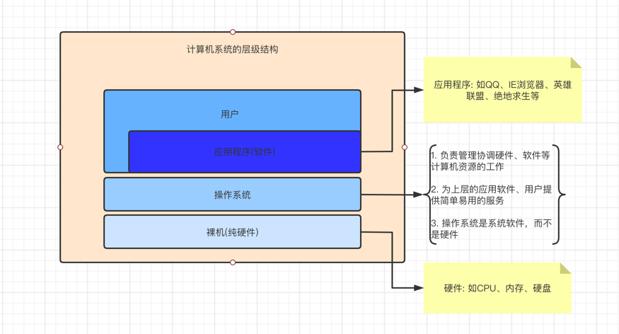

### 计算机系统的层次结构

### 操作系统的概念

- 是系统最基本最核心的软件，属于系统软件

- 控制和管理整个计算机的硬件和软件资源

- 合理的组织、调度计算机的工作与资源的分配

- 为用户和其他软件提供方便的接口和环境

### 操作系统的功能和目标

- 操作系统作为系统资源的管理者(这些资源包括软件、硬件、文件等)，需要提供什么功能？

    - 目标: 安全、高效的工作
    
    - 功能: 
        - CPU(处理器)管理
        - 存储器管理
        - 文件管理
        - 设备管理

- 操作系统作为用户与硬件之间的接口，要为其上层的用户、应用程序提供简单易用的服务，需要实现什么功能？

    - 目标: 方便用户使用
      
    - 提供的功能
        - 命令接口，用户直接使用
            - 联机命令接口: 用户说一句，系统做一句，比如直接输入pwd
            - 脱机命令接口: 用户说一堆，系统做一堆，比如shell脚本
        - 程序接口，即"系统调用"，用户通过程序间接使用
        - GUI（图形化用户界面），如Windows、Android、MacOS、IOS的图形化操作界面

- 操作系统作为最接近硬件的层次，需要在纯硬件的基础上实现什么功能？

    - 需要提供的功能和目标: 实现对硬件机器的扩展
    
    - 没有任何软件支持的机器是裸机，裸机上安装的操作系统，可以提供资源管理功能和方便用户的服务功能，
    将裸机改造成功能更强、使用更方便的机器

