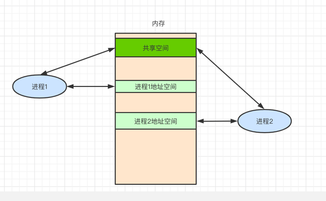
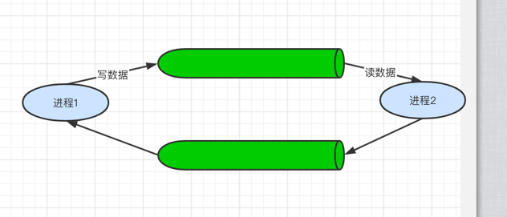
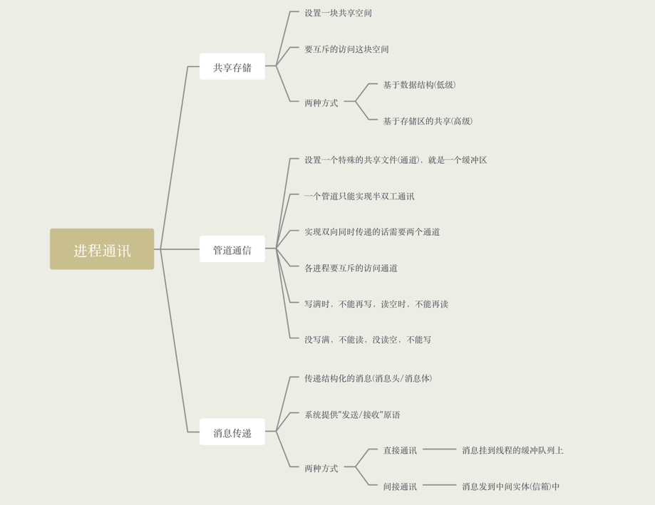

### 什么是进程通信

- 进程通信就是指进程之间的信息交换

- 进程是分配资源的单位(保存内存地址空间)，因此各个进程拥有的内存地址空间相互独立

- 为了保证安全，一个进程不能直接访问其他进程的地址空间，但进程之间的信息交换又是必须实现的，
为了保证进程间的安全通讯，操作系统提供了一些方法
  
- 通讯方式

    - 共享存储
    - 消息传递
    - 管道通信

### 共享存储

- 两个进程对共享空间的访问必须是互斥的(互斥访问通过操作系统提供的工具实现)

- 操作系统只负责提供共享空间和同步互斥工具(如P、V操作)

- 分类
    - 基于数据结构的共享，比如共享空间只能放一个长度为10的数组，这种共享方式速度慢，限制多，是一种低级的通讯方式
    - 基于存储区的共享，在内存中画出一块共享存储区，数据的形式、存放位置都是由进程控制，而不是操作系统，相比之下，
    这种共享方式速度更快，是一种高级的通讯方式

### 管道通信

- 管道是指用于连接读写进程的一个共享文件，又名pipe文件，其实就是在内存中开辟一个大小固定的缓冲区

- 管道只能采用半双工通信，某一时间段内只能实现单向传输，如果需要双向传输，则需要两个管道

- 各个进程要互斥的访问

- 数据以字符流的方式写入管道，当管道满时，写进程的write()系统调用被阻塞，等待读进程将数据读走。
当读进程将数据全部取走后，管道变空，此时读进程的read()系统调用被阻塞
  
- 如果没写满，就不允许读；如果没读空，就不允许写

- 数据一旦被读出，就从管道中被抛弃，这就意味着读进程最多只能有一个，否则可能会有读错数据的情况

### 消息传递

- 进程间的数据交换以格式化的消息(Message)为单位，进程通过操作系统提供的"发送/接收消息"两个原语进程数据交换

- 消息由消息头和消息体组成

    - 消息头，包括发送进程ID，接收进程ID，消息类型，消息长度等格式化的消息
    - 消息体

- 计算机网络中发送的"报文"其实就是一种格式化的消息

- 两种方式

    - 直接通讯方式，消息直接挂到接收进程的消息缓存队列上
    - 简介通讯方式，消息先发送到中间实体(信箱)中，因此也称"信箱通信方式"

