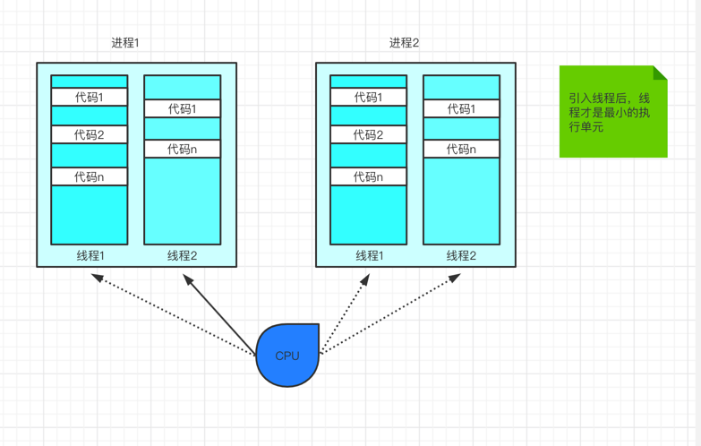
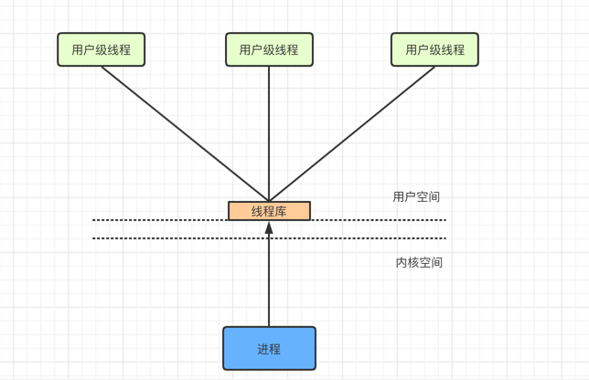
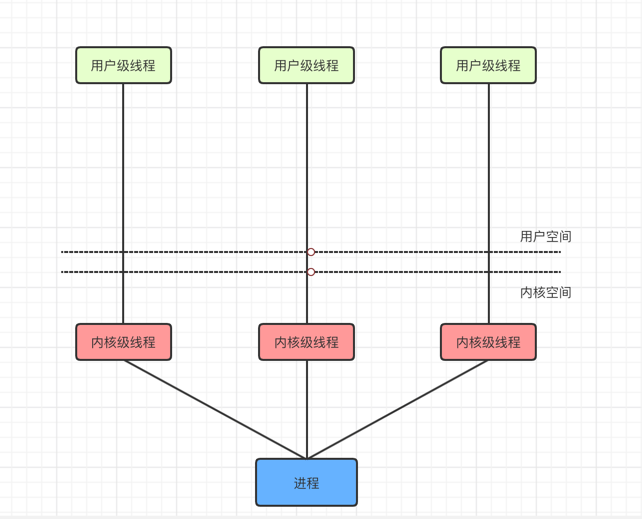
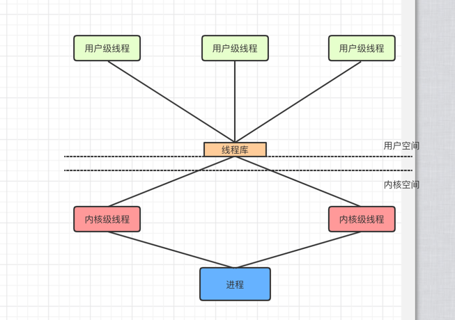
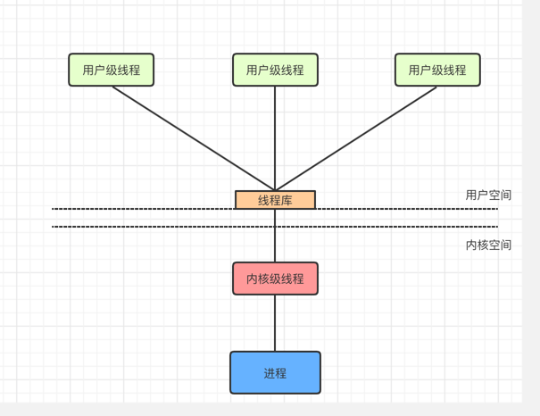
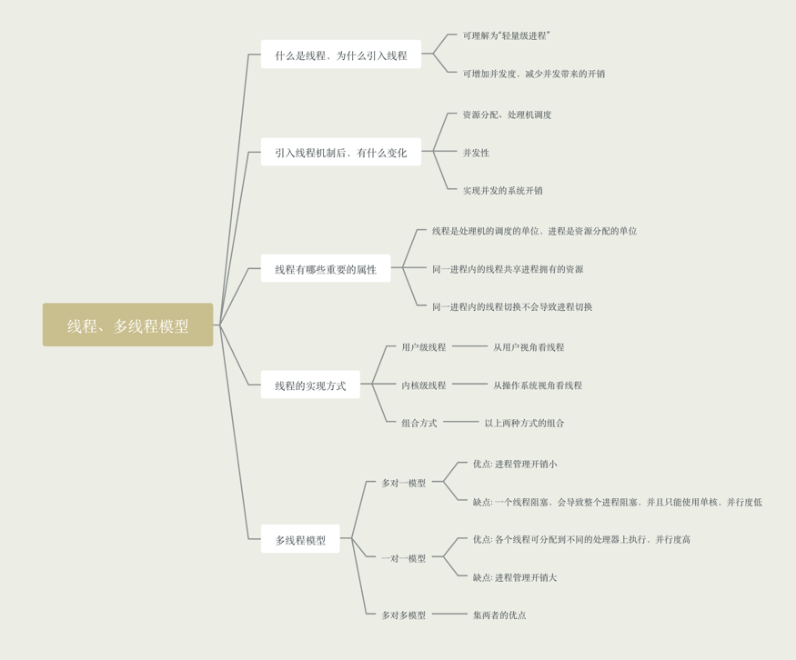

### 什么是线程，为什么引入线程？

- 因为有的进程可能要"同时"做很多事情，而传统的进程只能串行地执行一系列程序，为此，引入了"线程"，来增加并发度

- 可以把线程理解为"轻量级进程"

- 线程是一个基本的CPU执行单元，也是程序执行流的最小单位

- 引入线程后，不仅是进程之间可以并发，进程内的各线程之间也可以并发，从而进一步提升了系统的并发度

- 引入线程后，进程只是作为CPU资源的分配单元(如打印机、内存地址空间等都是分配给进程的)

### 引入线程后，有什么变化

- 资源分配、调度
    - 传统进程机制中，进程是资源分配和调度的基本单位
    - 引入线程后，进程是资源分配的基本单位、线程是调度的基本单位
    
- 并发性
    - 传统进程机制中，只能进程间并发
    - 引入线程后，线程间也能并发，提升了系统的并发度
    
- 系统开销
    - 传统的进程间并发，需要切换进程的运行环境，系统开销大
    - 线程间并发，如果在同一个进程内切换，则不需要切换进程环境，系统开销小
    - 引入线程后，并发所带来的系统开销小

### 线程的属性

- 线程是处理器调度的单元

- 多CPU计算机中，各个线程可占用不同的CPU

- 每个线程都有一个线程ID，线程控制块TCB

- 线程也有就绪、阻塞、运行三种基本状态

- 线程几乎不拥有系统资源

- 同一进程的不同线程间共享进程的资源

- 由于共享内存空间，同一进程内的线程通讯不需要系统干预

- 同一进程的线程切换，不会引起进程切换，系统开销小

- 不同的进程的线程切换，会引起进程切换，系统开销大

### 线程的实现方式

- 用户级线程

    - 用户级级线程由应用程序通过线程库创建，所有的线程管理工作都由应用系统负责，包括线程的切换
    - 用户级线程中，线程切换可以在用户态下即可完成，无须操作系统干预
    - 在用户看来，是有多个线程，但是操作系统内核来看，并意识不到线程的存在(用户级线程对用户不同命，对操作系统透明)

- 内核级线程
    
    - 内核级线程的管理工作由操作系统内核完成，线程调度、切换等工作都由内核负责，因此内核线程的切换必须在核心态下完成
    - 内核级线程就是"从操作系统内核视觉看能看到的线程"
    

### 线程的实现方式

- 在同时支持用户级线程和内核级线程的系统中，可采用两者组合的方式: 将n个用户级线程映射到m个内核级线程上(n>=m)

- 操作系统只"看得见"内核级线程，因此只有内核级线程才是处理分配的单位

- 如图，该进程是由两个内核级线程、三个用户级线程。在用户看来，这个进程中有三个线程，单即使该进程在一个4核处理器的计算机上运行，
也最多只能分配到两个核，最多只能有两个用户线程并行执行

### 多线程模型

在同时支持用户级线程和内核级线程的系统中，由几个用户级线程映射到几个内核级线程的问题引出了"多线程模型"问题

- 多对1模型，多个用户级线程映射到一个内核级线程，每个用户进程只对应一个内核级线程
    
    - 优点: 用户级线程的切换在用户空间即可以完成，不需要切换到核心态，线程管理的系统开销小，效率高
    - 缺点: 当一个用户级线程被阻塞后，整个进程都被阻塞，并发度不高，多个线程不可在多核上并行运行
    

- 一对一模型: 一个用户级线程映射到一个内核级线程。每个用户进程有与用户级线程同数量的内核级线程

    - 优点: 当一个线程被阻塞后，别的线程还可以继续执行，并发能力强，多线程可以在多核处理器上并行执行
    - 缺点: 一个用户进程会占用多个内核级线程，线程切换由操作系统内核完成，需要切换到核心态，因此线程管理的成本高，开销大

- 多对多模型: n用户级线程映射到m个内核级线程(n >= m)，每个用户进程对应m个内核级进程
  
    - 优点: 克服了多对一并发度不高的缺点，又克服了一对一模型中一个用户进程占用太多内核级线程，开销太大的问题

JVM使用的是1:1模型！！！
