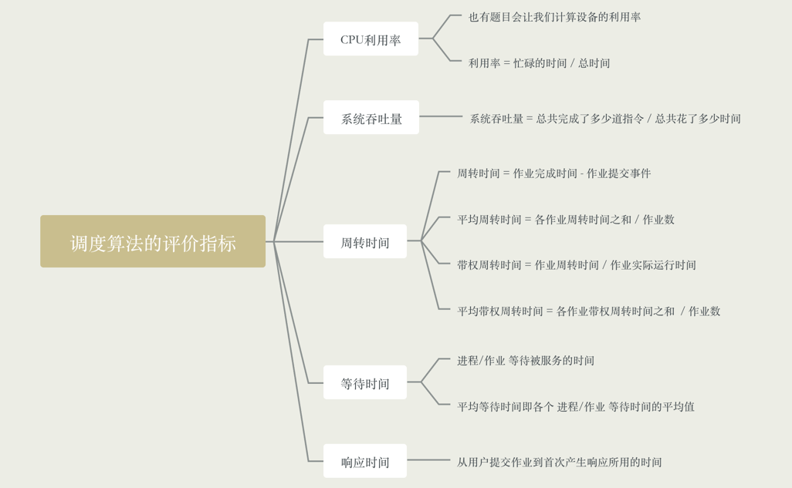

### CPU利用率

- CPU利用率指的是CPU"忙碌"的时间占总时间的比例

- 公式: 利用率 = 忙碌时间 / 总时间

### 系统吞吐量

- 对于计算机来说，希望用尽可能短的事件处理完尽可能多的作业

- 系统吞吐量: 单位时间内完成作业的数量

- 公式: 总共完成了多少道作业 / 总共花了多少时间

### 周转时间

- 对于用户来说，很关心自己的作业从提交到完成花了多久时间

- 周转时间，从作业提交给系统开始，到作业完成为止的这段时间间隔

- 主要包括四个部分，作业从外存后备队列上等待作业调度的时间，进程在就绪队列的等待进程调度的事件，进程在CPU上执行的事件、
进程等待I/O操作完成的事件，后三项在一个作业的整个处理过程中，可能发生多次
  
- 作业周转时间 = 作业完成时间 - 作业提交事件，用户来说比较关心单个作业的周转时间

- 平均周转时间 = 各作业周转时间之和 / 作业数，对操作系统来说，更关心系统的表现，因此更关心所有作业周转的平均值

- 带权周转周期 = 作业周转时间 / 作业实际运行的事件 = (作业完成时间 - 作业提交时间) / 作业实际运行时间

- 平均带权周转时间 = 各作业带权周转时间之后 / 作业数

### 等待时间

- 计算机的用户希望自己的作业尽可能少的等待处理机

- 等待时间，指[进程/作业]处于等待处理机状态时间之和，等待时间越长，用户满意度越低

- 对进程来说，等待时间就是指进程创建后等待被服务的事件之和，在等待I/O完成的期间其实进程也是在
被服务的，所以不计入等待时间
  
- 对于作业来说，不仅要考虑建立进程后的等待时间，还要加上作业在外存后备队列中等待的时间

- 一个作业总共需要被CPU服务多久，被I/O设备服务多久一般确定不变的，因此调度算法其实只会影响作业/进程的
等待时间
  
### 响应时间

- 对于计算机用户来说，会希望自己提交的请求尽可能早的被系统服务、响应

- 响应时间，指用户提交请求到首次产生响应所用的事件

