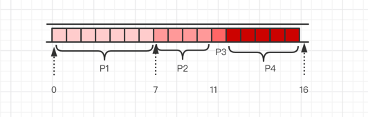

### 先来先服务(FCFS，First Come First Serve)

- 算法思想: 主要是从"公平"的角度考虑

- 算法规则: 按照作业/进程到达的先后顺序进行服务

- 用于作业/进程调度: 用于作业调度时，考虑哪个作业先到达后备队列；用于进程调度的时候，考虑哪个进程先达到就绪队列

- 优缺点
    
    - 优点: 公平、算法实现简单
    - 缺点: 排在长作业后面的短作业需要等待很长的事件，带权周转周期大，对短作业来说用户体验很
    
- 实是否会导致饥饿: 不会

- 举例

各进程达到就绪队列的事件、需要运行时间如下表所示，使用先来先服务调度算法、计算进程的等待时间、平均等待时间、周转时间、带权周转时间、平均带权周转时间

进程 | 到达时间 | 运行时间
| --- | --- | --- |
P1 | 0 | 7
P2 | 2 | 4
P3 | 4 | 1
P4 | 5 | 4

周转时间: P1 = 7 - 0 = 7、P2 = 11 - 2 = 9、 P3 = 12 - 4 = 8、P4 = 16 - 5 = 11

带权周转时间: P1 = 7 / 7 = 1、P2 = 9 / 4 = 2.25、P3 = 8 / 1 = 8、P4 = 11 / 4 = 7

等待时间: P1 = 7 - 7 = 0、P2 = 9 - 4 = 5、P3 = 8 - 1 = 7、P4 = 11 - 4 = 7

### 短作业优先(SJF，Shortest Job First)

- 算法思想: 追求最少的平均等待时间，最少的平均周转时间、最少的平均带权周转时间

- 算法规则: 最短的作业/进程优先得到服务

- 用于作业/进程调度: 即可以用于作业调度，也可以用于进程调度(SPF，Shortest Process First)

- 是否可抢占: SJF和SPF是非抢占式的算法，但也有抢占式的版本-最短剩余时间优先算法(即执行的任务的剩余时间和要插入任务的需要时间进行比较)

- 优缺点

    - 优点: "最短的"平均等待时间、平均周转时间
    - 缺点: 不公平。对短作业有利，对长作业不利。可能产生饥饿现象。另外，作业/进程的运行时间是由用户提供的，并不一定真实，不一定能做到真正的短作业有限
    
- 是否会导致饥饿：会，如果有源源不断的短作业/进程到来，可能长作业就得不到服务，就会出现"饥饿"

### 高响应比优先(HRRN，Highest Response Ratio Next)

- 响应比 = (等待时间 + 要求服务时间) / 要求服务时间

- 算法思想: 在每次调度时先计算各个作业/进程的响应比，选择响应比最高的作业/进程为其服务

- 用于作业/进程调度: 即可以用于作业调度，也可以用于进程调度

- 是否可抢占: 非抢占算法，因此只有当前运行的作业/进程主动放弃处理机的时候，才需要调度，才需要计算响应比

- 优缺点: 综合考虑了等待时间和运行时间(要求服务时间)，等待时间相同时，要求服务时间最短的优先(SJF的优点)，要求服务时间相同时，等待时间长的优先(FCFS的优点)，
对于厂作业来说，随着等待时间越来越久，其响应比也会越来越大，从而避免长作业饥饿问题
  
- 是否会导致饥饿: 否

算法 | 思想 | 可抢占？ | 优点 | 缺点 | 考虑到等待时间&运行时间？ | 会导致饥饿？
---|---|---|---|---|---|---
FCFS | 先来先服务 | 非抢占 | 公平、实现简单 | 对短作业不利 | 等待时间考虑了 运行时间没考虑 | 不会
SJF/SPF | 最短的作业/进程先服务 | 默认非抢占，有抢占的版本 | "最短的"平均等待/周转时间 | 对长作业不利，会导致饥饿；难以做到真正的短作业优先 | 等待时间没考虑   运行时间考虑了 | 会
HRRN | 高响应比优先 | 非抢占 | 上述两种算法的折中 | | 都考虑到了 | 不会

Note: 这几个算法主要关心了对用户的公平性、平均周转时间、平均等待时间等评价系统整体性能的指标，但不关心"响应时间"，也并不区分任务的紧急程度，因此对于用户来说，交互性很差，
所以上述的算法一般都是用户早期的批处理系统

----

### 时间片轮转算法(RR，Round-Robin)

- 算法思想: 公平地、轮流的为各个进程服务，让每个进程在一定时间间隔内都可以得到相应

- 算法规则: 按照个进程就绪队列的顺序，轮流的各个进程执行一个时间片。若进程未在一个时间片内执行完成，则剥夺处理机，将进程重新放入到就绪队列的队尾重新排队

- 用于作业/进程调度: 用于进程调度

- 是否可抢占: 若进程未能在时间片内运行完成，将被强行剥夺处理机使用权，因此时间片轮转调度算法属于抢占式算法，由时钟装置发出的时钟中断来通知CPU时间片已到

- 优缺点

    - 优点: 公平、响应快。适用于分时操作系统
    - 缺点: 由于高频率的进程切换，因此又一定开销，不区分任务的紧急程度
    
- 是否会导致饥饿: 不会

- 如果时间片太大就会和先到先服务差不多了

### 优先级调度算法

- 算法思想: 随着实时系统的出现，越来越多的应用场景需要根据任务的紧急程度来决定处理顺序

- 算法规则: 调度的时候选择优先级高的作业/进程

- 用于作业/进程调度: 两个都可以

- 是否可抢占: 抢占式、非抢占式都有，具体情况具体分析

- 优缺点

    - 优点: 用优先级区分任务紧急重要程度，适用于实时操作系统，可以灵活的调整对各个作业/进程的偏好程度
    - 缺点: 若源源不断的有优先级进程到来，则可能导致饥饿
    
- 是否会导致饥饿: 会

### 多级反馈队列调度算法

- 算法思想: 对其他调度算法的折中权衡

- 算法规则:

    - 1.设置多级就绪队列，各级队列的优先级从高到底，时间片从小到大，即优先级越高时间片越少
    - 2.新进程来先进入第一级队列，按FCFS原则排队等待被分配时间片，若用完归还时间片进程还未结束，则进程进入下一级队列的队尾
    - 3.只有第k个队列为空的时候，才会为k+1级的进程分配时间片
    
- 用于作业/进程调度: 用于进程调度

- 是否可抢占: 抢占式算法，k级队列的优先级比k+1要高

- 优缺点: 对各类型进程相对公平(FCFS的优点)，对每个到达的进程都能很快的相应(RR的优先)，短进程只用较少的时间就可以完成(SPF的优点)；不必实现
估计进程的运行时间，可灵活的挑战如果对各类进程的偏好
  
- 是否会导致饥饿: 会

算法 | 思想 | 可抢占？| 优点 | 缺点 | 会导致饥饿 | 补充
|---|---|---|---|---|---|---|
时间片轮转 | 时间片的划分，谁先到先分配时间片，用完排队 | 抢占式 | 公平、适用于分时系统 | 频繁切换有开销，不区分优先级| 不会 | 时间片太大或太小的影响
优先级调度 | 同时到达或者等待的时候，优先级高的优先使用时间片 | 有抢占式的调度，也有非抢占式的 | 区分优先级，适用于实时系统 | 可能会导致饥饿 | 会 | 动态/静态优先级
多级反馈队列 | 通过划分多个队列，对队列进行优先级和时间片的分配，实现均衡的算法 | 抢占式 | 平衡优秀 | 一般不说它的缺点，不过可能会导致饥饿 | 会 | -

Note: 比起早起的操作系统来说，由于计算机造价大幅度降低，因此之后出现的交互式操作系统更注重系统的响应时间、公平性、平衡性等指标，而这些指标也能较好的满足交互式系统的需求，因此
这三种算法适用于交互系统(比如Unix使用的就是多级反馈队列调度算法)
