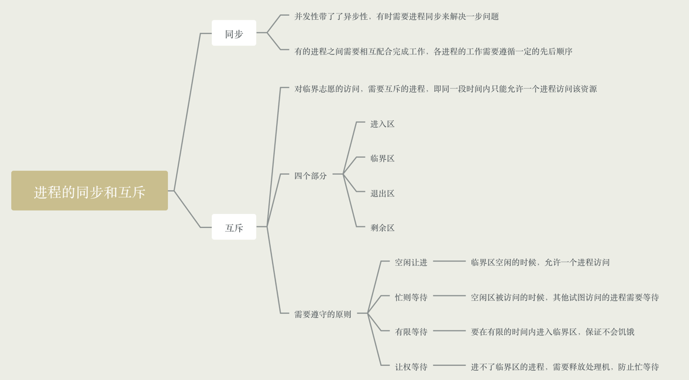
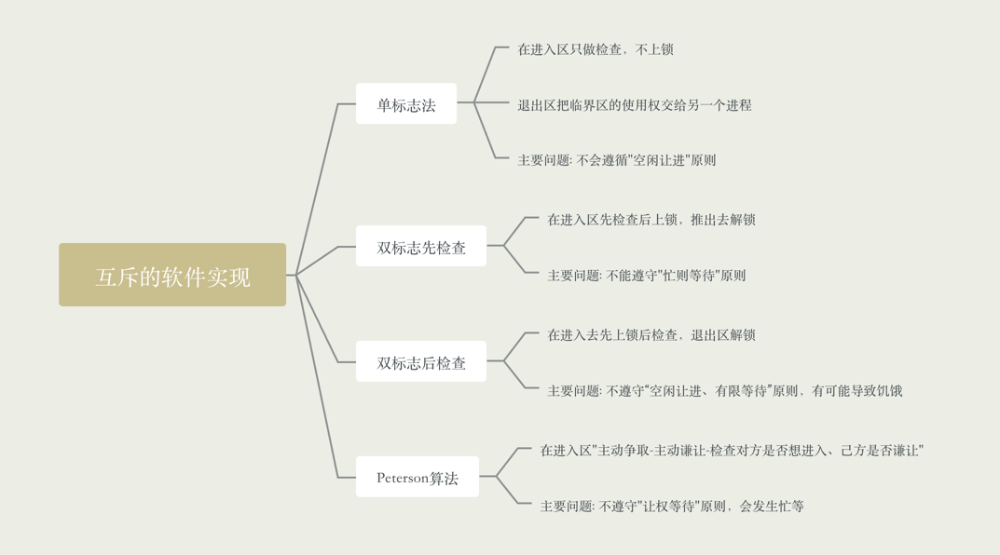
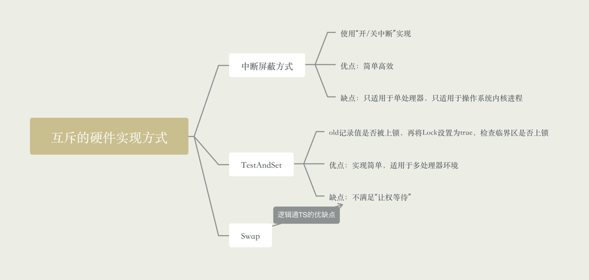

### 什么是进程同步

- 知识回顾: 进程具有异步性的特征，异步性就是指各并发执行的进程以各自独立的、不可预知的速度向前推进

- 比如之前管道的操作，必须是先写后读的顺序来执行

- 同步亦称直接制约关系，它是指完成某种任务而建立的两个或多个进程，这些进程因为需要在某些位置上协调他们
工作的工作次序而产生的制约关系。进程间的直接制约关系就是源于它们之间的相互合作
  
### 什么是进程互斥

- 进程的"并发"需要"共享"的支持，各个并发执行的进程不可避免的需要共享一些系统资源(比如内存、打印机、摄像头这些I/O设备)

- 我们把一个时间段内只能允许一个进程访问的资源称为临界资源。很多物理设备、变量、数据、内存缓冲区都属于临界资源

- 对于临界资源的访问，必须是互斥进行的
  
- 互斥也称为间接制约关系，进程互斥指当一个进程访问某个临界资源的时候，另一个想要访问该临界资源的进程必须等待。当前访问临界资源的进程
访问结束，释放资源之后，另一个进程才能访问临界资源
  
- 资源共享方式

    - 互斥共享方式，同一时间只能有一个进程访问该资源
    - 同时共享方式，允许一个时间段内由多个进程"同时"对它们进行访问
    
- 对临界资源的互斥访问，可以逻辑上分为如下四个部分

```
do {
    entry section;  // 进入临界区，负责检查是否可以进入临界区，若可以进入则应设置正在访问临界资源的标志，以防止其他进程同时进入临界区
    critical section; // 临界区，访问临界资源的代码
    exit section; // 退出区，负责接触正在访问邻接资源的标志
    remainder section; // 剩余区，做其他处理
}
```

- 为了实现对临界资源的互斥访问，同时保证系统整体性能，需要遵循以下原则

    - 空闲让进，临界区空闲的时候，可以允许一个请求进入临界区的进程立即进入临界区
    - 忙则等待，当已经有进程进入了临界区，其他试图进入临界区的进程必须等待
    - 有限等待，对请求访问的进程，应保证能在有限的时间内进入临界区(保证不会饥饿)
    - 让权等待，当进程不能进入临界区的时候，应立即释放处理机，防止进程忙等待




### 互斥的软件实现方式 - 单标志法

- 算法思想: 两个进程在访问临界区后会把使用临界区的权限交给另一个进程，也就是说每个进程进入临界区的权限只能被另一个进程赋予

```
int turn = 0; // turn表示当前允许进入临界区的进程号

P0进程：
1: while(turn != 0); // 如果不是当前线程能执行，则一直while
2: critical section;
3: turn = 1;
4: remainder section;

P1进程:
5: while(turn != 1);
6: citical section;
7: turn = 0;
8: remainder section;
```

- turn表示当前允许进入临界区的进程号，而只有当前允许进入临界区的进程在访问临界区之后，才会修改turn的值，也就是说对于临界区的访问，一定是按照p0-p1-p0-p1...这样轮流访问

- 这种轮流访问带来的问题是，如果此时允许进入临界区的进程是P0，而P0一直不访问临界区，那么虽然此时临界区空闲，但是并不允许P1访问

- 因此，单标志法存在的主要问题是: 违背"空闲让进"原则

### 互斥的软件实现方式 - 双标志先检查法

- 算法思想: 设置一个布尔类型数组flag[]，数组中各个元素用来标记各进程想进入临界区的意愿，比如flag[0] = true，就意味着P0想进入临界区，每个进程进入临界区之前先检查当前
有没有别的进程想进入临界区，如果没有，则把自身对应的标志flag[i]置为true，然后开始访问临界区
  
```
bool falg[2]; // 表示进入临界区意愿的数组
flag[0] = false;
flag[1] = false;

P0进程:
1：while(flag[1]);
2: flag[0] = true;
3: critical section;
4: remainder section;

P1进程:
5: while(flag[0]);
6: flag[1] = true;
7: citical section;
8: remainder section;
```

- 若按照1、5、2、6、3、7...的访问顺序执行，P0和P1就会同时访问临界区

- 因此此算法违背了"忙则等待"的原则，主要是进入去"检查"和"上锁"不是一气呵成

### 互斥的软件实现方式 - 双标志后检查法

- 算法思想: 双标志检查法的改版，因为"检查"和"上锁"不能一气呵成，因此人们又想到了先"上锁"后"检查"的方法，来避免上诉问题

```
bool flag[2]; // 表示进入临界区意愿的数组
flag[0] = false;
flag[1] = false;

P0进程:
1: flag[0] = true
2：while(flag[1]);
3: flag[0] = true;
4: critical section;
remainder section;

P1进程:
5: flag[1] = true
6: while(flag[0]);
7: flag[1] = true;
8: citical section;
remainder section;
```

- 如果按照1、5、2、6...的执行顺序，P0和P1将无法进入临界区

- 因此，此算法虽修复了"忙则等待"的问题，但是又产生了"空闲让进"以及"无限等待"的问题

- 原则，会因各进程都长期无法访问临界资源而产生"饥饿"现象。由于都争着想进入临界区，谁也不让谁导致都无法进入

### 互斥的软件实现方式 - Peterson算法

- 算法思想： 如果双方都争着想进入临界区，那么可以让进程尝试孔融让利，主动让对方使用临界区

```
bool flag[2]; // 表示进入临界区意愿的数组
int turn = 0; // turn表示优先让哪个进程进入临界区

P0进程:
1: falg[0] = true;
2: turn = 1;
3: while(flag[1] && turn == 1);
4. critical section;
5. flag[0] = false;
remainder section;

P1进程:
6: falg[1] = true;
7: turn = 0;
8: while(flag[0] && turn == 0);
9. critical section;
10. flag[1] = false;
remainder section;
```

- 遵循了空闲让进、忙则等待、有限等待的三个原则，但是依然未遵守让权等待的原则



### 互斥的硬件实现方式 - 中断屏蔽方式

- 利用"开/关中断指令"实现(与原语的实现思路相同)

- 优点: 简单、高效

- 缺点: 不适用于多处理机；只适用于操作系统内核程序，不适用于用户程序(开关中断指令只能运行在内核态，这组指令让用户随意使用会比较危险)

### 互斥的硬件实现方式 - TestAndSet指令

- 简称TS指令，也有地方称为TestAndSetLock指令，或TSL指令，由硬件实现的，执行过程不允许中断

```
// 布尔共享变量lock表示当前临界资源是否被锁
bool TestAndSet(bool *lock) {
  bool old;
  old = *lock; // old用来存放lock，原来的值
  *lock = true; // 无论是否已经加锁，都将lock设置为true
  return old; // 返回lock原来的值
}

// 使用TS实现互斥的算法逻辑
while(TestAndSet(&lock)); // "上锁"并"检查"
...
lock = false; // 解锁
...
```

- 若刚开始lock是false，则TSL会返回原来的值为false，while不满足，直接跳过循环，进入临界区。如果lock是true，执行TSL会一直循环，直到被解锁

- 相比软件实现方式，TSL指令把"上锁"和"检查"操作用硬件的方式变成了一气呵成的原则操作

- 优点: 实现简单，无需像软件是想方式那样严格检查是否有逻辑漏洞，适用于多处理器环境

- 缺点: 不满足"让权等待"原则，暂时无法进入临界区的进程会占用CPU并循环执行TSL指令，从而导致"忙等"

### Swap指令

- 有的地方叫Exchange指令，或简称XCHG指令

- Swap指令是硬件实现的，执行的过程不允许被中断

```
Swap(bool *a, bool *b) {
  bool tmp;
  tmp = *a;
  *a = *b;
  *b = tmp;
}

// 使用Swap实现互斥的算法逻辑
bool old = true;
while(old == true) {
  Swap(&lock, &old);
}
...
lock = false;
...
```

- 优点: 实现简单，无需像软件是想方式那样严格检查是否有逻辑漏洞，适用于多处理器环境

- 缺点: 不满足"让权等待"原则，暂时无法进入临界区的进程会占用CPU并循环执行TSL指令，从而导致"忙等"



