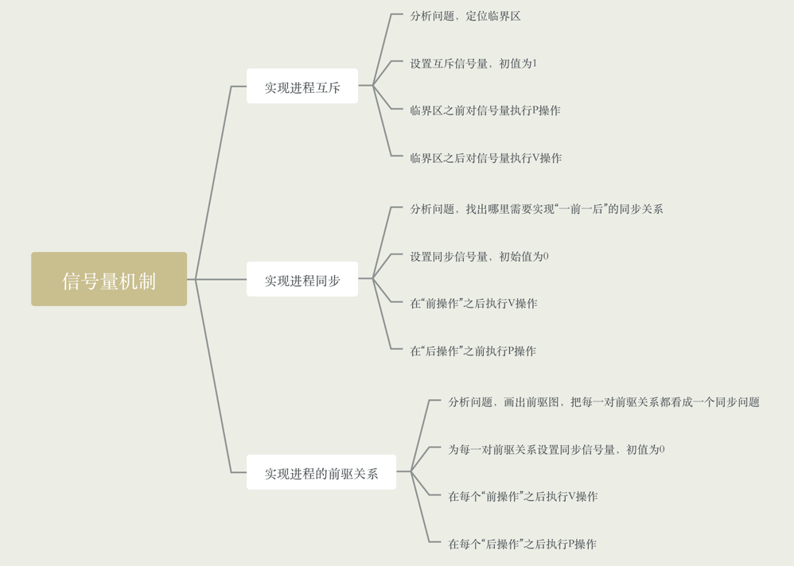
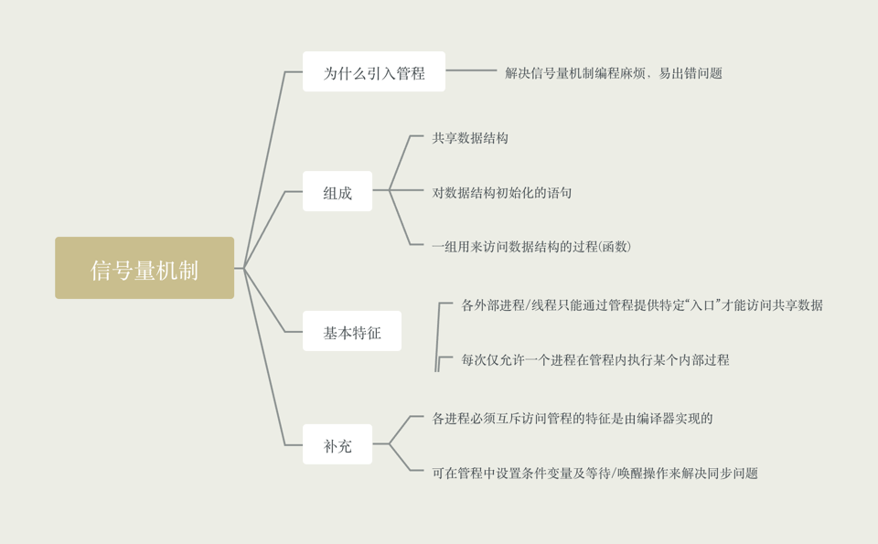

### 信号量机制

- 用户进程可以通过使用操作系统提供的一对原语来对信号量进行操作，从而很方便的实现进程互斥、同步

- 信号量就是一种变量(比如是一个整数，也可以是更复杂的记录性变量)，可以用一个信号量来表示系统中某种资源的数量

- 原语是一种特殊的程序段，只能一气呵成，不能中断，是由开/关中断指令实现的方式

- 一对原语，wait(S)和signal(S)原语，可以把原语理解成自己写的函数，函数名分别为wait和signal，S就是函数调用传的函数

- wait、signal原语同城简称为P、V操作

### 信号量机制 - 整形信号量

- 用一个数量型的变量作为信号表，表示系统中某种资源的个数

```
int S = 1; // 初始化整形信号量S
void wait(int S) {
    while(S <= 0); // 资源不足，就会循环等待，因此不满足"让权等待"，会出现"忙等"
    S = S - 1;
} 
void signal(int S) {
    S = S + 1; // 使用完资源后，在退出区释放资源
}
```

### 信号量机制 - 记录性信号量

- 整形信号量的缺陷是存在"忙等"问题，因此提出了"记录型信号量"，使用记录型数据结构表示的信号量

```
typedef struct {
    int value;  // 剩余资源数
    struct process *L; // 等待队列
} semaphore;

void wait(semaphore S) {
    S.value --;
    if (S.value < 0) {
        block(S.L); // block原语，让进程进入阻塞态，进入阻塞队列
    }
}

void signal(semaphore S) {
    S.value ++;
    if (S.value <= 0) {
        wakeup(S.L); // wake原语，唤醒进程进入就绪队列
    }
}
```

### 信号量机制实现进程互斥

- 分析并发进程的关键活动，划分临界区。必须保证"一前一后"执行两个操作

- 设置互斥信号量

- 在临界区之前执行P(mutex)

- 在临界区之后执行V(mutex)

- Note: 对于不同的临界区资源要设置不同的互斥信号量，P、V操作必须是成对出现，缺少P(mutex)就不能保证临界资源的互斥访问。缺少(mutex)会导致资源
永不释放，等待进程永不会被唤醒

```
semaphore S = 0;
P1() {
    代码1;
    代码2;
    V(S);
    代码3;
}
P1() {
    P(s);
    代码4;
    代码5;
}
```



### 管程

- 为什么引入管程，信号量机制存在编写程序困难、易出错的问题

- 管程的定义和基本特征，管程是一种特殊的软件模块
    - 组成部分
        - 1. 局部于管程的共享数据结构说明
        - 2. 对该数据结构进行操作的一组过程，过程可以理解为函数
        - 3. 对局部于管程的共享数据设置初始值的语句
        - 4. 管程有一个名字
    - 基本特征
        - 1. 局部与管理的数据只能被局部于管理的过程所访问
        - 2. 一个进程只有通过调用管程内的过程才能访问管程访问共享数据
        - 3. 每次仅允许一个进程在管程内执行某个内部过程

```
monitor ProducerConsuemer
   condition full, empty;
   int count = 0;
   void insert(Item item) {
       if(count == N) {
            wait(full);
        }
        count ++;
        insert_item(item);
        if (count == 1) {
            signal(empty);
        }
   }
   Item remove() {
    if (count == 0) {
        wait(empty);
    }
    count --;
    if (count == N - 1) {
        signal(full);
    }
    return remove_item();
   }
   end mointor;
   
   // 生产者进程
   producer() {
    while(1) {
        Producer.insert(item);
    }
   }
   
   // 消费者进程
   consumer() {
    while(1) {
        item = ProducerConsumer.remove();
    }
   }
```    



