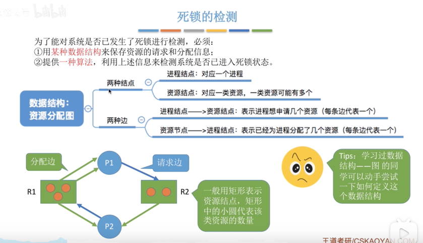

### 什么是死锁

在并发环境下，各进程因竞争资源而造成的一种相互等待对方手中的资源，都无法向前推进的现象，叫做"死锁"。
发生死锁后若无外力干涉，这些进程都将无法向前推进

### 死锁、饥饿、死循环的区别

- 死锁：各进程互相等待对方手中的资源，导致各进程都被阻塞，无法向前推进的现象

- 饥饿：由于长时间得不到想要的资源，某进程无法向前推进的现象，比如短进程优先算法(SPF)中，若有源源不断地
短进程到达，长进程就会一直得不到处理机，从而导致"饥饿"
  
- 死循环：某进程执行过程中一直跳不出某个循环的现象，有时因为程序逻辑Bug导致的，有时是程序员故意设计的

### 死锁产生的必要条件，缺一不可

- 互斥条件：只有对互斥使用的资源的抢夺才会导致死锁

- 不可剥夺条件：进程所获得的资源在未使用完之前，不能由其他进程强行剥夺，只能主动释放

- 请求和保持条件：进程已经保持了至少一个资源，但又提出了新的资源请求，而改资源又被其他进程占有，此时请求进程被阻塞，但又对自己的资源保持不放

- 循环等待条件：存在一种进程资源的循环等待链，链中的每个进程以获得资源同时被下一个进程所请求

### 什么时候发生死锁

- 对系统资源的竞争，各进程对不可剥夺资源资源的竞争可能引起死锁，对可剥夺的资源(如CPU)的竞争是不会引起死锁的

- 进程推进顺序非法。请求和释放资源的顺序不当，也同样会导致死锁

- 信号量的使用不当也会导致死锁

### 死锁的处理策略

- 预防死锁，破坏死锁产生的四个必要条件中的一个或多个

- 避免死锁，用某种方法防止系统进入不安全状态，从而避免死锁

- 死锁的检测和解除，允许死锁的发生，不过操作系统会负责检测出死锁的发生，然后采取某种措施解除死锁

### 死锁的处理策略 - 预防死锁

- 破坏互斥条件

    - 互斥条件：只有对必须互斥使用的资源的竞争才会导致死锁
    
    - 如果把只能互斥使用的资源改造成允许共享使用，则系统不会进入死锁状态，比如SPOOLing技术，操作系统可以采用SPOOLing技术把
    独占的设备在逻辑上改在成共享设备，比如SPOOLing技术把打印机改造成共享设备
      
    - 缺点：并不是所有的资源都可以改造成共享使用的资源，为了系统安全很多地方需要保护这种互斥性，因此很多时候都无法破坏互斥条件

- 破坏不可剥夺条件

    - 不可剥夺条件：进程所获得的资源在未使用完之前，不能由其他进程强行夺走，只能主动释放
    
    - 破坏不可剥夺条件
        - 方案1：当某个进程请求新的资源得不到满足的时候，它必须立即释放保持的所有资源，待以后需要再重新申请
        - 方案2：当某个进程请求的资源被其他进程占用的时候，可以由操作系统协助，将想要的资源强行剥夺，这种方式一般需要考虑各进程的优先级
    
    - 缺点
        - 实现起来复杂
        - 释放已获得的资源可能会照成前一阶段工作的失效，因此这种方法一般只适用于易保存和恢复状态的资源，如CPU
        - 反复地申请和释放资源会导致系统开销，降低系统吞吐量
        - 若采用方案1，意味着只要暂时得不到某个资源，之前获得的资源都要放弃，以后重新申请，若果一直发生这种情况，就会导致进程饥饿

- 破坏请求和保持条件
    
    - 请求和保持条件：进程已经保持了至少一个资源，但又提出了新的资源请求，而该资源又被其他进程占有，此时请求进程被阻塞，但又对自己已有的资源保持不放

    - 可以采用静态分配方法，即进程在运行前一次申请完它需要的所有资源，在它的资源未满足钱，不让它投入运行，一旦投入运行后，这些资源就一直归它所有，该进程就
    不再请求别的任何资源了
      
    - 改策略实现简单，但是有明显的缺点
    
    - 有些资源只需要很短的时间，因此如果进程的整个运行期间一直保持所有的资源，会造成很严重的资源浪费，资源利用率极低，另外，该策略也可能导致某些进程饥饿

- 破坏循环等待条件

    - 循环等待条件：存在一种进程资源的循环等待链，链中每一个进程已获得的资源同时被下一个进程所请求
    
    - 可采用顺序资源分配发，首先给系统中的资源编号，规定每个进程必须按照编号递增的顺序请求资源，同类资源(即编号相同的资源)一次申请完
    
    - 原理分析：一个进程只有已占有小编号的资源时，才有资格申请更大编号的资源，按此规则，已持有大编号的资源不可能回来申请小编号的资源，因此就不会产生循环等待的现象
    
    - 缺点
        - 不方便增加新的资源，因为可能需要重新分配所有的编号
        - 进程实际使用资源的顺序可能和编号递增的顺序不一致，会导致资源浪费
        - 必须按照规定的次序申请资源，用户编程麻烦

### 死锁的处理策略 - 避免死锁

- 安全序列、不安全状态、死锁的联系
  
    - 安全序列是指如果系统按照这种序列分配资源，则每个进程都能顺利完成，只要找出一个安全序列，系统就是安全状态，当然安全序列可能有多个
    
    - 如果分配资源后，系统找不到一个安全序列，系统就会进入不安全状态，这意味着以后可能所有的进程都无法顺利的执行下去。当然，如果有进程提前归还了一些资源，系统可能会重新回到安全状态
    
    - 如果系统处于安全状态，就一定不会发生死锁，如果系统进入不安全状态，就可能发生死锁

    - 因此可以再资源分配之前预判这次分配是否会导致系统进入不安全状态，以此决定是否答应资源分配请求，这也是"银行家算法"的核心思想
    
- 银行及算法

    - 银行家算法是Dijkstra为银行系统设计的，以确保银行在发生薪金贷时，不会发生不能满足所有客户需要的情况。后来改算法被用于操作系统中，用于避免死锁
    
    - 核心思想：在进程提出资源申请时，先预判此次分配是否会导致系统进入不安全状态。如果会进入不安全状态，就暂时不答应这次请求，让该进程先阻塞等待
    
    - 假设系统中有n个进程，m种资源，每个进程在运行前先声明对各种资源的最大需求量，则可用一个n*m的矩阵(可用二维数组实现)表示所有进程对各种资源的最大需求数。
    不妨称为最大需求矩阵Max，Max[i,j]=k表示进程Pi最多需要K个资源Rj，同理，系统可以用一个n*m的分配矩阵Allocation表示对所有进程的资源分配情况，Max-Allocation=Need矩阵，
    表示各进程最多还需要多少各类资源。另外，还要用一个长度为m的一维数组Available表示当前系统中还有多少可用资源。某进程Pi向系统申请资源，可用一个长度为m的一维锁住Requesti
    表示本次申请的各种资源数量
      
    - 可用银行家算法预判本次分配是否会导致系统进入不安全状态
        - 1. 如果Requesti[j] <= Need[i,j] (0<=j<=m)便转向2，否则认为出错
        - 2. 如果Requesti[j] <= Available[j] (0<=j<=m)便转向3，否则表示尚无足够资源，Pi必须等待
        - 3. 系统试探着把资源分配给进程Pi，并修改相应的数据
        - 4. 操作系统执行安全性算法，检查此次资源分配后，系统是否处于安全状态，若安全，才正式分配；否则，恢复相应数据，让进程阻塞等待
      

进程 | 最大需求 | 已分配 | 最多还需要
|---|---|---|---|
P0 | (7,5,3) | (2,2,1) | (5,3,2)
P1 | (3,2,2) | (2,0,0) | (1,2,2)
P2 | (9,0,2) | (3,0,2) | (6,0,0)
P3 | (2,2,2) | (2,1,1) | (0,1,1)
P4 | (4,3,3) | (0,2,2) | (4,3,1)

### 死锁的处理策略 - 死锁的检测和消除

- 为了能对系统是否已发生了死锁进行检测，必须：

    - 用某种数据结构来保存资源的请求和分配信息
    - 提供了一种算法，利用上述信息来检测系统是否已进入了死锁状态

- 资源分配图

    - 两种结点
        - 进程结点：对应一个进程
        - 资源结点：对应一类资源，一类资源可能有多个
    - 两种边
        - 进程节点-资源结点：表示进程想要申请几个资源(每条边代表一个)
        - 资源结点-进程结点：表示已经为进程分配了几个资源(每条代表一个)
    

- 为了能对系统是否已发生了死锁进程检测，必须

    - 1. 用某种数据结构来保存资源的请求和分配信息
    - 2. 提供一种算法，利用上述信息来检测系统是否已进入死锁状态
    
- 如果系统中剩余的可用资源数足够满足进程的需求，那么这个进程暂时是不会阻塞的，可以顺序地执行下去。如果这个进程执行结束了把资源归还给了系统，就可能使某些正在
等待资源的进程被激活，并顺利执行下去，相应的，这些被激活的进程执行完了之后又会归还一些资源，这样可能又会激活另外一些阻塞的进程
  
- 如果按上述过程分析，最终能消除所有边，就称这个图是可完全简化的，此时一定没死锁，如果最终不能消除所有的边，那么此时就是发生了死锁，最终还连着边的那些进程就是处于死锁状态的进程

- 检查死锁的算法
    - 在资源分配图中，找出既不阻塞又不是孤点的进程Pi(即找出一条有向边与它相连，且该有向边对应的资源的申请数量小于等于系统中已有的空闲资源数量。若所有的连接该
      进程的变均满足上述条件，则这个进程能继续运行直至完成，然后释放它所占有的所有资源)。消除它所有的请求变和分配边，使之成为孤立的节点
      
    - 进程Pi所释放的资源，可以唤醒某些因等待这些资源而阻塞的进程，原来的阻塞进程可能变为非阻塞的进程

- 死锁的解除

    - 一旦检测出死锁的发生，就应该立即解除死锁，并不是系统中所有的进程都是死锁状态，用死锁检测算法简化资源分配图后，还连着边的那些进程就是死锁进程
    
    - 解除死锁的主要方法有：
        - 资源剥夺法: 挂起某些死锁进程，并抢占它的资源，将这些资源分配给其他死锁进程，但是应防止被挂起的进程长时间得不到资源而饥饿
        - 撤销进程法: 强制撤销部分、甚至全部死锁进程，并剥夺这些进程的资源，这种方式的优点是实现简单，但所付出的代价可能会很大，因为有些进程可能已经运行了
        很长时间，已经接近结束了，一旦被终止可谓功亏一篑，以后还得从头再来
        - 进程回退法: 让一个或多个死锁进程回退到足以避免死锁的地步，这就要求系统要记录进程的历史信息，设置还原点
    
- 如果决定"对谁动手"
    
    - 1.进程优先级
    - 2.已执行多长时间
    - 3.还要多久能完成
    - 4.进程已使用了多少资源
    - 5.进程是交互式的还是批处理式的
