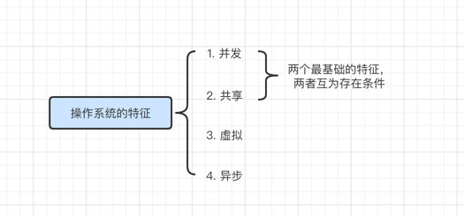
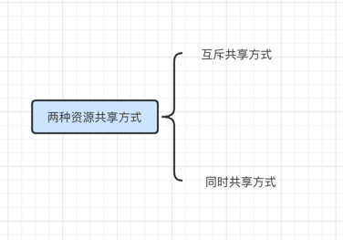

### 操作系统的特征

- 并发

- 共享

- 虚拟

- 异步

其中，并发和共享是最基本的特征，而且两个互为存在条件

### 并发

- 并发: 指两个或多个事件在同一时间间隔发生，这些时间宏观上是同时发生的，但微观上是交替发生的

- 并行: 指两个或多个事件在同一时刻同事发生

- 主要区别就是，并发是在单个CPU上执行多个任务，而并行就是在多个CPU上执行多个任务

- 操作系统的并发性是指计算机系统中同事存在多个运行着的程序

- 一个单核CPU同一时刻只能执行一个程序，因此操作系统会负责协调多个程序交替执行，微观上交替执行，但宏观上看起来像是同时执行

- 操作系统就是随着"多道程序技术"而出现的，因此操作系统和程序并发是一起诞生的

### 共享

- 共享即资源共享，是指操作系统中的资源可供内存中多个并发执行的进程共同使用

- 分为两种

    - 互斥共享方式，系统中的某些资源虽然可以提供给多个进程使用，但是一个时间段内只允许一个进程访问该资源
    - 同时共享方式，系统中的某些资源允许一个时间段内由多个进程"同时"对它们进行访问
    
所谓的"同时"往往是宏观上的，微观上仍然是交替执行

- 举例说明
    - 互斥共享，比如摄像头，统一时间段只能分配给一个进行，QQ或微信
    - 同时共享，使用QQ和微信发送文件，两个进程都在访问一硬盘资源

- 并发和共享的关系

    - 并发性指计算机系统中同时存在多个运行着的程序
    - 共享性是指操作系统中资源可供内存中多个并发执行的进程共同使用
    - 如果失去了并发性，则系统中只有一个程序正在运行，则共享性失去了存在的意义
    - 如果失去了共享性，则无法实现同时存在多个运行着的程序

### 虚拟

虚拟是指把一个物理上的实体变成若干个逻辑上的对应物，物理实体(前者)是实际存在的，而逻辑上对应物(后者)是用户感受到的

- 例子1，GTA5需要4G运行内存，QQ需要256M的内存，迅雷需要256M的内存，网易云音乐需要256M内存，但是电脑只有4G，那为什么它们
可以同时运行呢？这是"虚拟存储技术"，实际上只有4GB内存，在用户看起来似乎远远大于4GB
  
- 例子2，一个程序需要被分配CPU才能执行，那么为什么单核CPU的电脑中能同时运行怎么多个程序呢？这是"虚拟处理器技术"，实际上只有一个
单核CPU，在用户看起来却有多个CPU在同事为自己服务

- 虚拟技术
    - 空分复用技术，如虚拟存储器技术
    - 时分复用技术，如虚拟处理器技术
    
如果失去了并发性，那么系统只能串行的执行各个进程，那么就失去了实现虚拟性的意义。因此没有并发性，就谈不上虚拟性

### 异步

异步是指在多道程序环境下，允许多个程序并发执行，但由于资源有限，进程的执行不是一贯到底的，而是走走停停，以不可预测的速度向前推进，这就是进程的异步性

很显然，如果失去了并发性，系统串行的执行各个进程，那么程序就会一贯到底，就不需要异步性，因此只有系统拥有了并发性，才有可能导致异步性
