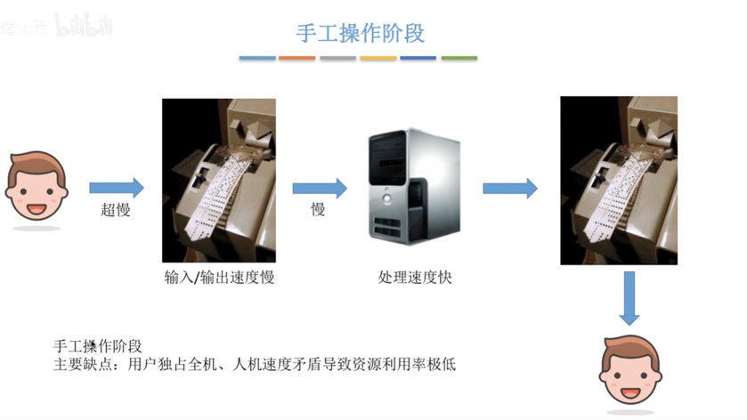
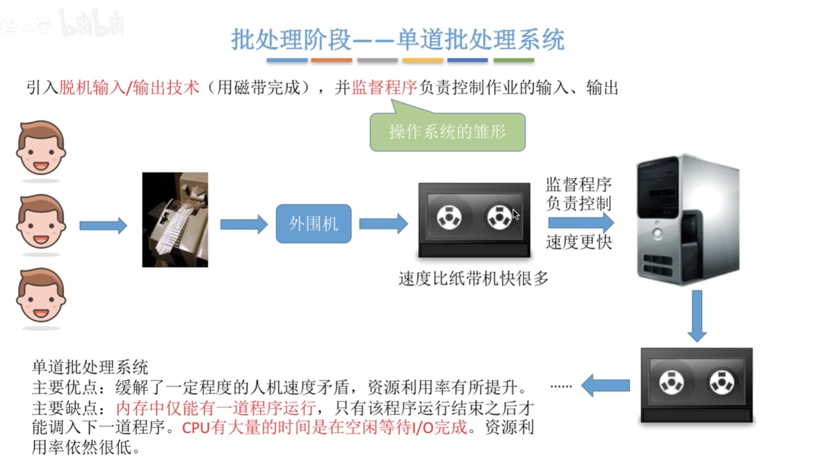
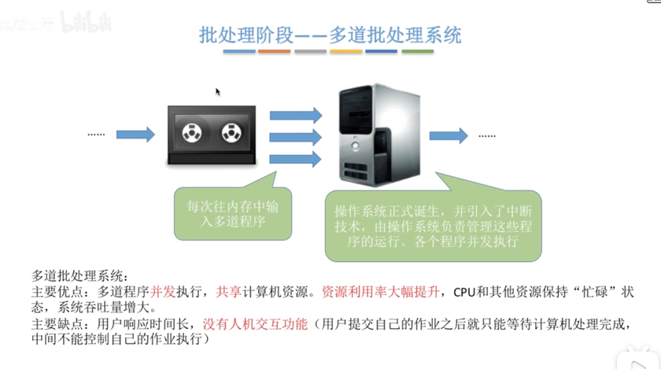
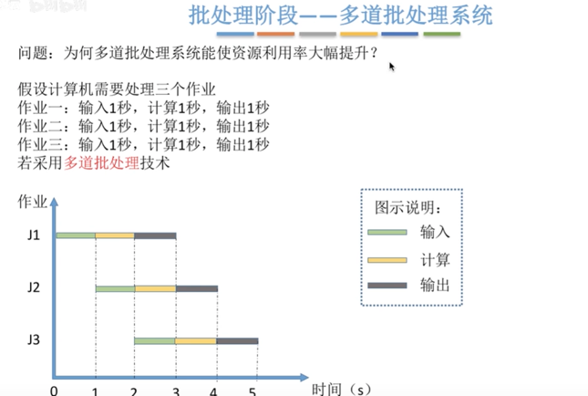
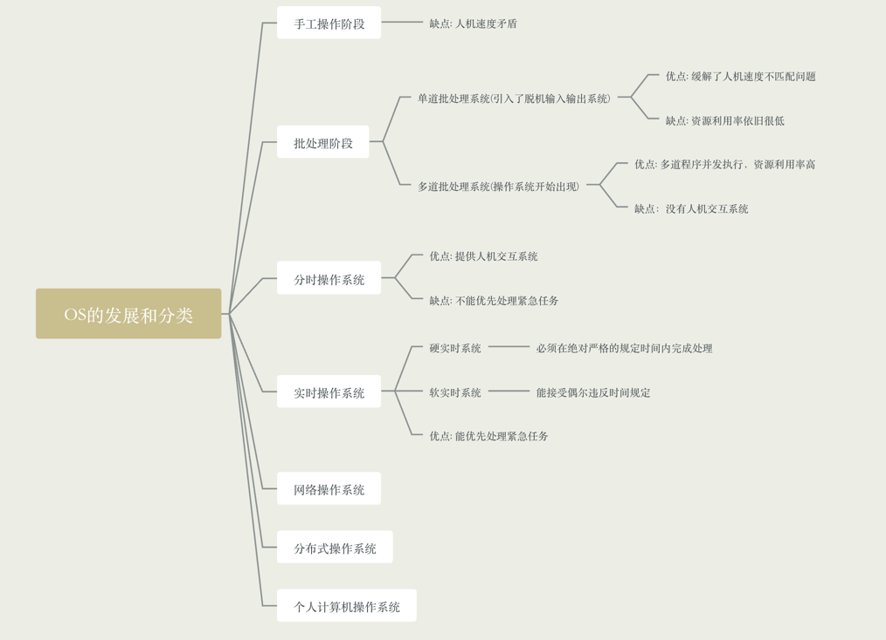

### OS的发展和分类

- 手工操作阶段

- 批处理阶段
    - 单道批处理系统
    - 多道批处理系统(操作系统开始出现)
    
- 分时操作系统

- 实时操作系统

- 网络操作系统

- 分布式操作系统

- 个人计算机操作系统

### 手工操作阶段

- 过程: 用户把程序写到纸带上(就是在纸带上打孔)，然后输入到计算机中，计算机随后处理这个程序，把输出结果
又放在纸带中(没错，还是打孔)，然后展示给用户
  
- 其中编写纸带程序速度很慢，纸带的输入输出的速度很慢，而处理器的速度很快，所以系统资源的利用率很低

- 主要缺点: 用户独占全机、人机速度矛盾导致资源利用率极低

### 单道批处理系统

- 单道批系统引入了脱机输入/输出(用磁带完成)，但是每次只能往内存里输入一道程序，监督程序复制控制作业的输入和输出

- 多个用户把程序写到纸带上，然后通过外围机录入到磁带中，监督程序会控制程序的输入和输出，每次只允许计算机内存中存在一道用户程序

- 主要优点: 缓和了一定程序上的人机速度矛盾，资源利用率有所提升

- 主要缺点: 系统中仅能有一道用户程序运行，只有该程序运行结束后才能调入下一道程序，CPU有大量的空闲时间等待I/O完成，资源利用率依旧很低

### 多道批处理系统

- 每次往计算机内存中输入多道程序，并引入了中断技术，由操作系统负责管理这些程序的并发运行

- 过程: 和单道批差不多，只不过可以向内算计内存中调入多道程序，让他们在计算机内存中并发运行

- 主要优点: 多道批程序并发运行，共享计算机资源，资源利用率大幅度提高，CPU和其他资源保持"忙碌"状态的事件增长

- 主要缺点: 用户响应事件长，没有人机交互功能(用户提交自己的作业之后只能等待计算机处理完成，中间不能控制自己作业的执行)

### 分时操作系统

计算机以时间片为单位轮流为各个用户/作业服务，各个用户可以通过终端与计算机进行交互

- 主要优点: 用户请求可以被即使相应，解决人机交互问题，允许多个用户同时使用一台计算机，并且用户对计算机的操作相互独立，感受
不到别人的存在
  
- 主要缺点: 不能优先处理一些紧急任务，操作系统对于各个用户/作业都是完全公平的，循环地为每个用户/作业服务一个时间片，不区分任务的
紧急性
  
### 实时操作系统

在实时系统的控制下，计算机系统接收到外部信号后及时进行处理，并且要在严格的时限内处理完事件。实时系统的主要特点就是及时性和可靠性

- 主要优点: 能够优先相应一些紧急任务，某些紧急任务不需要时间片排队

- 分类

    - 硬实时系统，必须在绝对严格的规定时间内完成处理，比如导弹控制系统和自定驾驶系统
    - 软实时系统，能接受偶尔违反时间规定，比如12306火车订票系统

### 其他几种系统

- 网络操作系统，伴随计算机网络的发展而诞生，能够把网络中各个计算机有机的结合起来，实现数据传输等功能，实现网络中各种资源的共享，
比如文件共享，和各台计算机通讯。比如Windows NT就是一种典型的网络操作系统
  
- 分布式操作系统，主要特点就是分布性和并行性，系统中各台计算机地位相同，任何工作都可以分布在这些计算机上，由他们并行、协同的完成

