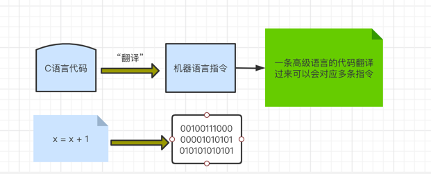
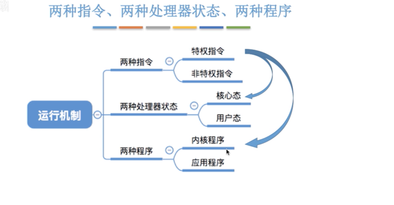
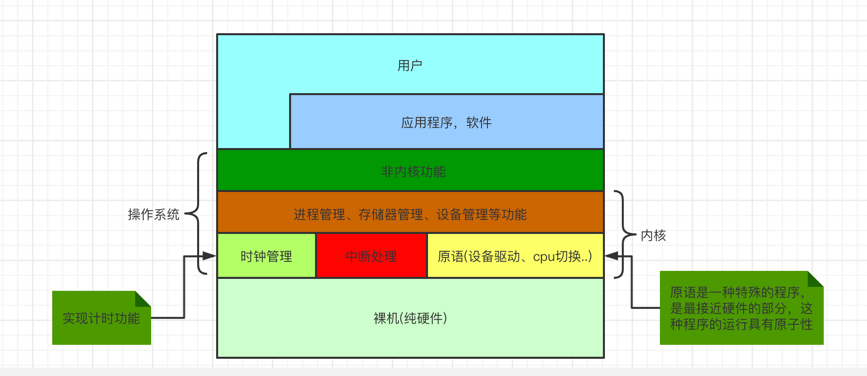
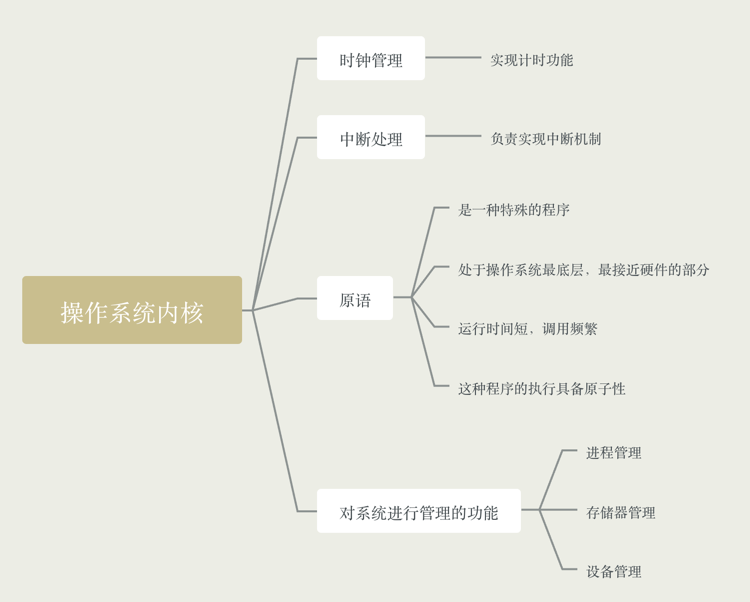
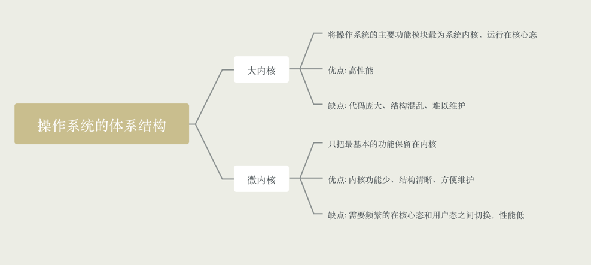
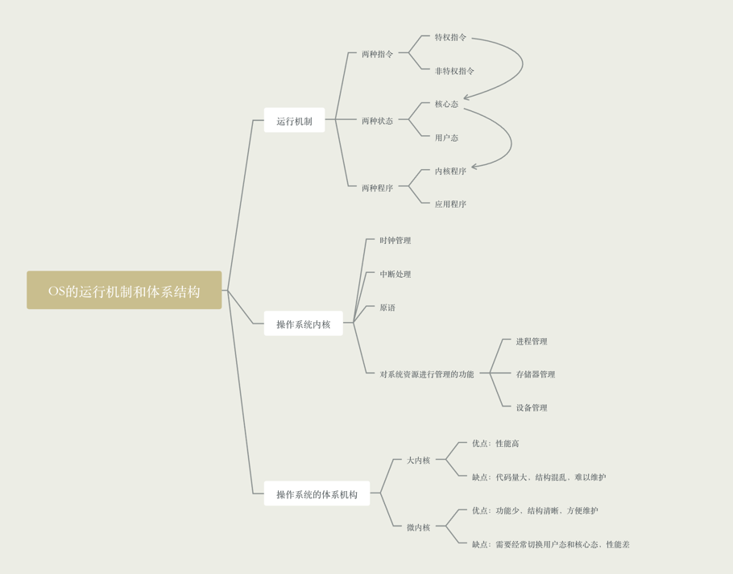

### 预备知识，什么是指令

简单来说，"指令"就是CPU能识别、执行的最基本命令，比如加指令就是让CPU进行加法运算的

### 两种指令、两种处理器状态、两种程序

- 两种指令
  
    - 有的指令"人畜无害"，比如: +、-、*、/这些普通指令。而有些指令有很高的权限，比如内存清零，如果用户可以使用
这些指令，那么意味着一个用户可以将其他用户的内存数据随意清零，这样就比较危险

    - 指令分类
        - 特权指令，不允许用户程序使用的指令，比如内存清零
        - 非特权指令，比如普通的运算指令
    
- 两种处理状态
    
    - CPU要判断当前是否可以执行特权指令，因此又产生了两种状态
    - 用程序状态字寄存器(PSW)中的某标志位来标识当前处理器处于什么状态，如0为用户态，1为和心态
    
    - 状态分类
        - 用户态(目态)，此时CPU只能执行非特权代码
        - 和心态(管态)，特权指令，非特权指令都可执行
    
- 两种程序

    - 内核程序，操作系统的内核程序是系统的管理者，既可以执行特权指令，也可以执行非特权指令，运行在核心态
    - 应用程序，为了保证系统能安全运行，普通应用程序只能执行非特权指令，运行在用户态

### 操作系统的内核

内核是计算机上配置的底层软件，是操作系统最基本、最核心的部分。实现操作系统内核功能的那些程序就是内核程序

- 时钟管理，实现计时功能

- 中断处理，负责实现中断机制

- 原语

    - 一种特殊的程序
    - 处于操作系统最底层，最接近硬件的部分
    - 这种程序的运行具备原子性
    - 运行时间短，调用频繁
    
- 对系统资源的管理
    - 进程管理
    - 设备存储器的管理
    - 设备管理

### 操作系统的体系结构

- 类比
    
    - 操作系统的体系结构问题与企业管理问题很类似，内核就是企业的管理者，负责一些重要的事情和工作，至于偶管理层
    才能执行特权指令。普通员工只能执行非特权指令。用户态、核心态之间的切换相当于普通员工和管理层之间的工作交接
    
    - 大内核: 创业初期体量不大，管理层会负责大部分的事情，优点就是效率高，缺点就是组织结构混乱，难以维护
    
    - 微内核: 随着企业体谅的增加，管理层只负责最核心的一些工作，优点就是组织结构清晰，方便维护，缺点就是效率低

### 只是体系回顾

