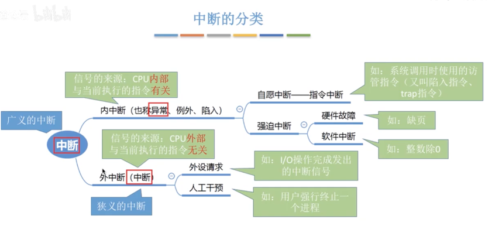
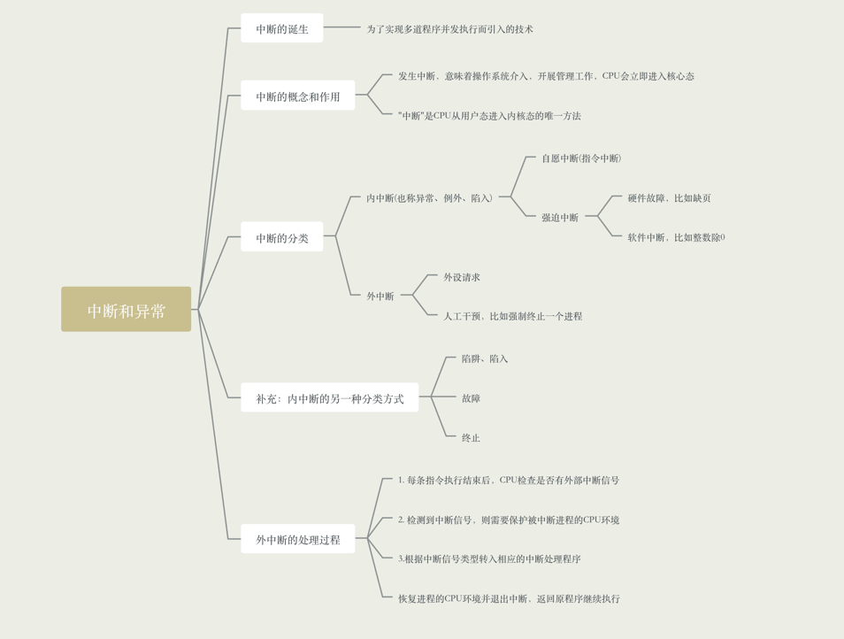

### 中断的诞生

早起的计算机各个程序只能串行执行，系统资源利用率很低。而为了解决这个问题，人们发明了操作系统作为计算机的
管理者，引入中断机制，实现了多道程序并发执行。而中断的本质: 发生了中断就以为着需要操作系统介入，开展管理工作

### 中断的概念和作用

- 当中断发生时，CPU立即进入核心态

- 当中断发生后，当前运行的进程暂停运行，并由操作系统内核对中断进行处理

- 对于不同的中断信号，会进行不同的处理

发生了中断，就意味着操作系统的介入，开展管理工作。由于操作系统的管理工作(如进程切换、分配I/O设备等)需要特权指令，
因此CPU需要从用户态切换到核心态，中断可以使CPU从用户态切换为核心态，使操作系统获得计算机的控制权，有了中断，才能实现多
道程序并发执行

- 用户态和核心态如何切换

    - 用户态到核心态，是通过中断实现的，而且中断时唯一的途径
    - 核心态到用户态，通过执行一个特权指令，将程序状态字(PSW)的标志设置为"用户态"

### 中断的分类

- 内中断，信号的来源: CPU内部，与当前执行的指令有关
    
    - 自愿中断(指令中断)，系统调用时使用的访管指令(又叫陷入指令、trap指令)
    - 强迫中断
        - 硬件故障，比如缺页
        - 软件故障，比如整数除0
    
- 外中断，信号的来源: CPU外部，与当前执行的指令无关
    - 外设请求，如I/O操作完成发出的中断信号
    - 人工干预，用户强行终止一个进程

### 外中断的处理过程

- 1. 执行完每个指令之后，CPU都要检查当前是否有外部中断信号
    
- 2. 如果检测到外部中断信号，则需要保护被中断进程的CPU环境，如程序状态字PSW，程序计数器PC，各种通用寄存器
    
- 3. 根据中断信号类型转入相应的中断处理程序
    
- 4. 恢复原进程的CPU环境并退出中断，返回原进程继续往下执行

