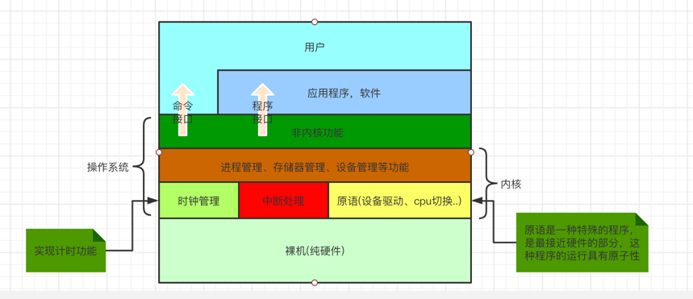
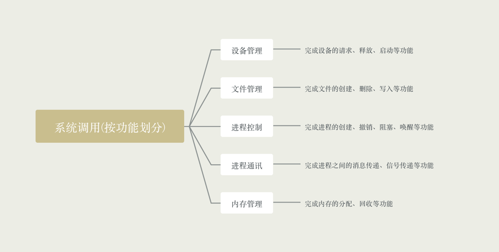
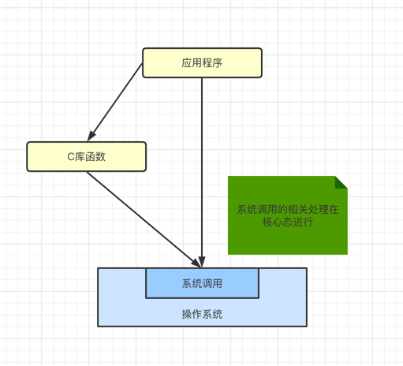
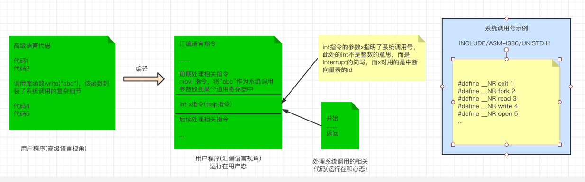
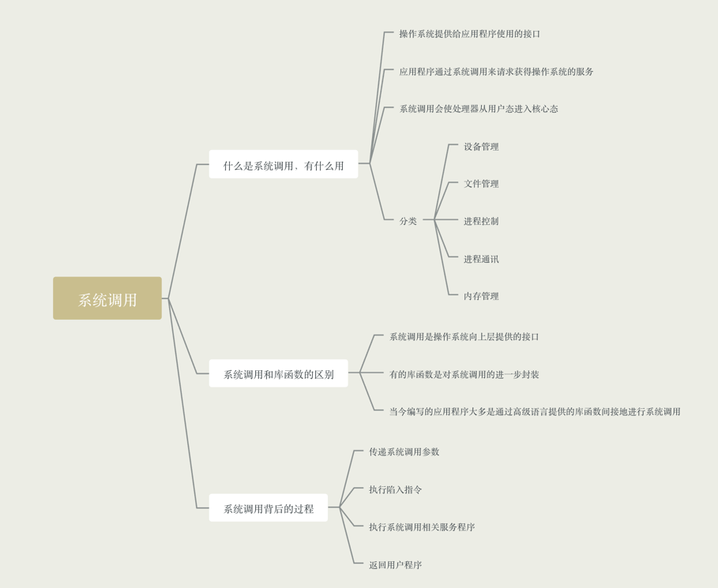

### 什么是系统调用，有什么作用

- 操作系统作为用户和计算机硬件之间的接口，需要向上提供一些简单易用的服务。主要包括命令接口
和程序接口，其中程序接口由一组"系统调用"组成

- 系统调用是操作系统提供给应用程序使用的接口，可以理解为一种可供应用程序调用的特殊函数，应用程序可以发出
系统调用请求来获得操作系统的服务

- 应用程序通过系统调用请求操作系统服务。系统中的各种共享资源都是由操作系统统一掌管的，因此在用户
程序中，凡是与资源有关的操作(如存储分配、I/O操作、文件管理等)，都必须通过操作系统调用的方法向操
作系统提出服务请求，由操作系统代为完成，这样可以保证系统的稳定性和安全性，防止用户进行非法操作

- 系统调用的相关处理涉及到对系统资源的管理、对进程的控制。这些功能需要执行一些特权指令才能完成，因此操作系统调用的相关指令需要在核心态下
进行
  
- 按照功能分类

    - 设备管理，完成设备的请求、释放、启动等功能
    - 文件管理，完成文件的读、写、创建、删除等功能
    - 进程控制，完成进程的创建、撤销、阻塞、唤醒等功能
    - 进程通讯，完成进程之间的消息传递、信号传递等功能
    - 内存管理，完成内存的分配、回收等功能
    
- 举例

比如打印论文，每个同学都按打印，但是打印后顺序不会乱，那么如果各个进程随意使用打印机，那么会有什么结果呢？当然是错乱混杂的

因此，操作系统提供了"系统调用"，用户进程想使用打印机这种公共资源，只能通过系统调用向操作系统发起请求，操作系统来统一的进行资源的协调和管理

### 系统调用和库函数的区别

| 层级       | 备注                                            |
|----------|-----------------------------------------------|
| 普通应用程序程序 | 可直接进行系统调用，也可以使用库函数 ，有的库函数涉及系统调用，有的不涉及     |
| 编程语言     | 向上提供库函数，有时会将系统调用封装成库函数，以隐藏系统调用的一些细节，使上层调用更加方便 |
| 操作系统     | 向上提供系统调用                                      |
| 裸机       | -                                             |

有些库函数不涉及到系统的调用，比如取绝对值等。而且有些涉及到系统调用，比如创建一个文件的函数

### 系统调用背后的过程

- 调用流程
  - 传递抵用调用参数
  - 执行陷入指令(用户态)
  - 执行系统调用相应服务程序(核心态)
  - 返回用户程序
  
- 注意
  - 陷入指令是在用户态执行的，执行陷入指令后立即会引发一个内中断，从而CPU进入核心态
  - 发出系统调用请求在用户态，而对系统调用的相应处理在核心态进行
  - 陷入指令是唯一一个只能在用户态执行，而不可再核心态执行的指令

