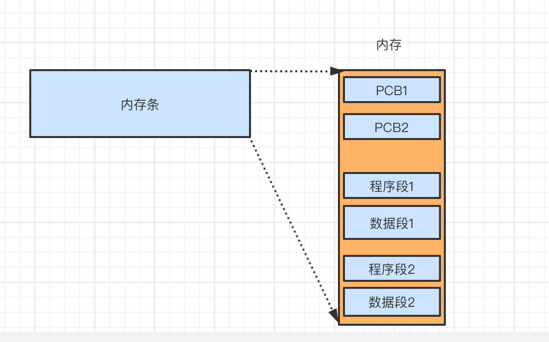
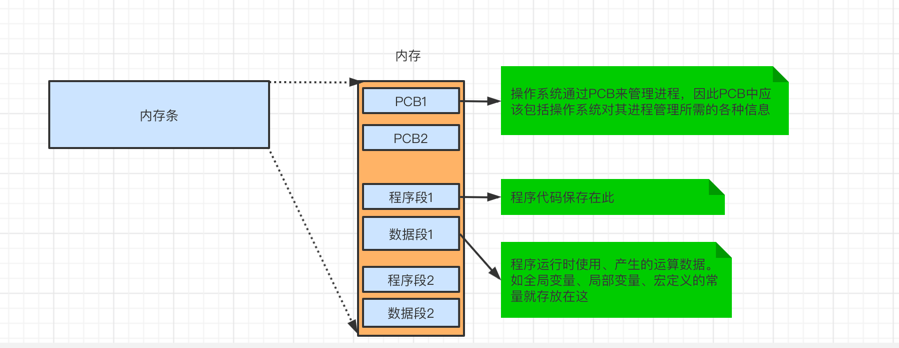
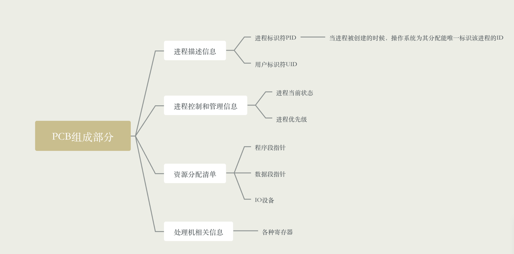
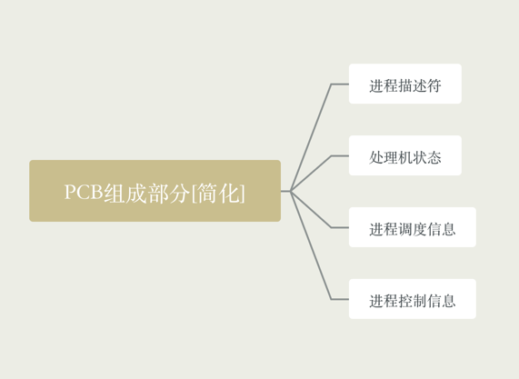
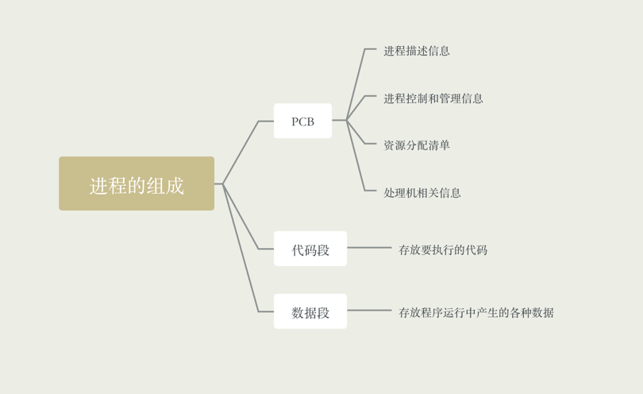
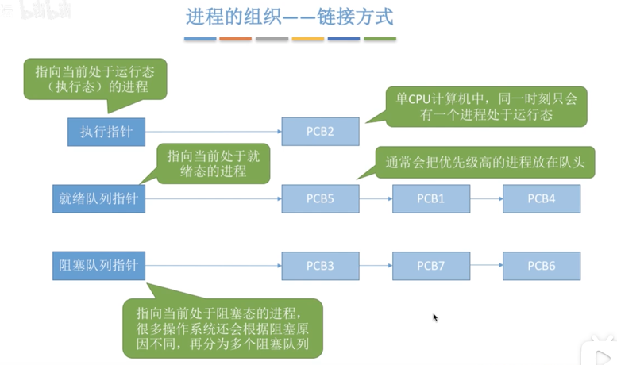
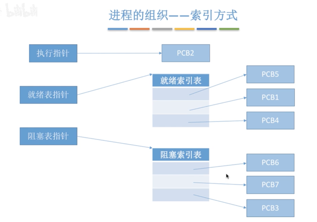
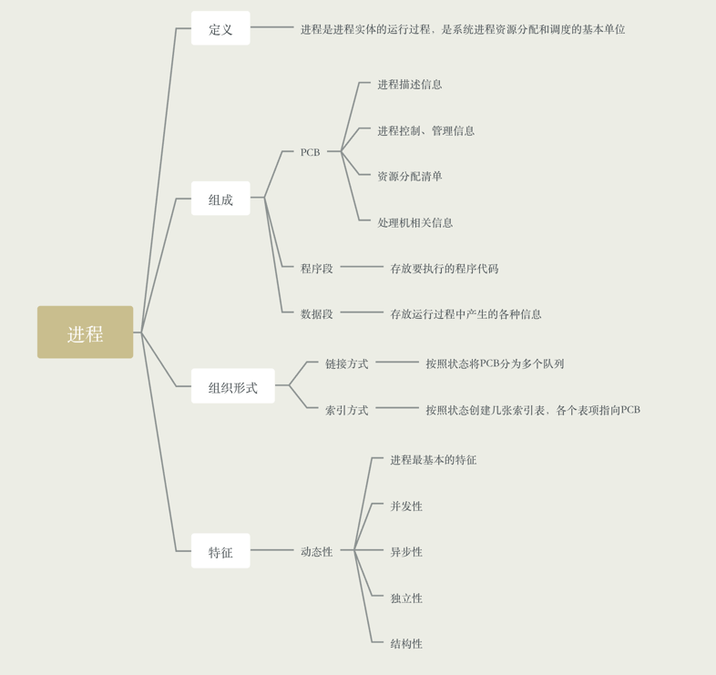

### 前提

- 引入多道程序技术后，为了方便操作系统管理，完成各程序的并发执行，引入了进程、进程实体的概念

- 内存中同时存放多道程序，各个程序的代码、运算数据存放的位置不同，操作系统是怎么才能找到各个程序的存放位置呢？

- 系统为每个运行的程序配置一个数据结构，成为进程控制块(PCB)，用来描述进程的各种信息(如程序代码存放的位置)

### 进程的定义

- 程序段、数据段、PCB三部分组成了进程实体(进程映像)，一般情况下，我们把进程实体就简称为进程。
例如，所谓创建进程，实质上就是创建进程实体中的PCB，而撤销进程，实质上就是撤销进程实体中的PCB

- Note: PCB是进程存在的唯一标志！

- 从不同的角度，进程可以有不同的定义，比较传统的定义有:
    - 进程是程序的一次执行过程
    - 进程是一个程序及其数据在处理机上顺序执行所发生的活动
    - 进程是具有独立功能的程序在数据集合上运行的过程，它是系统进程资源分配和调度的一个独立单位
    
- 引入进程实体的概念后，可以把进程定义为: 进程是进程实体的运行过程，是系统进行资源分配和调度的一个独立单位

- Note: 严格来说，进程实体和进程不一样，进程实体是静态的，
  而进程是动态的。不过除非特定的说明，否则就认为进程实体就是进程

### 进程的组成 

- 进程(进程实体)是由程序段、数据段、PCB三部分组成

- PCB
    - 进程描述信息
        - 进程标识符PID，当进程被创建时，操作系统会为该进程分配一个唯一的，不重复的ID，用于区分不同的进程
        - 用户标识符UID
    - 进程控制和管理信息
        - 进程当前状态
        - 进程优先级
    - 资源分配清单
        - 程序段指针
        - 数据段指针
        - 键盘
        - 鼠标
    - 处理机相关信息
        - 各种寄存器值
    
- PCB简化组成部分
    - 进程标识符
    - 处理机状态
    - 进程调度信息
    - 进程控制信息
    
- 进程的组成
    - PCB
        - 进程描述信息
        - 进程控制和管理信息
        - 资源分配清单
        - 处理机相关信息
    - 程序段，存放要执行的代码
    - 数据段，存放程序运行过程中处理的各种数据

### 进程的组织

- 在一个系统中，通常有数十、数百、乃至上千个PCB，为了能对他们加以有效的管理，应该用适当的方式
把这些PCB组织起来
  
- Note: 进程的组成讨论是一个进程内部由那些部分组成，而进程的组织讨论的是多个进程之间的组织方式问题

- 组织方式
    - 链接方式
        - 按照进程状态将PCB分为多个队列
        - 操作系统持有指向各个队列的指针
    - 索引方式
        - 根据进程状态的不同，简历几张索引表
        - 操作系统持有指向各个索引表的指针

### 进程的特征

进程和程序是两种截然不同的概念，相比于程序，进程拥有如下特征

- 动态性，进程是程序的一次运行过程，是动态的产生、变化和消亡的。是进程最基本的特征

- 并发性，内存中有多个进程，各个进程可以并发执行

- 独立性，进程是能够独立运行的，独立获得资源、独立接收调度的基本单位。进程是资源分配、接受调度的基本单位

- 异步性，各进程按各自独立的、不可预知的速度向前推进，操作系统要提供"进程同步机制"来解决异步问题。异步性会
导致程序执行的结果的不确定性

- 结构性，各个今晨都会配置一个PCB，结构上看，进程由PCB、程序段、数据段组成

