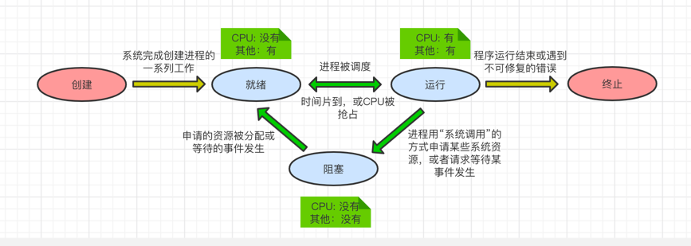
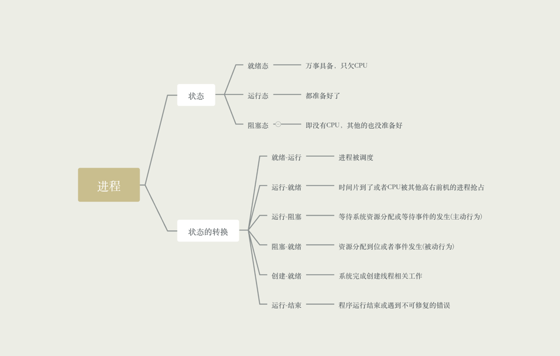

### 进程的三种基本状态

进程是程序的一次执行，在这个执行过程中，有时进程正在被CPU处理，有时又需要等待CPU服务，可见，
进程的状态是会有各种变化。为了方便对各个进程的管理，操作系统需要将进程合理的划分成为几种状态

- 运行状态，占用CPU，并在CPU上运行，如果是单核环境下，每个时刻只有一个进程处于运行状态，多核可以同时有多个在运行

- 就绪状态，已经具备运行条件，但是由于没有空闲CPU，从而暂时不能运行。进程已经拥有了除了CPU之外的所有需要的资源，
一旦获得了CPU，即可以立即进入运行状态，即：万事具备，只欠缺CPU

- 阻塞状态，因等待某一事件而暂时不能运行。如等待操作系统分配打印机、磁盘等，CPU是计算机中最宝贵的资源之一，为了提高
CPU的利用率，需要先将其他进程需要的资源分配到位，才能得到CPU的服务

### 另外两种状态

- 创建状态，进程正在被创建，操作系统为进程分配资源，初始化PCB

- 终止状态，进程正在冲系统中撤销，操作系统会回收该进程的资源，撤销PCB

### 进程状态的转换

- 运行态 -> 就绪态: 是一种进程自身做出的主动行为

- 阻塞态 -> 就绪态: 不是进程自身能控制的，是一种被动行为

- 不能由阻塞太直接转为运行态，也不能由就绪态直接转换为阻塞态

