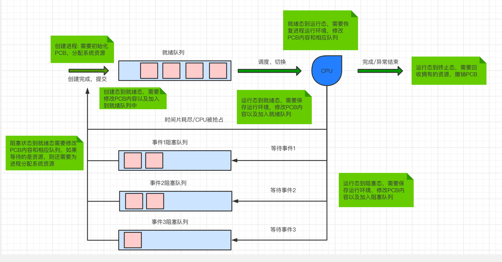
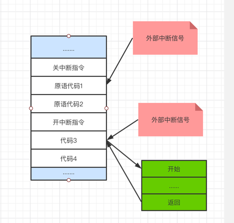
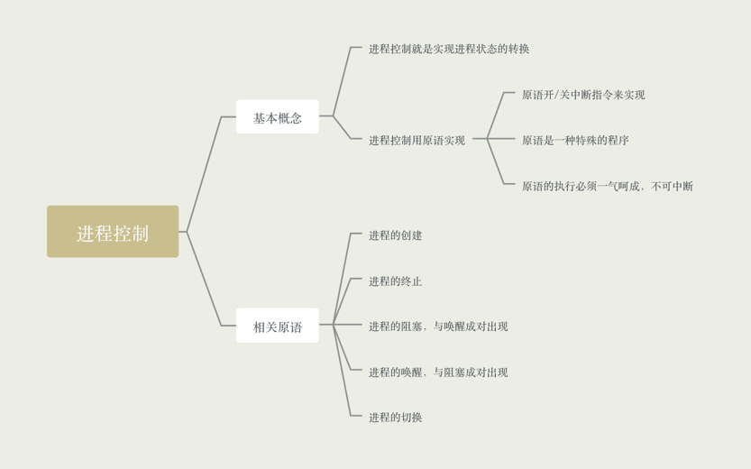

### 什么是进程控制

进程控制的主要功能是对系统中所有的进程事实有效的管理，它具备创建进程、撤销已有进程、实现进程状态转换等功能

简化理解: 进程控制就是要实现进程状态转换

### 如何实现进程控制

- 用原语实现进程控制，原语的特点是执行期间不允许中断，只能一气呵成

- 这种不可被中断的操作即原子性

- 原语采用"关中断指令"和"开中断指令"实现，这两个指令权限很高，只能在核心态下执行

### 进程控制相关原语

进程控制会导致进程状态的切换，无论是那种原语，无非就三类事情

- 更新PCB信息(如修改状态标识、将运行环境保存到PCB、从PCB中恢复)
    - 所有的进程控制原语一定都会修改进程状态标识
    - 剥夺当前运行进程的CPU使用权必然需要保存其运行环境
    - 某进程开始运行前必然要恢复其运行环境
    
- 将PCB插入到合适的队列中

- 分配/回收资源

- 程序创建过程

    - 创建原语
        - 申请空白PCB
        - 为新进程分配所需要资源
        - 初始化PCB
        - 将PCB插入就绪队列
    
    - 引入进程创建事件
        - 用户登录，分时系统中，用户登录成功，系统会建立其一个新的进程
        - 作业调度，多道批处理系统西红，有新的作业放入内存中，会为其创建一个新的进程
        - 提供服务，用户向操作系统提出某些请求时，会新建一个进程处理该请求
        - 应用请求，由用户进程主动请求新建一个子进程
    
- 程序终止过程
  
    - 撤销原语
        - 从PCB集合中找到终止进程的PCB
        - 若进程在运行，立即剥夺CPU，将CPU分配给其他进程
        - 终止其所有的子进程
        - 将该进程拥有的所有资源归还给父进程或者操作系统
        - 删除PCB
    
    - 引起程序终止事件
        - 正常结束
        - 异常结束
        - 外界干预

- 程序的阻塞和唤醒，阻塞原语和唤醒原语必须成对使用

    - 进程阻塞
        - 阻塞原语
            - 找到要阻塞进程对应的PCB
            - 保存进程运行现场，将PCB状态修改为"阻塞态"，暂停进程运行
            - 将PCB插入到相应的事件的等待队列中去
        - 引起阻塞的事件
            - 需要等待系统分配某种资源
            - 需要等待相互合作的其他进程完成工作

    - 进程唤醒
        - 唤醒原语
            - 在事件等待队列中找到PCB
            - 将PCB从等待队列中移除，设置进程为就绪状态
            - 将PCB插入就绪队列，等待被调度
        - 引起进程唤醒的事件
            - 等待事件发生，因为什么事件阻塞，就要由什么事件唤醒

    
- 进程的切换
    
    - 切换原语
        - 将运行环境信息保存到PCB
        - PCB移入相应队列
        - 选择另一个进程执行，并更新其PCB
        - 根据PCB恢复进程所需的运行环境
    
    - 引起进程切换的事件
        - 当前那时间片到
        - 有更高优先级的进程到达
        - 当前进程主动阻塞
        - 当前进程终止

